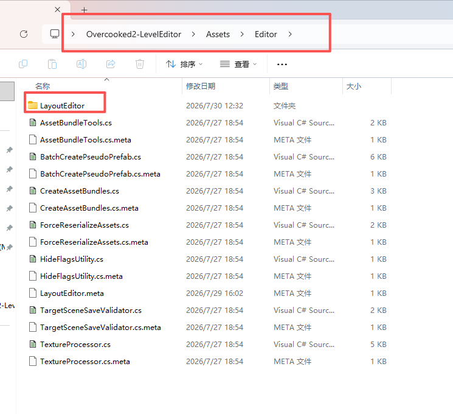
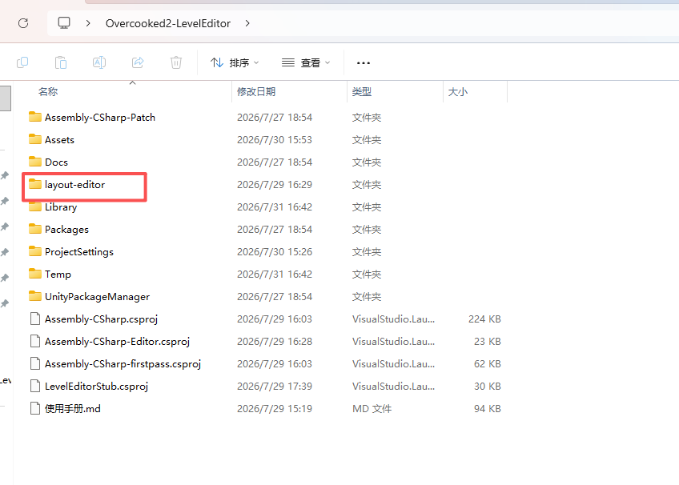
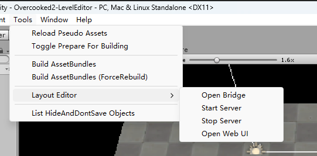

# OC2 LevelEditor Web Tools

- 作者： 嘉

> - 起因是因为Unity2017界面不好用，所以就研发了这么一个工具。

### 注意事项
- 注意，在更新版本或者操作文件之前，需要把Unity关闭，以免出现意外错误。
  - 实测丢失了一些数据的。
- 本项目无法保证百分百不会出问题，在使用前请使用测试关卡试用，以免丢失数据。
- 本项目无法代替unity，只是减少了繁琐的unity的操作，最终调试还是需要使用unity。

### 环境准备
- 基于GUA老师的编辑器，请正确安装好GUA老师的项目后再继续
- https://github.com/gua248/Overcooked2-LevelEditor

#### 安装和开始方法
1. 将本仓库下载到你的本地
- https://github.com/guojia99/Overcooked2-LevelEditor-WebTools
- 或者在QQ群 1091785437 获取
2. 将`LayoutEditor` 放到`../Overcooked2-LevelEditor-20260804/Assets/Editor`中

3. 将`layout-editor` 放到`../Overcooked2-LevelEditor-20260804/` 目录下即可

4. 点击菜单`Tool`菜单Open Bridge 即可使用
   

   
### 功能清单
- [x] 布局编辑器
  - [x] 地板编辑
  - [x] 物品编辑
  - [x] 物品双向绑定和参数设定
  - [x] 背景道具编辑
  - [x] 背景地板编辑
  - [x] 风景编辑
- [x] 菜单编辑器
  - [x] 食材校验
  - [x] 锅具校验
- [x] 关卡编辑器
  - [x] 信息便捷修改
  - [x] 快捷创建关卡
  - [x] AI 定分
- [ ] 自定义食材管理
- [ ] 自定义音乐包管理
- [ ] 支持上传2D贴图, 支持自定义素材
- [ ] 支持上传3D贴图

### 报告bug
- 你可以通过github 提交issue报告bug
- 或者加入QQ群聊 1091785437

### 更新日志
- 20260730-02:29  v0.1.0
  - 完成的基础功能研发
- 20260730-17:45  v0.2.0
  - 支持了背景、地板管理，以及关卡管理、菜单和食材校验
- 20260730-19:00  v0.2.1
  - 支持了多角度旋转、核心组件支持界面修改参数。
- 20260731        v0.2.2
  - 新功能&修改
    - 新增Nav导航，方便后续功能植入
    - 添加了两个快捷键
    - 离开编辑器时提醒回写到Unity
    - 新增一键同步
    - 重叠的物品、地板现在可以方便选中了。
    - 新增上菜口和脏盘的双向绑定
    - 新增AI自动评分功能
    - 新建关卡、关卡集时自动写好打包所需参数
    - 食材生成器支持出菜方向
    - 完善玩家管理
  - bug
    - 做了一些禁止中文文件名的限制
    - 微调了背景水的默认位置错误，以免漏出空洞位置
    - 奇数宽度地板不再回填时有空隙
- 20260802       v0.2.2.1 
  - bug
    - 修复中文bug
- 20260802       v0.3.0
  - 支持各类地板
  - 修复音频问题
  - 优化排版和UI
  - 预先支持v0.9 Editor
- 20260803       v0.3.1
  - bug
    - 修复披萨菜谱添加食材箱无法添加芝士和番茄。
    - 修复返回空参数的食材箱，导致的指针越界问题。
    - 修复关卡菜谱使用问题。
  - 功能
    - 简单支持开关、多路控制终端的使用。
- 20260803       v0.3.1.x
  - bug
    - 修复菜谱相关的bug
    - 优化菜谱界面
- 20260804       v0.3.2
  - bug
    - 修复装饰物回写碰撞冲突和消失、移位问题
    - 修复了物品重叠问题
    - 修复了框选时，左键弹窗的问题
  - 功能
    - 支持了分层单独回写。
    - 支持物品z轴控制。
    - 支持关卡截图上传和配置。
    - 支持了部分核心物品的个性化配置。
    - 优化布局编辑页的UI
    - 支持了物品检视
    - 支持锅具食材搜索
- 20260805       v0.3.3
  - bug
    - 修复锅具最低高度被限制的问题。
    - 修复默认模板玩家碰撞bug
    - 修复菜单的错误食材、锅具。
  - 功能
    - 支持输入坐标、高度坐标。
    - 支持音频查看。
    - 支持菜单内容自动回写，支持编辑器v0.9的自动补全功能。
    - 优化食材菜单UI
    - 支持锅具可指定中间产物。
- 20260806       v0.3.4
  - bug
    - 修复一些菜单bug
  - 功能
    - 新增关卡汇总页
