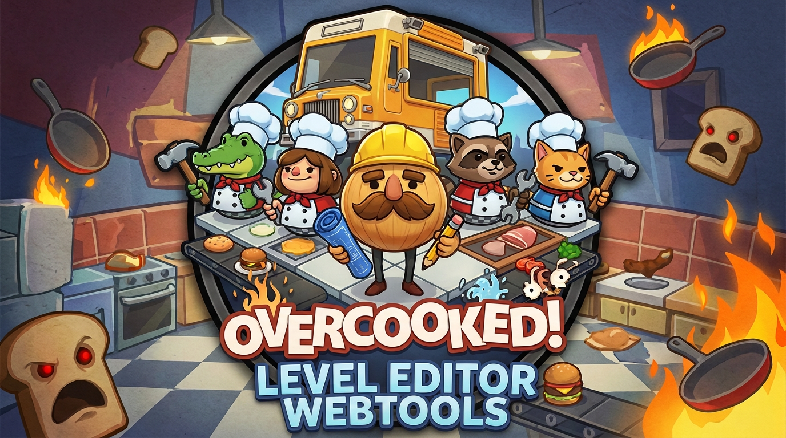

# OC2 LevelEditor Web Tools

**《Overcooked! 2》自定义关卡 Web 可视化编辑器**

作者：嘉 ｜ 起因：Unity 2017 界面不好用，于是做了这个工具

---

## 目录

- [注意事项](#注意事项)
- [环境准备](#环境准备)
- [安装和开始方法](#安装和开始方法)
- [功能亮点](#功能亮点)
- [报告 Bug](#报告-bug)
- [免责声明](#免责声明)
- [开源协议](#开源协议)

## 注意事项

> [!WARNING]
> - **更新版本或操作文件之前，请先关闭 Unity**，以免出现意外错误（实测丢失过数据）。
> - 本项目无法保证百分百不出问题，**使用前请先用测试关卡试用**，以免丢失数据。
> - 本项目**无法替代 Unity**，只是减少了繁琐的 Unity 操作，最终调试仍需使用 Unity。

## 环境准备

- 本工具基于 GUA 老师的编辑器，请先正确安装 GUA 老师的项目再继续：
  - <https://github.com/gua248/Overcooked2-LevelEditor>

## 安装和开始方法

### 方式一 · 图形化安装器（推荐，Windows）

使用随仓库提供的 `installer.exe`，全程图形化操作，**无需手动复制文件、无需手动反编译**，且为覆盖式安装、可重复执行（升级版本时重新运行即可）。

1. 将本仓库（或发行包 `OC2-Installer.zip`）下载并解压到本地，确认 `installer.exe`、`pkg`、`Assembly-CSharp` 三者位于同一目录：
   - <https://github.com/guojia99/Overcooked2-LevelEditor-WebTools>
   - 或在 QQ 群 `1091785437` 获取
2. **关闭 Unity** 后，双击运行 `installer.exe`，按界面三步操作：

| 步骤 | 操作 | 说明 |
| --- | --- | --- |
| 第 1 步 · 获取项目目录 | **方式 A**：在线下载上游项目（可选下载源，失败自动切换） **方式 B**：浏览选择本地已有的 `Overcooked2-LevelEditor` 目录 | 二选一，方式 A 成功后自动填入 |
| 第 2 步 · 拷贝游戏资源底包 | 选择游戏的 `StreamingAssets` 目录（或 `Overcooked2_Data` / 游戏根目录） | 安装器自动检测是否已配置，已配置可跳过 |
| 第 3 步 · 开始安装 | 点击「开始安装」按钮 | 安装前自动进行目录结构与环境检测、版本比对 |

3. 确认弹窗后等待日志显示「安装完成」即可。

安装器会自动完成以下工作：

- 拷贝反编译代码到 `Assets/Scripts/Assembly-CSharp`（安装器自带，**无需再用 AssetRipper 手动反编译**），并在存在 `Assembly-CSharp-Patch` 时自动打补丁
- 将 `pkg` 中的 `LayoutEditor`、`layout-editor`、`commonW1/2/3`、`WebCustomStubRuntime` 及 `Plugins` 组件替换到工程对应位置（即方式二表格的全部内容）
- 将游戏资源底包拷贝到 `Assets/StreamingAssets/Windows`

> [!NOTE]
> - 非 Windows 系统或不想使用安装器时，请使用下面的手动安装方式。
> - 安装只会替换上述列出的目录 / 文件，工程中的其他内容不受影响。

### 方式二 · 手动安装

1. 将本仓库下载到本地：
   - <https://github.com/guojia99/Overcooked2-LevelEditor-WebTools>
   - 或在 QQ 群 `1091785437` 获取
2. 打开 `pkg` 目录，按下表将各组件复制到 `Overcooked2-LevelEditor` 项目的对应位置：

| `pkg` 目录下的内容 | 复制到 |
| --- | --- |
| `LayoutEditor` | `Overcooked2-LevelEditor/Assets/Editor` |
| `layout-editor` | `Overcooked2-LevelEditor/` |
| `commonW1` `commonW1.meta` | `Overcooked2-LevelEditor/Assets/` |
| `commonW2` `commonW2.meta` | `Overcooked2-LevelEditor/Assets/` |
| `commonW3` `commonW3.meta` | `Overcooked2-LevelEditor/Assets/` |
| `WebCustomStubRuntime` `WebCustomStubRuntime.meta` | `Overcooked2-LevelEditor/Assets/` |
| `Plugins` 中的所有组件 | `Overcooked2-LevelEditor/Assets/Plugins` |

## 功能亮点

- **编辑体验**：四套页面主题（黑金 / 粉红 / 天蓝 / 纯白）、3D 模式（beta）、跨页面拷贝、三轴旋转、精度 0.1 可调
- **关卡管理**：多关卡集打包、关卡截图直接生成导入、关卡集改名、汇总页说明与多人菜谱分工
- **菜谱与菜单**：庞大菜谱库（沙拉、果汁、冰沙、冰淇淋、炒饭、布丁、汤等）、自定义菜谱 / 菜单、可自定义菜谱模型面数
- **动画组**：支持旋转、并行、时间轴控制、动态镜头抖动与闪电特效
- **机关与开关**：开关组合、共轭开关、互锁开关、开关事件组
- **音频**：音乐导入和压缩、音频查看
- **模型与自定义**：老鼠自定义模型、内置蟑螂模型
- **相机与灯光**：初始视角、视距、背景颜色、灯光暖度 / 强度调整
- **锅具管理**：烹饪时间配置、煮糊时间独立设定
- **其他**：历史记录恢复、AI 自动评分、工作量推测（实验性）

> 完整功能清单请进入 Web 页面查看，更新历史见 [UPDATE_LOG.md](UPDATE_LOG.md)。

## 报告 Bug

- 通过 GitHub 提交 [Issue](https://github.com/guojia99/Overcooked2-LevelEditor-WebTools/issues)
- 或加入 QQ 群聊 `1091785437`

## 免责声明

- 本项目**仅供个人学习、研究和技术交流使用**，严禁用于任何商业用途。
- 本项目与《Overcooked! 2》及 Ghost Town Games / Team17 官方无任何关联，《Overcooked! 2》的相关版权与商标归其权利人所有。
- 本项目基于 GUA 老师的开源项目 [Overcooked2-LevelEditor](https://github.com/gua248/Overcooked2-LevelEditor) 开发，请遵守其原始项目的相关协议与规定。
- 使用本项目所产生的任何直接或间接损失（包括但不限于数据丢失、存档损坏等），本项目开发者不承担任何责任。
- 请在遵守当地法律法规及游戏官方条款的前提下使用本项目；若官方提出异议，请立即停止使用并删除本项目。
- 任何单位或个人不得以本项目或其衍生版本进行售卖、付费分发或其他营利行为。

## 开源协议

本项目采用 [AGPL-3.0](LICENSE)（GNU Affero General Public License v3.0）协议开源。

- 任何基于本项目的修改、二次开发及分发，**必须同样以 AGPL-3.0 协议开源**；
- 通过网络提供服务时，也必须向用户提供完整的源代码；
- 严禁将本项目或其衍生版本用于闭源商业分发。
