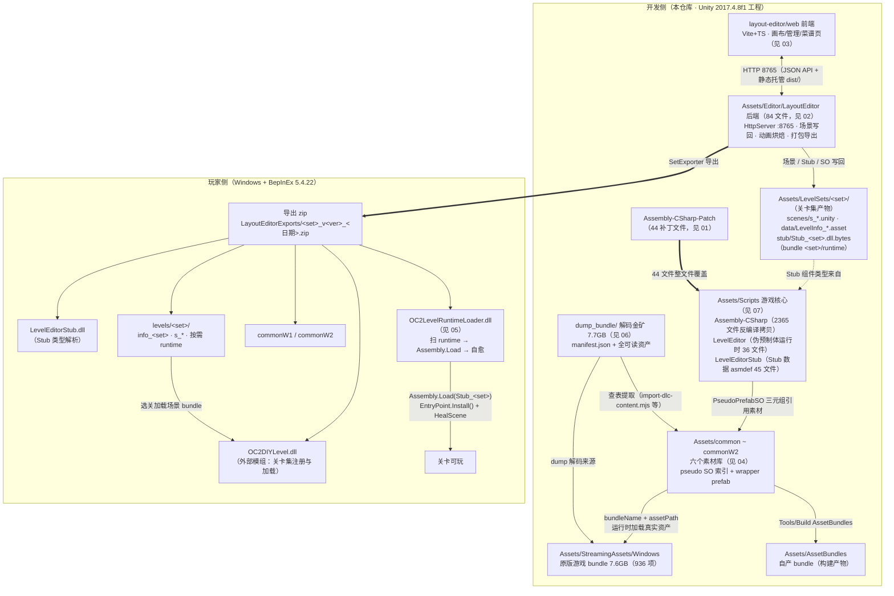
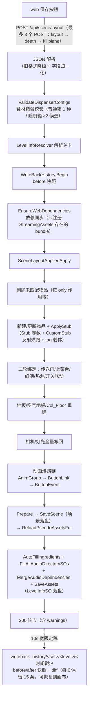
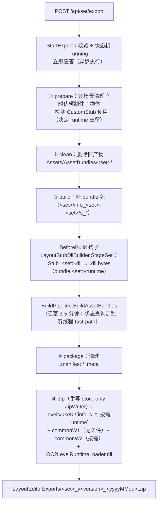

# 00 · 架构总览

> 本篇是全部模块文档的入口。先给出全局架构与三条核心数据流，再提供模块索引表。
> 目标：读完本篇即可知道"改某个功能该去哪个目录、看哪篇文档"，避免全盘扫描。
>
> **Agent 入口**：本套文档已浓缩为按需导航技能——`.opencode/skills/oc2-architecture/SKILL.md` 与 `.cursor/skills/oc2-architecture/SKILL.md`（双份同步）。会话中应只常读该技能，再按其路由表读取本目录对应文档与具体代码。

---

## 1. 项目一句话定位

本项目是一套 **Overcooked2 自定义关卡编辑器**：基于反编译的游戏源码在 Unity 2017.4.8f1 中搭建编辑器宿主，用 **Web 前端（俯视图画布）+ Unity Editor 后端（HTTP 桥）** 编辑关卡，最终产出 **AssetBundle 关卡包 zip**，玩家侧通过 **BepInEx 插件链**（OC2DIYLevel + OC2LevelRuntimeLoader）在真机加载游玩。

技术路线与社区常见的 "LD 文本关卡格式"（LevelDesc / AttachSpawn / CrateReference 等）**完全不同**：本项目走 **真实 Unity 场景 + Stub 数据组件 + 原版 bundle 引用** 路线，上述 LD 类名在本仓库不存在（已全仓库检索确认）。

---

## 2. 全局架构图

---

## 3. 三条核心数据流

### 3.1 写回流（前端画布 → Unity 场景 + LevelInfoSO）

### 3.2 导出流（关卡集 → AssetBundle → zip）

### 3.3 真机加载流（zip → 可玩）

```mermaid
flowchart TD
    subgraph EDITOR["编辑器内 Play（等价链路，即时试玩）"]
        P1["打开关卡场景<br/>（常驻 PseudoPrefabManager + Stub）"] --> P2["Init()：加载 dependencies 全部 bundle"]
        P2 --> P3["SetAssetRef()：反射注入场景管理器"]
        P3 --> P4["LevelConfigSetup 动态伪造<br/>SceneDirectoryData / CampaignLevelConfig<br/>RecipeList / RecipeMatchList"]
        P4 --> P5["未修改的游戏流程代码接管 → 可玩"]
    end

    subgraph REAL["真机（BepInEx）"]
        R0["导出 zip"] --> R1["解压到 BepInEx/plugins/OC2DIYLevel/"]
        R1 --> R2["OC2LevelRuntimeLoader 启动首帧：<br/>扫描 levels/&lt;set&gt;/runtime<br/>→ AssetBundle.LoadFromFile（永不 Unload）"]
        R2 --> R3["*.dll.bytes → Assembly.Load(Stub_&lt;set&gt;)<br/>→ 反射调 CustomStub.EntryPoint.Install()<br/>（Harmony 补丁 + StubTicker + sceneLoaded 自愈）"]
        R3 --> R4["玩家选关：OC2DIYLevel 读 info_&lt;set&gt; 注册关卡集<br/>→ 加载场景 bundle"]
        R4 --> R5["场景 Stub 组件 + PseudoPrefabSO<br/>指向的原版 bundle 资产"]
        R5 --> R6["关卡可玩"]
    end
```

---

## 4. 模块索引表

| # | 文档 | 目录 | 一句话定位 |
|---|---|---|---|
| 01 | [01-上游补丁-Assembly-CSharp-Patch.md](01-上游补丁-Assembly-CSharp-Patch.md) | `Assembly-CSharp-Patch/` | 44 个文件的"源码覆盖"补丁集：让反编译游戏源码变成可在编辑器运行的宿主 |
| 02 | [02-后端-Assets-Editor-LayoutEditor.md](02-后端-Assets-Editor-LayoutEditor.md) | `Assets/Editor/LayoutEditor/` | Unity Editor 插件：HTTP 桥 + 场景写回 + 动画烘焙 + 打包导出（84 文件） |
| 03 | [03-前端-layout-editor-web.md](03-前端-layout-editor-web.md) | `layout-editor/` | Vite+TS Web 前端：俯视图画布 + 关卡管理 + 菜谱页 + 工具链脚本 |
| 04 | [04-素材库-Assets-common系列.md](04-素材库-Assets-common系列.md) | `Assets/common` `common01/02/03` `commonW1/W2` | 六个素材库：pseudo SO 索引 + 原版 bundle 真实资产的双层架构 |
| 05 | [05-运行时加载器-OC2LevelRuntimeLoader.md](05-运行时加载器-OC2LevelRuntimeLoader.md) | `BepInExPlugins/OC2LevelRuntimeLoader/` | 真机 BepInEx 插件：关卡集 C# 程序集注入 + 场景自愈 + 排障日志 |
| 06 | [06-资源包-dump_bundle.md](06-资源包-dump_bundle.md) | `dump_bundle/` | 游戏 bundle 全量解码产物（7.7GB 可读格式）：构建脚本的查表数据源 |
| 07 | [07-游戏核心-Assets-Scripts.md](07-游戏核心-Assets-Scripts.md) | `Assets/Scripts/` | 游戏底层运行代码：反编译拷贝 + LevelEditor + LevelEditorStub 三程序集 |

### 常见任务 → 入口

| 我想… | 先看 |
|---|---|
| 加/改一个 HTTP API | 02 §2.4 路由总表 + 03 §5 通信清单（两端要同步改） |
| 给某类物件加编辑参数（stub 字段） | 03（stubControls/types）+ 02（LayoutEditorStubIO + Models DTO）+ 07 §4.2（Stub 组件本体） |
| 改游戏行为逻辑 | 01（patch 覆盖机制）或 02 §CustomStub（关卡集代码母本，随 zip 分发） |
| 加新 DLC 素材 | 06 §4 资源流水线 + 04 §2 目录组织 + 03 §7.2 build-catalog.mjs |
| 排查真机关卡问题 | 05 §日志体系 + 02 §7 设计约定 |
| 改随机食材箱/CustomStub | 05（加载协议）+ 02 §3.9（母本逐文件）+ `.opencode/skills/oc2-customstub/SKILL.md` |
| 导出包结构问题 | 02 §6 导出流程 + 05 §5 文件约定 |

---

## 5. 关键横切设计约定（全仓库通用铁律）

1. **宿主文件一律不动**：对反编译宿主（`Assets/Scripts/` 下三个程序集）的适配用反射、`[InitializeOnLoad]` 守卫、Play 期补丁完成；游戏侧行为改造收敛到 CustomStub（Harmony + ticker）与 OC2LevelRuntimeLoader。补丁本体放 `Assembly-CSharp-Patch/`，按 tutorial 流程拷贝覆盖。
2. **三处镜像算法**：菜谱烹饪分组（`recipeGroups.ts` ↔ `build-catalog.mjs` ↔ `LayoutEditorRecipeKnowledge.cs`）、占格表 FOOTPRINT（`state.ts` ↔ `build-catalog.mjs` ↔ `LayoutEditorCatalogLookup.cs`）、schemaVersion（前端 ↔ 桥，当前 =5）——修改必须三处同步。
3. **CustomStub 双通道数据**：组件（权威，`Stub_<set>` 程序集）+ `SpecificPseudoPrefabTag.prefabTag` 字符串载体（程序集缺失时自愈降级）；tag 前缀表（`RandomCrate|`/`TimedSwitch|`/`PushablePot|`/`SwitchReenable|`/`WorldMapDressing|`/`UtensilTiming|`）在 `LayoutEditorSetExporter.CustomStubTagPrefixes`、`CustomStub.EntryPoint`、loader 三处同步维护。
4. **依赖只注册存在的 bundle**（`BundleFileExists` 守卫）：防止宿主场景打开即 `KeyNotFoundException`。
5. **保存工作流统一**：`Prepare（剥临时物体）→ SaveScene → ReloadPseudoAssetsFull`，保证 bundle 临时子物体不被烘焙进场景。
6. **instanceId 约定**：`u:<instanceID>`（场景既有）/ `new:<来源>:<uuid>`（前端新建）；删除物品后联动引用需经 `stubRefs.remapAllInstanceRefs` 与 `cleanOrphaned*` 清洗。
7. **离线韧性**：前端目录/菜谱/音频全部「动态 API 优先 → public/ 静态 JSON 回退」；桥看门狗 3s 轮询、3 连败弹窗指引重启。
8. **版本金丝雀**：`CustomStub.EntryPoint.Version`、`Loader.cs` 插件版本、`APP_VERSION`、`BridgeSchemaVersion` 各自独立演进，日志中均可查新鲜度。

---

## 6. 版本与环境速查

| 项 | 值 |
|---|---|
| Unity | 2017.4.8f1（C# 6 / .NET 3.5 profile） |
| 后端端口 | 8765（`http://*:8765` → 回退 `127.0.0.1` + LanRelay 8766） |
| 前端 | Vite 5 + TypeScript 5.6（strict），唯一运行时依赖 three.js（仅 3D 预览） |
| BepInEx | 5.4.22（net35 插件） |
| 前端版本 | `APP_VERSION`（`layout-editor/web/src/version.ts`） |
| 桥 schema | `BridgeSchemaVersion = 5`（`LayoutEditorRecipeKnowledge.cs`） |
| loader 版本 | OC2LevelRuntimeLoader v1.6.0（源码与 `web/public/` 分发副本需手动同步） |
| 原版 bundle | `Assets/StreamingAssets/Windows/`（7.6GB，git 忽略） |
| 自产 bundle | `Assets/AssetBundles/`（git 忽略） |
| 中间产物 | `dump_bundle/`（git 追踪）、`audio-exports/`、`logs/`、`writeback_history/`、`LayoutEditorExports/` |
