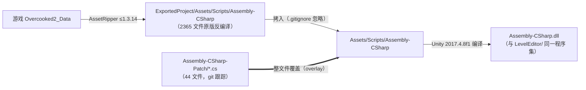
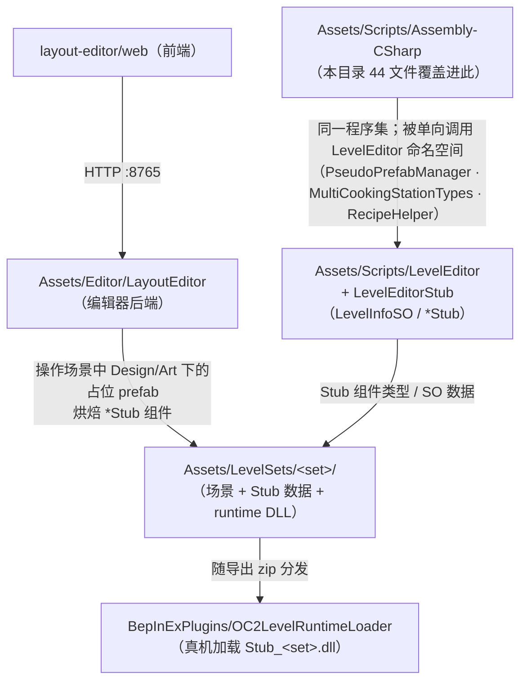

# 01 · 上游补丁 Assembly-CSharp-Patch

> 目录：`Assembly-CSharp-Patch/`（仓库根，44 个 .cs 文件）
> 一句话定位：让"反编译的 Overcooked2 游戏源码"变成"可在 Unity 2017 编辑器中运行的关卡编辑器宿主"的最小覆盖补丁集。
> 返回 [00-架构总览.md](00-架构总览.md)

---

## 1. 目录结构

```
Assembly-CSharp-Patch/                     ← 44 个 .cs 文件的"补丁覆盖层"（git 跟踪）
├── *.cs                                   ← 40 个顶层文件（按游戏反编译源码的扁平命名）
├── GameModes/
│   └── Horde/ClientHordeFlowController.cs
├── Team17/Online/Multiplayer/
│   ├── PeerBase.cs
│   └── Messaging/SpawnableEntityCollection.cs
└── UnityEngine/PostProcessing/GraphicsUtils.cs
```

- 目录结构**完全镜像**游戏反编译代码 `Assets/Scripts/Assembly-CSharp/`（2365 个 .cs，被 `.gitignore` 忽略）。
- 它**不在** `Assets/` 下，Unity 不会编译它——它只是一个 git 可跟踪的"源码覆盖包"。
- 历史上有过 `LayoutRuntime*.cs`、`ServerRespawnCollider.cs`、`RespawnColliderMessage.cs` 等 9 个文件，后在 commit `b11482530` 迁移到 `Assets/Editor/LayoutEditor/CustomStub/` 时删除。

## 2. 核心作用：源码覆盖（overlay）机制

**不是 DLL 补丁，而是同名文件整体覆盖：**



补丁分两层：**基线补丁**（commit `1b2ed8d20`，13 个文件）使反编译源码能在编辑器中编译运行；**功能性补丁**（约 30 个后续 commit）做 DLC 资产适配、自定义菜谱支持、多类型灶台、原版 bug 修复、编辑器体验优化。

## 3. 修改标记约定（如何识别 patch）

1. **`// patch` 成对注释**：41/44 个文件用成对 `// patch` 包裹修改块，原逻辑以注释保留在上方——主要标记（如 `ServerTriggerZone.cs:57-59`）。
2. **`#if UNITY_EDITOR` 块**：`AudioManager`（音频兜底）、`PeerBase`（日志）、`GraphicsUtils`（DestroyImmediate）。
3. **`using LevelEditor;` / `using LevelEditorStub;`**：14 个文件引入编辑器程序集，是"游戏代码 ⇄ 编辑器代码"的连接证据（PseudoPrefabManager、MultiCookingStationTypes、RecipeHelper 等被游戏侧调用）。
4. **git 层标记**：`git log -- Assembly-CSharp-Patch` 可追溯每个补丁的动机。

## 4. 全部 44 个补丁文件按功能域详解

### 4.1 关卡系统 / 编辑器集成钩子

| 文件 | 类 | 补丁作用 |
|---|---|---|
| `MultiplayerController.cs` | MultiplayerController | 联机总控。①修复 `HeldItemMeshVisibility` 同步类型注册笔误（ClientHeldItems→ClientHeldItem）；②在网络同步启动后调用 `PseudoPrefabManager.SetupAfterStartSynchronisingAllPseudoPrefabs()`——**整个编辑器关卡激活的关键入口** |
| `ServerOrderControllerBase.cs` | ServerOrderControllerBase | 订单控制器。从 `PseudoPrefabManager.Instance.stub.levelInfo` 读取 `minOrderCount/maxOrderCount`，让自定义关卡可配置最少/最多同时订单数 |
| `AudioManager.cs` | AudioManager | `#if UNITY_EDITOR` 兜底：编辑器内音频目录为空时从 `common02/pseudo_prefab_so/audio/AudioDirectories` 经 AssetDatabase 动态加载 |
| `LevelIntroFlowroutine.cs` | LevelIntroFlowroutine | 编辑器内把 Ready/Go 界面延迟压缩到 0.1s，跳过关卡开场等待 |
| `Cannon.cs` | Cannon | 加农炮（dlc08）：新增 `m_target` 字段并在 Awake 自动查找 Target/AttachPoint/ExitPoint 子物体 |
| `PlayerPhysicsSurfaceProperties.cs` | PlayerPhysicsSurfaceProperties | 玩家物理表面属性 SO；补丁仅加 `[CreateAssetMenu(menuName="LevelEditor/...")]` 使其可在编辑器创建（冰面等） |

### 4.2 烹饪/搅拌/容器核心（自定义菜谱支持主战场）

| 文件 | 类 | 补丁作用 |
|---|---|---|
| `AssembledNodeTransfer.cs` | AssembledNodeTransfer（静态） | 食物在容器间转移的统一规则。允许"已熟/已混的复合食物"按组成拆分进入搅拌碗与不同烹饪步骤的锅（回锅保留进度），是自定义菜谱+中间产物体系的枢纽 |
| `CookableContainer.cs` | CookableContainer | 放宽 `AllowItemPlacement`：注释掉 CookableProperties/审批列表检查，允许任意可烹饪物进锅具 |
| `MixableContainer.cs` | MixableContainer | 放宽搅拌碗放置规则（允许过度混合物等），配合自定义中间产物 |
| `CookingStation.cs` | CookingStation | 灶台放置判定支持 `MultiCookingStationTypes`（一物多灶型，如搅拌碗既进搅拌台又进烤箱） |
| `ServerCookingStation.cs` | ServerCookingStation | 服务端灶台，同上支持 MultiCookingStationTypes 匹配注册订单回调 |
| `ServerCookingRegion.cs` / `ClientCookingRegion.cs` | 同名 | 篝火类"烹饪区域"：修复已销毁 collider 的空引用 |
| `ServerCookingUtensilRespawnBehaviour.cs` | 同名 | 厨具离台重生判定支持多灶型匹配 |

### 4.3 容器外观（CustomRecipe 的客户端渲染链路）

| 文件 | 类 | 补丁作用 |
|---|---|---|
| `BurgerBunCosmeticDecisions.cs` | 同名 | 汉堡胚外观；多层汉堡时动态扩容父 PreparationContainer 的 BoxCollider（大汉堡碰撞修复） |
| `BurritoCosmeticDecisions.cs` | 同名 | 卷饼外观；容忍 `m_fullTortilla == m_emptyTortilla`（同一模型复用） |
| `ClientContentsCosmeticDecisions.cs` | 同名 | 锅内内容物颜色；新增 `GetAllIngredients()` 递归取复合节点全部食材求平均色（多步骤食材着色修复） |
| `ClientFryingContentsCosmeticDecisions.cs` | 同名 | 油炸内容物；Renderer 查找改为 `RequestComponentRecursive` |
| `RoastingTrayCosmeticDecisions.cs` | 同名 | 烤串盘；子物体定位改按 `nodes[i].transform` 而非容器子级顺序 |
| `ClientOvenCosmeticDecisions.cs` / `ClientFurnaceOvenCosmeticDecisions.cs` | 同名 | 烤箱门开合判定支持 MultiCookingStationTypes + 混合进度检查 |
| `ClientToastingForkCosmeticDecisions.cs` / `ServerToastingForkCosmeticDecisions.cs` | 同名 | 烤叉偏移支持多灶型 |
| `ClientAttachedOrderCosmeticDecisions.cs` | 同名 | 上菜口订单展示；实例化装盘 prefab 后强制 `SetActive(true)` |

### 4.4 盘/杯/清洗/回收

| 文件 | 类 | 补丁作用 |
|---|---|---|
| `Plate.cs` | Plate | 盘/杯基类；Awake 把容量提到 100 并按 glass 标记适配（玻璃杯小容量修复） |
| `ServerPlate.cs` | ServerPlate | **本地新增补丁（Assets 副本尚未同步）**：允许盘内容物直接转入煮锅/搅拌碗（`m_freeObject` 检查豁免），修复盘/托盘混淆 |
| `ServerPlateStation.cs` | ServerPlateStation | 上菜口找回收台时按"是否托盘(Tray)"严格匹配对应 PlateReturnStation（盘/托盘混淆修复） |
| `WashingStation.cs` / `ServerWashingStation.cs` | 同名 | 洗碗池：支持洗"干净盘堆/异类堆"（按 dryingStation.stackPrefab 的 platePrefab 校验），而非原版一刀切拒绝 |
| `ServerPreparationContainer.cs` | 同名 | **本地新增补丁（Assets 副本尚未同步）**：允许 PreparationContainer（如汉堡胚）整个倒入煮锅/搅拌碗参与烹饪/混合 |

### 4.5 机关/触发器/重生

| 文件 | 类 | 补丁作用 |
|---|---|---|
| `ServerTriggerZone.cs` | ServerTriggerZone | 触发区：进/出时补发 `SyncOccupied()` 服务端事件 + 清理已销毁 collider（原版 bug 修复，联机同步踏板必需） |
| `ClientTriggerZone.cs` | ClientTriggerZone | 配套客户端：实现 `ApplyServerEvent(TriggerZoneMessage)` |
| `ServerTriggerToggleOnAnimator.cs` / `ClientTriggerToggleOnAnimator.cs` | 同名 | 触发器支持对"已启用的 TriggerOnAnimator"做双态 toggle |
| `TriggerCallback.cs` | TriggerCallback | 基线补丁：trigger 字符串 → C# 回调注册表（编辑器/机关接线用） |
| `ServerFireHazardSpawner.cs` | ServerFireHazardSpawner | 火焰喷射器落地：先点燃 Flammable 桌台再生成地面火 |

### 4.6 网络/同步

| 文件 | 类 | 补丁作用 |
|---|---|---|
| `Team17/Online/Multiplayer/PeerBase.cs` | PeerBase | `#if UNITY_EDITOR` 下打印网络异常日志（编辑器排障） |
| `Team17/.../Messaging/SpawnableEntityCollection.cs` | 同名 | 网络可生成实体注册表；Instantiate 后强制 `SetActive(true)` + 脱离父级（伪 prefab 生成物激活修复） |

### 4.7 UI/流程/杂项

| 文件 | 类 | 补丁作用 |
|---|---|---|
| `DialogueAnimationState.cs` | 同名 | 对话动画状态机（Story 模式）；基线补丁，公开 `m_completedTriggerHash`、补 OnValidate 等 |
| `GameModes/Horde/ClientHordeFlowController.cs` | 同名 | Horde(生存) 模式客户端流程；基线补丁（dlc07_horde 资产适配） |
| `GameUtils.cs` | GameUtils | 全局工具库；`InstantiatePFX` 加 null 防护等小修 |
| `UnityEngine/PostProcessing/GraphicsUtils.cs` | 同名 | 后处理工具；编辑器非播放态用 DestroyImmediate |

## 5. 与社区 "LD 格式" 的术语对照（重点澄清）

本项目**不存在** `LevelDesc / AttachSpawn / ServerAttachSpawn / CrateReference / SpawnReferences` 这些类名（全仓库验证）。社区 LD 文本格式的等价物在本项目中的对应：

| LD 术语 | 本项目实际对应 |
|---|---|
| LevelDesc/LD 文件 | Unity 场景 `LevelSets/<set>/scenes/s_*.unity`（Template 复制而来），经 `SceneLayoutExporter/Applier` 导出/写回 |
| 关卡元数据 | `LevelInfoSO`（LevelEditorStub）：levelName(ZH)、sceneName、recipes、optionalRecipeMatchListItems、includeRecipeMatchLists、dependencies、config_1p~4p |
| 关卡集 | `LevelSetInfoSO`：levelSetName(ZH)、author、uid、version、levelInfos |
| 人数配置 | `LevelConfigSetupPerPlayerCountSO`：订单时长/间隔/回合时长/星级分数 |
| 关卡加载 | 编辑器：`PseudoPrefabManager.Init()` 反射伪造 `SceneDirectoryData`/`CampaignLevelConfig`；真机：BepInEx 模组 OC2DIYLevel 加载 bundle |
| AttachSpawn | `TriggerAttachedSpawn`（+Server/Client）、`AttachItemSpawner` 家族；编辑器侧 `PseudoPrefabAttachingFoodSpawner` 配置 |
| ServerAttachSpawn | `ServerTriggerAttachedSpawn` / `ServerAttachItemSpawner` / `ServerPickupItemSpawner` / `ServerPlacementItemSpawner` |
| CrateReference | 无此类；食材箱 = `Dispenser` prefab；本项目扩展随机食材箱 `CustomStub.RandomCrate`（见 02 §3.9） |
| SpawnReferences | 最接近 `SpawnableEntityCollection`（网络生成注册表，本目录已 patch）与 `SpawnObject` |

## 6. 与本项目其余部分的关系



- **引用方向**：Patch 文件（编译进 Assembly-CSharp）单向调用 `LevelEditor` 命名空间（`PseudoPrefabManager`、`MultiCookingStationTypes`、`RecipeHelper`）；`LevelEditorStub` 有独立 asmdef（无引用），供关卡集 runtime 程序集依赖。
- **文档对应**：`Docs/zh|en/tutorial.md`（安装=反编译+覆盖）、`Docs/zh/reference.md`（物体/Stub 字段手册）、`Docs/pushable-pot-void-fall-debug.md`（明确"补丁改 `Assembly-CSharp-Patch/`，同步到 `Assets/Scripts/Assembly-CSharp/`"的开发约定）。

## 7. 同步状态与维护流程（重要）

**当前未同步项**：`ServerPlate.cs`、`ServerPreparationContainer.cs` 的 patch 版本比 `Assets/Scripts/Assembly-CSharp/` 副本**多出最新修复**（commit `1e1daad5f` 盘/托盘混淆、`bb317ec98` 面包胚入锅具）——需按 tutorial 步骤 6 重新拷贝同步，否则编辑器内运行的是旧逻辑。

**维护流程**：
1. 修改补丁：只改 `Assembly-CSharp-Patch/` 下文件（用 `// patch` 成对注释标记）；
2. 同步：整文件拷贝覆盖 `Assets/Scripts/Assembly-CSharp/` 同名文件；
3. 上游 merge 时该目录"跟随上游 + 收缩"（见 `Docs/2026-09-03-common3-upgrade.md` 维护策略）。
