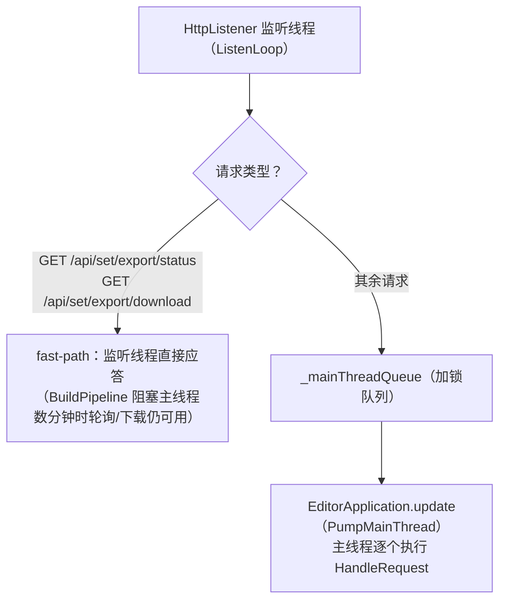
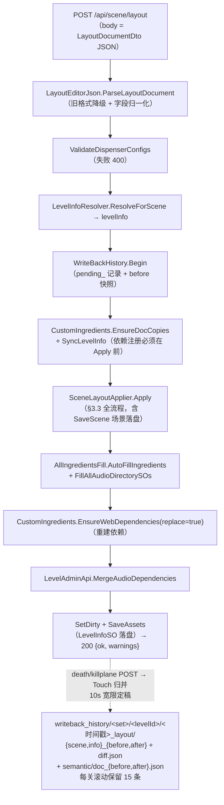
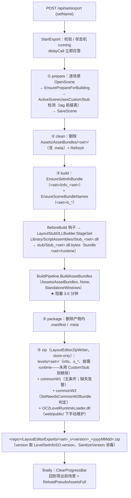

# 02 · 后端 Assets/Editor/LayoutEditor

> 目录：`Assets/Editor/LayoutEditor/`（84 个 .cs，约 42,000 行，Unity Editor 程序集 / .NET 3.5）
> 一句话定位：Unity Editor 插件——在内嵌 HttpListener 上同时提供 **REST API 后端 + Web 前端静态托管**，把浏览器画布数据写回 Unity 场景 / `LevelInfoSO`，并完成 AssetBundle 构建与 zip 导出。
> 返回 [00-架构总览.md](00-架构总览.md)

---

## 1. 完整目录树（所有 .cs，相对 `Assets/Editor/LayoutEditor/`）

```
├── AirFloorRig.cs                        空气地板"岛式"层级 rig 工具
├── AnimGroupBakery.cs                    动画组 → 原生 Animator 烘焙器 (2819 行)
├── AnimGroupBakeryTests.cs               烘焙器 asset key 单测（菜单触发）
├── AnimGroupImporter.cs                  场景动画组 → 文档模型反向导入 (1302 行)
├── ButtonEventBakery.cs                  按钮↔事件组联动烘焙
├── ButtonLinkBakery.cs                   按钮↔动画组联动烘焙 (956 行)
├── CustomRecipeConfigSO.cs               自定义菜谱配置 SO（LevelEditorStub 命名空间）
├── CustomStubAutoBake.cs                 CustomStub 按需自动化（拷贝/编译/补烘焙闭环）
├── CustomStubCopyTool.cs                 CustomStub 母本 → 关卡集 stub/ 拷贝工具
├── CustomStubHttpApi.cs                  CustomStub web API 桥（钩子注册）
├── CustomStubOrphanRepair.cs             场景孤儿脚本引用修复（文本级 YAML 改写）
├── LayoutEditorAllIngredientsFill.cs     allIngredients / 音频目录自动填充
├── LayoutEditorAudioExporter.cs          游戏音频提取导出（audio-exports/）
├── LayoutEditorBridgeWindow.cs           主 EditorWindow + 服务看门狗 ★入口
├── LayoutEditorBundleDumper.cs           StreamingAssets bundle 全量 dump → dump_bundle/
├── LayoutEditorBurgerApi.cs              汉堡组装工作台后端 (1062 行)
├── LayoutEditorCannonPatch.cs            大炮 Play 期运行时补丁
├── LayoutEditorCatalogApi.cs             食材/菜谱目录与关卡菜谱读写 (1134 行)
├── LayoutEditorCatalogLookup.cs          占地尺寸表 + 默认父路径表
├── LayoutEditorCookingUtensilGuard.cs    锅具 stub 自愈守卫/降级工具
├── LayoutEditorCustomIngredients.cs      common03/commonW1/commonW2 依赖注册
├── LayoutEditorDependencyRepair.cs       缺失自定义 bundle 依赖启动修复
├── LayoutEditorDiag.cs                   AssetBundle 加载诊断菜单
├── LayoutEditorDispenserIconFix.cs       食材箱新皮肤图标兼容补丁 (520 行)
├── LayoutEditorFloorMaterialsApi.cs      地板材质目录扫描
├── LayoutEditorFlowStateProbe.cs         Play 期加载状态机探针
├── LayoutEditorFootprintDump.cs          装饰 prefab 实测尺寸批量导出
├── LayoutEditorFootprintMeasure.cs       单实例占地/高度测量
├── LayoutEditorGridReader.cs             QuadGridManager 网格信息读取
├── LayoutEditorGridSnapGuard.cs          解除 EditorGridSnap X/Z 吸附守卫
├── LayoutEditorHierarchy.cs              层级路径 查找/创建
├── LayoutEditorHotPotDiagnostics.cs      火锅链路 Play 期诊断
├── LayoutEditorHotPotFill.cs             火锅大锅许可食材自动登记
├── LayoutEditorHttpServer.cs             HTTP 服务与全部路由 ★核心 (1937 行)
├── LayoutEditorImageExporter.cs          dump_bundle 图片分类导出 → dump_images/
├── LayoutEditorIngredientSprayPatch.cs   奶油喷罐 m_OrderPrefab 运行时补齐
├── LayoutEditorItemSwitcherPatch.cs      饮料机/酱料机多选循环运行时补丁
├── LayoutEditorJson.cs                   JSON 序列化/解析（含降级手写解析）
├── LayoutEditorLanRelay.cs               LAN TCP 中继（Windows 无 URLACL 时）
├── LayoutEditorLevelAdminApi.cs          关卡集/关卡/自定义菜谱管理 ★最大 (4048 行)
├── LayoutEditorLevelInfoResolver.cs      场景 → LevelInfoSO 解析
├── LayoutEditorLevelInfoSanitizer.cs     旧 LevelInfoSO 字段迁移/消毒
├── LayoutEditorLog.cs                    持久日志 + 写回告警收集
├── LayoutEditorManualLookup.cs           中英文名词典查询
├── LayoutEditorModels.cs                 全部 DTO 数据模型 (1675 行)
├── LayoutEditorPaths.cs                  web dist 路径/URL 帮助
├── LayoutEditorPlayModeLogCapture.cs     Play 日志落盘 logs/
├── LayoutEditorPseudoReload.cs           伪预制件重载（Prepare/Reload 工作流）
├── LayoutEditorPushablePotPreview.cs     可移动火锅编辑器预览锅
├── LayoutEditorRecipeKnowledge.cs        菜谱组成知识/烹饪分组计算 (894 行)
├── LayoutEditorRoastTrayFill.cs          烤盘许可食材自动登记
├── LayoutEditorSceneRepair.cs            场景损坏预制件实例清理
├── LayoutEditorSetExporter.cs            关卡集 AssetBundle 构建与 zip 导出 ★
├── LayoutEditorStubIO.cs                 Stub 组件导出/写回核心 (2307 行) ★
├── LayoutEditorSwitchLinkPatch.cs        开关联动运行时补丁（Play 期）
├── LayoutEditorTerminalPatch.cs          控制终端运行时补丁
├── LayoutEditorWorldMapDressingPatch.cs  世界地图装饰展开运行时补丁
├── LayoutEditorWriteBackHistory.cs       写回历史（快照/diff/恢复）(1569 行)
├── LayoutEditorZipWriter.cs              手写 store-only zip 打包器
├── LayoutStubDllBuilder.cs               Stub DLL → .dll.bytes → runtime bundle
├── SceneFloorExporter.cs                 地板/背景面导出
├── SceneLayoutApplier.cs                 文档 → 场景写回核心 (2472 行) ★
├── SceneLayoutExporter.cs                场景 → 文档导出核心
├── SceneWalkabilityReader.cs             可行走矩形 / 死亡配置读取
├── AudioFs/                              —— 纯 C# Unity bundle/FSB5 解析库 ——
│   ├── AudioFsBundle.cs                  UnityFS (2017.4 v6, LZ4) bundle 读取器
│   ├── AudioFsFsb5.cs                    FSB5 解析 + Vorbis→ogg 重组 + ADPCM→wav
│   ├── AudioFsLz4.cs                     LZ4 块解压（decode only）
│   ├── AudioFsSerializedFile.cs          SerializedFile + typetree 动态读取
│   ├── AudioFsTables.cs                  common string / vorbis setup 表加载
│   ├── oc2-common-strings.txt            （数据文件）
│   └── vorbis-setup-tables.txt           （数据文件）
└── CustomStub/                           —— 运行时关卡逻辑"母本"（模板代码）——
    ├── CustomStub.asmdef                 Editor 平台程序集，引用 LevelEditorStub
    ├── core/EntryPoint.cs                运行时安装器（ticker+Harmony+场景自愈）
    ├── core/GameApi.cs                   Assembly-CSharp 反射类型缓存 (736 行)
    ├── core/HarmonyPatches.cs            KillPlane/煮糊阈值 Harmony 补丁
    ├── core/StubLog.cs                   统一日志桥（loader 转发）
    ├── HotPot/HotPot.cs                  火锅运行时管理器
    ├── HotPot/PushablePot.cs             可推动大火锅装配器
    ├── HotPot/PushableVoidFall.cs        可移动火锅坠落/重生 (1148 行)
    ├── HotPot/PushableVoidFallTarget.cs  载具标记组件
    ├── RandomCrate/RandomCrate.cs        随机食材箱运行时组件 (693 行)
    ├── Switch/TimedCookingSwitch.cs      火锅灶台定时开关
    ├── Switch/SwitchReenable.cs          按钮自动复位
    ├── Terminal/TerminalGuard.cs         未绑定终端防线
    ├── UtensilTiming/UtensilTiming.cs    锅具时间运行时应用（含 Harmony 接管）
    ├── UtensilTiming/UtensilTimingConfig.cs 锅具时间配置组件（权威通道）
    └── WorldMap/WorldMapDressing.cs      世界地图装饰强制展开
```

---

## 2. 核心架构

### 2.1 入口与生命周期

```
Unity 启动 / Domain Reload
  └─ [InitializeOnLoad] LayoutEditorServerLifecycle          (LayoutEditorBridgeWindow.cs 尾部)
       └─ EditorApplication.update += WatchdogTick           每 2s 检查一次
            └─ EditorPrefs["LayoutEditor.ServerAutoStart"] 为 true 时
                 确保 LayoutEditorHttpServer 存活（限流：60s 内最多 5 次重启，间隔 ≥2s）
```

- **主窗口**：`LayoutEditorBridgeWindow : EditorWindow`（菜单 `Layout Editor/Open Bridge`）：启动/停止服务、打开浏览器编排页（`/layout?scene=<当前场景>`）、四个导出按钮（装饰尺寸/音频/Bundle dump/素材图）、两个 CustomStub 按钮（反射软调用，扩展缺失时置灰不报错）。
- **HTTP 服务**：`LayoutEditorHttpServer`（普通 C# 类，非 MonoBehaviour）。

### 2.2 通信机制（HTTP，端口 8765）

| 项 | 值 |
|---|---|
| 协议 | 纯 `System.Net.HttpListener`（无 WebSocket） |
| 默认端口 | **8765**（`DefaultPort`） |
| 绑定 | 优先 `http://*:8765/`（+ localhost）；Windows 非管理员绑定失败 → 回退仅 `127.0.0.1`，并自动起 `LayoutEditorLanRelay`：`0.0.0.0:8766 → 127.0.0.1:8765` 原始 TCP 字节中继（不走 HTTP.sys，无需 URLACL） |
| 重试 | 端口占用时 5 次 × 500ms |
| CORS | `*`（GET/POST/OPTIONS），OPTIONS 直答 204 |
| 前端托管 | `layout-editor/web/dist`（`LayoutEditorPaths.WebDistRoot`）；SPA 子路由回退 `index.html`，`/recipes` → `recipes.html`，`/index.html` 302 → `/` |
| 主页 | `http://127.0.0.1:8765/manage`；编排页 `/layout?scene=...` |

### 2.3 线程模型



- `_responseSent` 标志防止重复写响应；异常兜底为 500 JSON。
- `/api/compile`（触发 `AssetDatabase.Refresh`）会因域重载截断连接，属预期，看门狗负责拉起。

### 2.4 API 路由总表（`LayoutEditorHttpServer.HandleRequest`）

**健康/环境**
| 路由 | 说明 |
|---|---|
| `GET /api/health` | ok/port/static/schemaVersion(=5)/knowledgeLoaded/dictionaryLoaded |
| `GET /api/env/status` | 静态前端、audio-exports、StreamingAssets/Windows 游戏包数量、dump_bundle/manifest.json 存在性 |

**场景画布（核心读写）**
| 路由 | 说明 |
|---|---|
| `GET /api/scene/layout?assetPath=` | 打开场景并导出 `LayoutDocumentDto`（物品/地板/可行走/死亡/动画组/开关联动/按钮联动/相机/灯光） |
| `POST /api/scene/layout?snap=0.01&syncWalkable=1&only=items\|decor\|floors` | **写回**（§4 详述） |
| `POST /api/scene/repair-broken?assetPath=` | 清理损坏预制件实例 |
| `POST /api/scene/death` / `POST /api/scene/killplane` | 死亡主题 / KillPlane 边界（归并进写回历史） |
| `GET /api/grid` | QuadGridManager 网格信息 |

**目录（catalog）**
| 路由 | 说明 |
|---|---|
| `GET /api/catalog/ingredients` / `floor-materials` / `questionmarks` / `questionmarks/icon` / `music` / `audio-directories` / `ambiences` / `death-effects` | 各类目录扫描 |
| `GET /api/recipes?levelSet=`、`GET/POST /api/level-recipes` | 关卡菜谱读写 |
| `GET /api/level/optional-presets`、`POST /api/level/optional-items`、`POST /api/level/matchlists`、`POST /api/recipes/compute-burger-optionals`、`GET /api/level/burger-optional` | 可选部件/匹配表 |

**关卡集/关卡管理**
| 路由 | 说明 |
|---|---|
| `GET /api/sets`、`GET /api/sets/<set>/levels` | 列表 |
| `POST /api/set/create \| info \| delete \| export` | 关卡集操作 |
| `GET /api/set/export/status`、`GET /api/set/export/download?setName&fileName` | 导出状态/下载（fast-path） |
| `GET /api/set/stub/status`、`POST /api/set/stub/copy \| compile` | CustomStub 状态/拷贝/编译（经 `CustomStubApi` 钩子，未安装 501） |
| `GET /api/level`、`GET /api/level/bundles`（依赖分析）、`GET /api/level/delete-preview` | 关卡查询 |
| `POST /api/level/create \| info \| config \| audio \| delete \| reorder` | 关卡操作 |
| `POST /api/level/image-upload`（贴图地板）、`POST /api/level/screenshot-upload`、`GET /api/level/data-file` | 上传/预览 |

**自定义菜谱 / 汉堡工作台**
| 路由 | 说明 |
|---|---|
| `GET/POST /api/custom-recipes*` | config、list、debug-scan、references、diagnose、create、update、delete、upload-icon、upload-model、category/* |
| `GET /api/custom-recipes/model-files`、`GET /api/custom-recipes/model-files/<b64目录>/<文件>` | 3D 预览文件服务 |
| `GET /api/burger/definitions`、`POST /api/burger/create`、`POST /api/burger/definition/update` | 汉堡工作台 |

**写回历史 / 媒体 / 杂项**
| 路由 | 说明 |
|---|---|
| `GET /api/writeback/history \| /detail \| /doc?side=before\|after` | 写回历史查询/恢复 |
| `GET /api/audio/exports`（manifest）、`GET /api/audio/stream?path=`（支持 HTTP Range） | 音频 |
| `GET /api/icons/status`、`GET /api/web-recipes`、`POST /api/web-recipes/install\|uninstall`（废弃）、`POST /api/reload`、`POST /api/compile` | 杂项 |

### 2.5 静态解耦钩子（可选扩展点，删文件仍可编译）

| 钩子 | 定义处 | 订阅方 |
|---|---|---|
| `LayoutEditorHttpServer.CustomStubApi : Func<action,set,json>` | HttpServer | `CustomStubHttpApi`（[InitializeOnLoad]） |
| `LayoutEditorStubIO.CustomStubCopyRequested : Action<string>` | StubIO | `CustomStubAutoBake`（自动拷贝母本） |
| `LayoutEditorSetExporter.BeforeBuild : Action<string>` | SetExporter | `LayoutStubDllBuilder`（导出前打包 Stub DLL） |
| `LayoutEditorDispenserIconFix.AfterRandomCrateSync : Action` | DispenserIconFix | `CustomStubAutoBake`（问号图标补画） |

---

## 3. 逐文件详细说明

### 3.1 服务与窗口

| 文件 | 详细说明 |
|---|---|
| **LayoutEditorBridgeWindow.cs** | 主 EditorWindow。类 `LayoutEditorBridgeWindow` + `LayoutEditorServerLifecycle`（[InitializeOnLoad]）。`OpenWindow/StartServerMenu/StopServerMenu`（菜单）、`WatchdogTick()`（2s 周期保活 + 限流重启）、`OnGUI`（服务控制/URL/导出按钮/CustomStub 反射软调用）。持有静态单例 `_server`；`EditorPrefs` 记录自动保活意图跨域重载存活 |
| **LayoutEditorHttpServer.cs** | 后端心脏。`Start(port=8765)`（通配→本机绑定回退→LanRelay）、`Stop()`、`ListenLoop/EnqueueMain/PumpMainThread`（主线程泵）、`TryServeExportFastPath`、`HandleRequest`（§2.4 全部路由分发）、`TryServeStatic`（SPA 静态 + 路径穿越防护）、`ValidateDispenserConfigs`（写回强校验：普通箱必须 1 种食材、随机箱 ≥2 候选）、`LogExportDiagnostics/LogDispenserTrace`、`BuildEnvStatus`、`ServeAudioExports/ServeAudioStream`（Range 分支）、`ServeIconsStatus` |
| **LayoutEditorLanRelay.cs** | `Start(relayPort, targetPort)` 在 0.0.0.0 监听 TcpListener，每连接双向线程泵字节转发（`Pump` 半关闭处理）。仅 HttpListener 通配绑定失败时自动启动 |
| **LayoutEditorPaths.cs** | `WebDistRoot`（`<repo>/layout-editor/web/dist`）、`IsWebDistReady`、`WebUiUrl`、`WebUiUrlForActiveScene`、`IsPathUnderRoot`（路径穿越防护） |
| **LayoutEditorJson.cs** | `ToJson`（JsonUtility + 基础类型手写 + NaN/Inf 消毒）、`ParseLayoutDocument`（JsonUtility → 失败时 `ParseLayoutDocumentLegacy` 手写扫描 items 数组；null 字段/footprint 归一化补全） |
| **LayoutEditorLog.cs** | 持久日志到 `<repo>/logs/layout_editor.log`；写回告警通道 `BeginApply/RecordApplyWarning/DrainApplyWarnings`（≤50 条，写回响应透传给 web 状态栏） |
| **LayoutEditorModels.cs** | 全部 DTO：`LayoutDocumentDto`（items/floors/walkable/deathInfo/animControls(旧键 moveControls)/switchLinks/buttonLinks/buttonEvents/cameraInfo/lights）、`LayoutItemDto` + 约 20 种 stub 子 DTO、`FloorDto`（tint/image/warp/airFloor）、`AnimGroupDto` 系列、`LevelSet*/Level*/PerPlayerConfig/AudioConfig`、bundle 分析、自定义菜谱/汉堡全套、写回状态、`EnvStatusDto` |

### 3.2 场景导出（场景 → 文档）

| 文件 | 详细说明 |
|---|---|
| **SceneLayoutExporter.cs** | `ExportActiveScene()` 组装完整文档：遍历 `Design/Art/Chefs` 三根（跳过 `Design/Collision` 子树与 `LevelEditorStub.Stub` 子孙）收集 prefab 实例根 → `LayoutItemDto`（`LayoutEditorStubIO.ExportStub` 填 stub 数据）；`ResolveFootprint`（目录覆写优先 → Art/ 装饰 renderer 实测 → 1×1 兜底）；`CollectCollisionObjects`（非 prefab 纯 BoxCollider 按 **1.132 魔法数**识别空气墙）；`CollectSwitchLinks`；相机/灯光收集；动画组/按钮联动导入。常量 `AirWallCatalogGuid` |
| **SceneFloorExporter.cs** | 收集非 prefab 的内置 Plane/Quad（mesh fileID 10209/10210）与内嵌 warp 网格（`ImgWarpFloorMesh` 前缀）地板 → `FloorDto`；`TryAddAirFloor`（按名 `Col_AirFloor` + Ground 层识别，含去重）；图片地板状态从 GameObject 名（`imgfloor|path|mode|opacity[|rot]`）解码；tint 从名 `#rrggbb` 解码；材质名 → surfaceKind 推断 |
| **SceneWalkabilityReader.cs** | 只读层：`ReadWalkable()`（Ground 层 BoxCollider → `WalkableRectDto`，PlayerPhysicsSurface → ice）；`ReadDeathInfo()/ReadKillPlanes()`（优先 PseudoPrefabManagerStub.levelInfo.onDeathEffectSO，回退 GameSession；RespawnCollider → respawnType + bounds；死亡类型按特效 guid 分类 water/goo/fall） |
| **LayoutEditorGridReader.cs** | 反射读 `QuadGridManager` 的 m_gridHalfSize/m_size/m_origin → `GridInfoDto` |
| **LayoutEditorHierarchy.cs** | `GetHierarchyPath`、`FindByPath`（逐级查找 + 同名兄弟兜底）、`FindOrCreatePath` |

### 3.3 场景写回（文档 → 场景）

| 文件 | 详细说明 |
|---|---|
| **SceneLayoutApplier.cs** | `Apply(document, snapStep, syncWalkable, only)` 全流程：①`PruneThemeBackgroundItems` 去重 → ②`PrepareSceneForApply` → ③before 快照 + 删除未匹配物品 → ④首轮：空气墙（BoxCollider 1.2×1.132×1.2）、防堆叠守卫、`new:` 前缀 → `PrefabUtility.InstantiatePrefab + FindOrCreatePath + ApplyStub`，既有 → 变换更新 + ApplyStub → ⑤二轮：`ApplyTeleportalExit/ApplyServingStationPlateReturns/ApplyTerminalPilotable/ApplyHeatedOvenHeatSource/ApplySwitchLinks/BakeWorldMapDressing` → ⑥`ApplyFloors`（图片/tint/材质**烘焙进材质实例**而非 MPB；warp 透视网格按相机反投影；`SyncWalkableToFloors` 重建 Col_Floor，静态地面挂 `ObjectContainer`）→ ⑦相机/灯光全量 → ⑧动画烘焙链（ButtonLinkBakery.PrepareGroups → AnimGroupBakery.Sync → ButtonLinkBakery.Sync → ButtonEventBakery.Sync → AutoEnableDynamicParenting）→ ⑨`EnsurePrepareForBuilding → MarkSceneDirty → SaveScene → SupplySemanticAfter → ReloadPseudoAssetsFull → GridSnapGuard.RelaxGridSnapOnScene` |
| **LayoutEditorStubIO.cs** | stub 数据层（最复杂的防御性代码）。`ExportStub(go,item)`：按组件类型导出 Player/ServingStation/Dispenser（含随机箱）/AttachingFoodSpawner/Conveyor/Teleportal/CookingUtensil（含 UtensilTiming 反射读取）/Travelator/Flamethrower/PlateReturn/CleanPlateStack/Burner/Switch/PressureSwitch/Terminal/HeatedOven/Cannon/MeshWithMaterial/SOArray/通用 guid/TimedCookingSwitch。`ApplyStub(go,item)`：写回各分支；防 NRE 降级（`CookingUtensilGuard.DowngradeToBase`）；wrapper 补挂派生 stub + 派生运行时组件；**数组字段必须走 SerializedObject**（Unity 2017 prefab 实例数组收缩残留根治）；`ResolveRefObject`（createdObjects 优先、InstanceID 兜底——绑定丢失主根因修复）；随机食材箱 `ExportRandomCrate/ApplyRandomCrate/WriteRandomCrateData`（组件权威 + `PseudoPrefabSOArray` 候选 + `SpecificPseudoPrefabTag` tag `RandomCrate|<iconGuid>|w1,w2,...` 双通道）/`EnsureRandomCrateDependencies`（bundle 必须存在于 StreamingAssets 才注册）/`RebakeRandomCratesInActiveScene`（域重载后自愈）；`FindCustomStubType(setName, className)` 反射找 `CustomStub.<class>`；静态钩子 `CustomStubCopyRequested` |
| **AirFloorRig.cs** | 空气地板动画"岛式"层级（`AirFloor(ObjectContainer)/Ground(BoxCollider)`）：`IsColliderObject/IsWrapperName/GetAnimatedMember/EnsureRig`。被 SceneLayoutApplier/SceneFloorExporter/AnimGroupBakery 共用 |
| **LayoutEditorPseudoReload.cs** | 伪预制件生命周期适配层：`LayoutEditorSceneCleanup`（sceneClosing 清理）、`EnsurePrepareForBuilding`、`ReloadPseudoAssets`（轻量）、`ReloadPseudoAssetsFull`（DeInit+Init+Sanitize+预载 bundle+补种子+重试）、`EnsureCustomBundleDependency`。所有写回/管理端点的"保存后刷新"统一走这里 |

### 3.4 动画与按钮烘焙

| 文件 | 详细说明 |
|---|---|
| **AnimGroupBakery.cs** | 把 `AnimControlDataDto` 烘焙为**与原版关卡同构**的原生动画：`Design/Animated Objects/<组名>` 根 + Animator + 游戏的 TriggerQueue/TriggerTimer + `Assets/LevelSets/<set>/data/<level>/animations/` 下 controller/clips 资产。`Sync → BakeGroup`（成员 re-parent、`BuildTimeline/MigrateEventTimeline`（旧 delay 链 → startTime 时间轴）、`BuildClusters`（时间重叠事件并行合并组合 clip）、`BuildMoveClip/BuildRotateClip/BuildWaitClip`（loop/pingpong/lift/drop/相位错位）、`BuildController`（全触发驱动状态机）、`CleanupStale`）；`BakeFxGroup`（shake=相机 rig `FX_CameraShake`、flash=`Lights/FX_Lightning` + 雷声）；`PersistAuthoringSource`（原始编排 JSON 作为 `AnimGroupSource` TextAsset 子资产嵌入 controller，无损回读）；asset key 生成（`BuildAssetKey/ShortHash`） |
| **AnimGroupImporter.cs** | `ImportFromScene`：扫描场景候选（TriggerQueue/TriggerTimer + Animator 含 Transform 曲线）→ `TryImportFromSource`（优先反序列化嵌入 AnimGroupSource）→ 回退片段分析（路线/相位匹配/静态成员/lift 剖面提取）。只有形状平行的成员才保证再烘焙保真 |
| **ButtonLinkBakery.cs** | 按钮/压力开关 → 动画组联动，烘焙到 `Design/Button Logic/Btn(Logic|Pair)_*`：顺序触发状态环（Ready_i→Run_i→Ready_{i+1}）、lockUntilFinished（ClearTriggerDuringState）、共轭对 AND 门（pairId，每方 ≤2 组）；`PrepareGroups/Sync/ImportFromScene/CleanupStale` |
| **ButtonEventBakery.cs** | 按钮 → 事件组联动（事件 = 向目标广播 trigger + doneTrigger 完成信号），烘焙到 `Design/Button Event Logic`，按压触发名 `BEP_<helper>` |
| **AnimGroupBakeryTests.cs** | 菜单 `Layout Editor/Tests/...`：asset key 唯一性/稳定性 + Timeline 迁移 + FX 事件断言 |

### 3.5 管理端 API

| 文件 | 详细说明 |
|---|---|
| **LayoutEditorLevelAdminApi.cs**（4048 行） | 关卡集/关卡/自定义菜谱全生命周期。**目录**：`ScanMusic/ScanAudioDirectories/ScanAmbiences/ScanDeathEffects`（扫 common01/common02 pseudo_prefab_so）、`LoadAudioKnowledge`（`layout-editor/scripts/data/audio-knowledge.json`）。**关卡集**：`ScanSets`（自动补根 bundle `<set>/info_<set>`）、`CreateSet`、`DeleteSet`、`UpdateSetInfo`、`EnsureSetInfoBundle`。**关卡**：`ScanLevels`、`CreateLevel`（从 `Assets/Template` 复制场景 s_<id> 与 config_1p..4p、创建 LevelInfoSO、绑定 PseudoPrefabManagerStub.levelInfo、登记 levelInfos）、`UpdateLevelInfo/Config/Audio`、`AutoMergeAudioDependencies`、`PreviewDeleteLevel/DeleteLevel/ReorderLevels`、`SetDeathTheme`、`SetKillPlaneBounds`。**依赖分析**：`LoadBundleManifest`（bundle-manifest.json）、`BundleClosure`（传递闭包）、`AnalyzeBundles`（recipes/allIngredients/cookingSteps/matchLists/场景 YAML guid 扫描）。**上传**：`UploadImageFloor`、`UploadScreenshot`。**自定义菜谱**（约占一半）：`GetOrCreateCustomRecipeConfig`、`ScanCustomRecipes`、`GetCustomRecipeReferences`、`Create/Update/DeleteCustomRecipe`（uid 唯一性）、`UploadCustomRecipeIcon/Model`（FBX/OBJ+贴图落盘 + Unity 导入尺寸回传）、`DiagnoseCustomRecipe`、`SetRecipeModelTransform`、分类管理。模板常量均在 `Assets/Template/` |
| **LayoutEditorCatalogApi.cs** | `ScanIngredients`（common01/02/03 + 关卡集 custom 目录；guid 脱同步自愈 `HealGuidDesync`）、`ScanRecipes`（官方 + 自定义 + commonW2，`RecipeKnowledge.ComputeCookingGroups` 分组）、`GetLevelRecipes/SetLevelRecipes`（写 LevelInfoSO.recipes → SyncLevelInfo 重建依赖 + HotPot/RoastTray Fill + **含汉堡菜谱时自动同步本关 BurgerOptional**：`SyncBurgerOptionalsForSavedRecipes` 重算夹心全集/bunSO 对齐主面包，并把 [BurgerOptional]+中间产物 merge 进 optionalRecipeMatchListItems，替换 auto-managed 旧条目、保留 hotdog/pizza/手动条目；须在 EnsureWebDependencies 之前执行以计入中间产物依赖）、Optional/Matchlist 管理（matchlist key 白名单 dlc02..dlc13/combineddlc）、`ComputeBurgerOptionalFill`（与自动同步共用 `SyncLevelBurgerOptionalAndGetItems`）、`BundleFileExists`（全项目依赖注册守门） |
| **LayoutEditorBurgerApi.cs** | 汉堡工作台（#/burger-maker）：数据模型 = 成品汉堡 CustomRecipeSO(Composite) + 共享 `CustomRecipeOptionalBurgerSO`（bunSO + optionalSOs[] + 模型数组）；`GetDefinitions/CreateBurger/UpdateDefinition/GetLevelBurgerOptionalDefinition`；`SyncLevelBurgerOptionalFromBurgers`（**覆盖式**：夹心/bunSO/模型数组每次全量重建，模型绑定唯一来源 = commonW2 组装定义规范绑定，本关旧绑定不保留；bunSO 对齐所选汉堡主面包，多种面包告警） |
| **LayoutEditorFloorMaterialsApi.cs** | `Scan(levelSet)`（关卡集 materials/ 优先，回退 common01/common02/commonW1）；`TryParseMaterialTilingSuffix` 等（往返恢复烘焙平铺） |
| **LayoutEditorRecipeKnowledge.cs** | `BridgeSchemaVersion=5`；步骤→厨具表 `StepUtensils`；`ComputeCookingGroups`（与前端/build-catalog.mjs **三处镜像**）；`TryGetOriginal`（recipe-knowledge.json） |
| **LayoutEditorManualLookup.cs** | 中英文名：`names-dictionary.json` → 使用手册.md 表 → id 兜底；`TryGetLevelSetName` |
| **LayoutEditorCustomIngredients.cs** | common03/commonW1/commonW2 引用与依赖：`EnsureDocCopies`（写回前校验 + 收集 `_pendingDocBundles`）、`SyncLevelInfo/EnsureWebDependencies`（**只注册 StreamingAssets 存在的 bundle**）、`SetNeedsCommonW2Bundle`（导出 zip 按需携带判定） |

### 3.6 自动填充与守卫

| 文件 | 详细说明 |
|---|---|
| **LayoutEditorAllIngredientsFill.cs** | `AutoFillIngredients`（story/include matchlist + 场景食材箱/锅具 + 自定义菜谱叶食材 → allIngredients；机器专属食材黑名单排除）、`FillAllAudioDirectorySOs`。写回成功后由 HttpServer 自动触发 |
| **LayoutEditorHotPotFill.cs** | 所选火锅菜谱叶食材 + permutations 生/熟节点 → 场景所有大锅 stub 的 allowedIngredientSOs（只增不删，幂等） |
| **LayoutEditorRoastTrayFill.cs** | 同模式：RoastingTray 步骤菜谱叶食材 → 烤盘 stub |
| **LayoutEditorCookingUtensilGuard.cs** | bundle 直读判定（`IsIngredientSpray/RealPrefabHasIngredientContainer` 等）+ `DowngradeToBase`（移除派生 stub 恢复基础道具）+ [InitializeOnLoad] 自愈轮询（修 PseudoPrefab stub 字段时序竞态） |
| **LayoutEditorDispenserIconFix.cs** | 新结构食材箱皮肤（木纹·中秋）触发宿主 MissingComponentException 的兼容补丁：`PreloadAndSeed`（注入 bundle + 补种子 MeshRenderer）、`SyncSeededIcons`、钩子 `AfterRandomCrateSync` |
| **LayoutEditorGridSnapGuard.cs** | [InitializeOnLoad] 反射把场景伪预制件 child 的 `EditorGridSnap.m_constrainX/Z` 置 false（防写回的半格坐标被拉回整格） |
| **LayoutEditorPushablePotPreview.cs** | 编辑模式下为 `web_utensil_large_pot_01_pushable` 载具实例化预览锅；进 Play 销毁（运行时由 CustomStub.PushablePot 权威装配） |
| **LayoutEditorSceneRepair.cs** | `RemoveBrokenPrefabInstances`：删除 MissingPrefabInstance 实例；恢复被置空的 stub.pseudoPrefabSO。菜单 + `/api/scene/repair-broken` |
| **LayoutEditorLevelInfoSanitizer.cs** | [InitializeOnLoad]（静态构造即跑，赶在宿主 OnEnable 前）：null 音频数组补空、空配置用模板回填、剔除死 ambience |
| **LayoutEditorDependencyRepair.cs** | [InitializeOnLoad] + 菜单：磁盘不存在时从 LevelInfoSO.dependencies 移除**仅插件自己的** `<set>/custom_recipes` |

### 3.7 Play 期运行时补丁（编辑器内验证用）

| 文件 | 详细说明 |
|---|---|
| **LayoutEditorSwitchLinkPatch.cs** | 开关可反复按（补发 Reset）；自定义触发名同步到 PickupItemSwitcher/PlacementItemSwitcher/AutoWorkstation/Cannon + 按钮挂 Cannon.m_button；伪根 TriggerOnObject→child 转发器 |
| **LayoutEditorCannonPatch.cs** | 进炮可瞄准（PlayerControls.ControlScheme → ServerPilotRotation）；空炮按钮门控 |
| **LayoutEditorItemSwitcherPatch.cs** | Play 后按 soArray 从 bundle 加载多选列表写入机器真实 prefab（饮料机/酱料机；LoadBundleAsset 直读避免宿主全量重置卡死） |
| **LayoutEditorTerminalPatch.cs** | Terminal.m_pilotableObject 为 null 时从 stub 重解析回填；仍缺失则禁用装饰组件防 NRE 刷屏 |
| **LayoutEditorIngredientSprayPatch.cs** | dlc03 奶油喷罐 m_OrderPrefab 空（原版数据缺陷）→ Play 后按皮肤补对应奶油 prefab |
| **LayoutEditorWorldMapDressingPatch.cs** | 含 WorldMapSceneryOptimizer 的旧场景装饰 Play 后强制 End(Unfold) |
| **LayoutEditorHotPotDiagnostics.cs** | 0.5s 周期输出火锅链路状态（CookingRegion/TriggerRecorder/汤面 lookup） |
| **LayoutEditorFlowStateProbe.cs** | "进 Play 没倒计时"探针：反射读 Server/ClientKitchenLoader 状态机、User.GameState、实体注册数 |
| **LayoutEditorPlayModeLogCapture.cs** | Play 全量 Console（含堆栈）→ logs/playmode_*.log；EditorPrefs 跨域重载续写；同消息 ≤50 条防刷屏 |

### 3.8 导出器与工具

| 文件 | 详细说明 |
|---|---|
| **LayoutEditorSetExporter.cs** | 见 §6 导出流程。`StartExport`（立即应答 + delayCall）、`RunExportCore`（prepare→clean→build→package→zip 五阶段）、`ActiveSceneUsesCustomStub`（tag 前缀表 `CustomStubTagPrefixes`：RandomCrate\|/TimedSwitch\|/PushablePot\|/SwitchReenable\|/WorldMapDressing\|/UtensilTiming\|）、静态钩子 `BeforeBuild` |
| **LayoutEditorZipWriter.cs** | Unity 2017 .NET 3.5 无 ZipFile，手写 Local File Header + Central Directory + EOCD，store（无压缩）模式，UTF-8 文件名，CRC32 查表——AssetBundle 自带压缩，store 不显著增大体积 |
| **LayoutStubDllBuilder.cs** | [InitializeOnLoad] 订阅 `BeforeBuild`；`StageSet(setName)` 把 `Library/ScriptAssemblies/Stub_<set>.dll` 复制为 `Assets/LevelSets/<set>/stub/Stub_<set>.dll.bytes`（TextAsset）并赋 bundle 名 `<set>/runtime`；`StageAllSetsQuiet`（DLL 比 .bytes 新即自动重打包）；导出时 throwOnStale 显式报错 |
| **CustomStubCopyTool.cs** | 母本 `Assets/Editor/LayoutEditor/CustomStub/` → `Assets/LevelSets/<set>/stub/` 镜像拷贝（只复制 .cs 不复制 .meta：首拷生成新 GUID、重拷内容同步不动 .meta 保证场景脚本引用稳定）；生成 `Stub_<set>.asmdef`（references LevelEditorStub）；`IsConfigured/IsDrifted`、`SyncAllDrifted`、`EnsureRandomDispenserPrefab`（RandomDispenser 包装 prefab 幂等兜底） |
| **CustomStubHttpApi.cs** | 注册 `CustomStubApi`；status（configured/drifted/dllState）/copy/compile（先应答再 delayCall Refresh，避免域重载截断响应） |
| **CustomStubAutoBake.cs** | [InitializeOnLoad]：订阅 `CustomStubCopyRequested`（写回随机箱但集内无 stub → 自动拷贝）；域重载后 `SyncAllDrifted + EnsureRandomDispenserPrefab + RebakeActiveScene + StageAllSetsQuiet`；订阅 `AfterRandomCrateSync` 补画问号图标 |
| **CustomStubOrphanRepair.cs** | 老烘焙时代批量误挂组件的迁移损坏修复：按**字段签名**分类；合法载体 → guid 替换复活；僵尸/空脚本 → 文本级删除场景 YAML 组件块；先扫描报告、确认后执行；备份到 `writeback_history/orphan_repair/` |
| **LayoutEditorBundleDumper.cs** | `Dump()`：遍历 `Assets/StreamingAssets/Windows` 全部 bundle 逐对象导出到 `<repo>/dump_bundle/`（Texture2D/Sprite→png、Cubemap→6 面 png、TextAsset→txt、Mesh→obj、AudioClip→wav、模型容器→合并 obj、Font/其他→json）；写 `manifest.json`。与 `layout-editor/scripts/dump-bundle-all.py` 互为镜像 |
| **LayoutEditorImageExporter.cs** | 基于 dump_bundle/Assets 的图片二次分类导出到 `dump_images/` + manifest.json |
| **LayoutEditorAudioExporter.cs** | `ExportAudioForWeb()`：扫 common01/02 BGM 与 AudioDirectory SO → 用 AudioFs/ 直读游戏 bundle → FSB5 提取（Vorbis→.ogg、ADPCM→.wav）→ `<repo>/audio-exports/` + `audio-exports.json`。不依赖 python/libvorbis |
| **AudioFs/ 五件套** | 命名空间 `LayoutEditor.AudioFs`（internal）纯 C# 只读解析库：`AudioFsBundle`（UnityFS 2017.4 v6、LZ4/LZ4HC）、`AudioFsLz4`（块解码）、`AudioFsSerializedFile`（typetree 动态读值、跨文件 PPtr）、`AudioFsFsb5`（FSB5 头/样本表、Vorbis 重组 ogg、IMA ADPCM 解码、RIFF wav）、`AudioFsTables`（`oc2-common-strings.txt` 与 `vorbis-setup-tables.txt` 数据文件） |
| **LayoutEditorFootprintDump.cs / LayoutEditorFootprintMeasure.cs** | 前者批量测量 common01/02/03/W1 美术 prefab 占地/高度 → `layout-editor/scripts/data/measured-footprints.json`；后者单实例测量（撤销 Y 旋转四分之一转、除以实例缩放） |
| **LayoutEditorDiag.cs** | 菜单诊断：直接 LoadFromFile bundle47/bundle354 验证 assetPath 变体 |
| **CustomRecipeConfigSO.cs** | 命名空间 `LevelEditorStub` 的 SO：uidPrefix/nextSequence（UID 分配）、categories、modelTransforms（避免改宿主 CustomRecipeSO 类定义） |

### 3.9 CustomStub/（运行时逻辑母本）

母本程序集 `CustomStub.asmdef` 仅 Editor 平台（模板 + 语法校验）；实际运行体是 `CustomStubCopyTool` 拷贝到各关卡集、全平台编译的 `Stub_<set>` 程序集；游戏侧由 **OC2LevelRuntimeLoader.dll**（见 [05](05-运行时加载器-OC2LevelRuntimeLoader.md)）在关卡加载前 `Assembly.Load`。

| 文件 | 要点 |
|---|---|
| **core/EntryPoint.cs** | 安装器（loader 反射调用 / 编辑器 Play RuntimeInitializeOnLoad 自动）；哨兵 GameObject `CustomStub.Runtime` 保证幂等；装 Harmony 补丁 + 合一 StubTicker（各功能不同帧间隔）+ sceneLoaded 自愈（按 tag 载体还原组件）。`Version = "v5"` 为新鲜度金丝雀 |
| **core/GameApi.cs** | Assembly-CSharp 反射类型/字段/方法缓存（铁律：只反射 vanilla 游戏存在的类型；全部 Safe 包裹） |
| **core/HarmonyPatches.cs** | `ServerRespawnCollider.ObjectAdded` 前缀（玩家触 KillPlane 先脱离可移动火锅）；锅具煮糊/过混阈值 ≠ 2× 时的阈值判定前缀接管 |
| **core/StubLog.cs** | 统一日志桥：游戏侧经 loader 的 LogFromCrate 转发（`[Stub:<程序集>]` + 主机/客机/时间戳前缀），编辑器回落 Debug.Log |
| **RandomCrate/RandomCrate.cs** | 随机食材箱（v6）：等真实箱子（PickupItemSpawner）→ 等网络同步 → 服务端判定 → 注册候选 + 取出即掷配额递减（归零回满）→ 绘问号（渲染器查找顺序镜像游戏，兼容新皮肤）；`PaintQuestionMark` 静态方法被编辑器侧复用 |
| **HotPot/HotPot.cs** | 火锅链路五断点修复：灶台格层抬 y=1、火焰 Enter/ExitCookingRegion 直驱、ImCooked 补发、可移动火锅 Cook 直推、汤面高度兜底 |
| **HotPot/PushablePot.cs** | 可推动大火锅装配器：从 bundle 加载完整大锅挂载 + 剥冲突组件；**铁律：同步启动后绝不销毁重建**（空气锅根因）；数据三通道（m_potSO / tag `PushablePot|bundle:path;...` / soArray 槽 0） |
| **HotPot/PushableVoidFall.cs** | 5 点 footprint 支撑检测坠落；SetActive(false) 隐藏 + 5s 归位（对齐官方 ServerUtensilRespawnBehaviour） |
| **HotPot/PushableVoidFallTarget.cs** | 载具标记（13 行） |
| **Switch/TimedCookingSwitch.cs** | 灶台定时开关：开/关秒数循环切换 CookingRegion.enabled + 火焰 PFX；tag `TimedSwitch|1,on,off,s` |
| **Switch/SwitchReenable.cs** | 按钮轮询式自动复位（监听 TriggerDisableScript 下降沿补发 enableTrigger） |
| **Terminal/TerminalGuard.cs** | 未绑定终端防线：禁 Interactable / ForwardTriggerToTarget / 晚挂载 CosmeticDecisions |
| **UtensilTiming/UtensilTimingConfig.cs** | 编辑期权威配置组件（cook/burn/mix/over 四字段；tag 前缀 `UtensilTiming|`） |
| **UtensilTiming/UtensilTiming.cs** | 运行时应用：扫 CookingHandler/MixingHandler 沿祖先找 tag；直写公有字段；burn/over>0 挂本组件 + Harmony 接管 |
| **WorldMap/WorldMapDressing.cs** | child Awake 后对每个 WorldMapSceneryOptimizer 调 End(Unfold) + 关闭其 Collider |

---

## 4. 写回主链路（web 保存 = 最多 3 个 POST：layout → death → killplane）



**文件模型（写回的目标形态）**：

```
Assets/LevelSets/<set>/                     ← 关卡集根（bundle 名 "<set>/info_<set>"）
├── data/LevelSetInfo.asset                 ← LevelSetInfoSO（levelInfos[] 有序）
├── data/<levelId>/
│   ├── LevelInfo_<levelId>.asset           ← LevelInfoSO ★关卡核心数据
│   ├── config_1p..4p.asset                 ← LevelConfigSetupPerPlayerCountSO
│   ├── animations/…                        ← AnimGroupBakery 生成的动画资产
│   └── img|screenshot 贴图、custom_recipes…
├── scenes/s_<levelId>.unity                ← 场景（bundle 名 "<set>/s_<levelId>"）
├── custom_recipes/                         ← 本集自定义菜谱（bundle 名 "<set>/custom_recipes"）
├── stub/                                   ← Stub_<set> 源码 + asmdef + .dll.bytes(bundle "<set>/runtime")
└── materials/                              ← 本集地板材质
```

场景内部约定：根节点 `Design / Art / Chefs`；`Design/Collision/Col_Floor|Col_AirFloor`（Ground 层）；`Design/Animated Objects/<组>`（动画组根）；`Design/Button Logic` / `Design/Button Event Logic`；`Lights/FX_Lightning`；`PseudoPrefabManagerStub.levelInfo` 指向 LevelInfoSO；物品 = wrapper prefab 实例（带 `PseudoPrefab*Stub` 数据组件），真实模型由 PseudoPrefabManager 按 `PseudoPrefabSO.bundleName+assetPath` 从 StreamingAssets bundle 实例化为 child。

---

## 5. 与外部目录的交互点

### 5.1 `Assets/common*`（详见 [04](04-素材库-Assets-common系列.md)）

| 目录 | 用途 | 访问代码 |
|---|---|---|
| common01/common02 | 原内容 wrapper（pseudo_prefab_so：食材、BGM、AudioDirectories、死亡特效） | CatalogApi.ScanIngredients、LevelAdminApi.ScanMusic/ScanAudioDirectories/ScanDeathEffects、FootprintDump、FloorMaterialsApi |
| common03 | 通用内容源库（food/Ingredients、pseudo_prefab_so、prefabs 含 dlc 分目录） | CustomIngredients（IsCommon03Asset/EnsureWebDependencies）、StubIO（全库递归找 SO、dlc11 洋葱映射）、CatalogApi/FoodGroupOf |
| commonW1 | question_mark/ 图标库、RandomDispenser 包装、web 火锅专区 | HttpServer questionmarks 端点、StubIO.LoadQuestionMarkTexture、SetExporter（zip 携带 commonw1） |
| commonW2 | Burger 大全共享库 | BurgerApi、SetNeedsCommonW2Bundle |
| Assets/Template | s_template / config_1p..4p / levelinfo_template | CreateLevel、Sanitizer 回填 |
| Assets/StreamingAssets/Windows | 原版游戏 bundle | `BundleFileExists` 守卫、BundleDumper、Diag、DispenserIconFix.PreloadAndSeed |

### 5.2 `Assets/Scripts`（详见 [07](07-游戏核心-Assets-Scripts.md)）

- `LevelEditor`：PseudoPrefabManager（bundle 加载/伪预制件实例化）、PseudoPrefab* 运行时组件。被 PseudoReload/GridSnapGuard/各 Patch 使用。
- `LevelEditorStub`：stub 数据组件层（StubIO/CatalogApi/LevelAdminApi 的主要数据类型来源）。
- `Assembly-CSharp`：反编译游戏代码（TriggerQueue、Cannon、CookingRegion、ObjectContainer、RespawnCollider…）。

### 5.3 `Assembly-CSharp-Patch/`（详见 [01](01-上游补丁-Assembly-CSharp-Patch.md)）

LayoutEditor 不直接修改它，但其编译产物提供编辑器 Play 期运行的游戏类型（各 *Patch 与 CustomStub 的 GameApi 反射目标与之同源）。

### 5.4 其他仓库级交互

- `layout-editor/web/dist`：前端静态资源（HttpServer 托管）；`web/public/OC2LevelRuntimeLoader.dll`：导出 zip 附带。
- `layout-editor/scripts/data/*.json`：recipe-knowledge / names-dictionary / bundle-manifest / audio-knowledge / measured-footprints。
- `audio-exports/`、`logs/`、`writeback_history/`、`Assets/AssetBundles/`（构建产物）、`LayoutEditorExports/`（zip 产物，Assets 外避免 .meta）。

---

## 6. 打包 / 导出流程

**入口**：`POST /api/set/export {setName}` → `StartExport`（校验、状态机置 running、delayCall 立即应答）。状态查询/下载走监听线程 fast-path。



**产物语义**：zip 整体解压到 `BepInEx/plugins/OC2DIYLevel/` 即就位。

---

## 7. 关键设计约定

1. **"宿主文件一律不动"**：对反编译宿主的适配全部用反射、[InitializeOnLoad] 守卫、Play 期补丁；游戏侧行为改造收敛到 CustomStub 与 OC2LevelRuntimeLoader。
2. **CustomStub 双通道数据**：组件（权威）+ tag 字符串载体（自愈降级）；tag 前缀表三处同步（SetExporter/EntryPoint/loader）。
3. **场景是动画的唯一事实源**：烘焙 → 嵌入 AnimGroupSource 无损回读 → 片段分析兜底。
4. **依赖只注册存在的 bundle**（BundleFileExists）——防宿主 KeyNotFoundException 的全链路守卫。
5. **保存工作流统一**：`Prepare → SaveScene → ReloadPseudoAssetsFull`。
6. **反射软依赖**：CustomStub 相关全部经静态钩子/反射，删除可选扩展文件后主体仍可编译。
7. **诊断体系**：logs/layout_editor.log（金丝雀行/链路追踪）、写回告警透传、Play 日志捕获、flow-probe、写回历史 diff。
