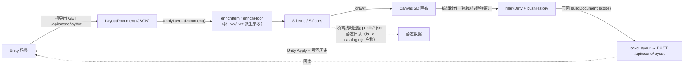

# 03 · 前端 layout-editor

> 目录：`layout-editor/`（主体在 `web/`，Vite + TypeScript；配套 `scripts/` 资源工具链）
> 一句话定位：Overcooked2 关卡编辑器的 Web 前端——俯视图画布编排 + 关卡管理 + 菜谱清单 + 自定义菜谱工作台，由 Unity 桥（:8765）托管静态资源并提供 API。
> 返回 [00-架构总览.md](00-架构总览.md)

---

## 1. 目录结构

### 1.1 顶层

```
layout-editor/
├── README.md               # 总说明：使用流程、目录生成、API 速查（18KB，维护者必读）
├── UPDATE_LOG.md           # 版本更新日志（/changelog 页面数据源，构建时拷入 public/）
├── plan_20260816.md        # web 端功能适配待办盘点
├── 菜单列表.md             # 194 个菜谱的静态清单（人工核对用）
├── docs/                   # 本文档目录
├── layout-editor/          # 误嵌套的残留目录（仅一个缓存文件，可忽略）
├── scripts/                # 资源目录生成/图标提取/关卡生成 工具链（见 §7）
└── web/                    # ★ 前端主体
```

### 1.2 web/

```
web/
├── index.html              # 主 SPA 入口（/layout /manage /dependencies /custom-recipes /guide /changelog 共用）
├── recipes.html            # 第二入口：菜谱清单页（/recipes）
├── package.json            # 依赖仅 three；dev: vite/typescript/@types/three
├── vite.config.ts          # 双入口构建 + SPA fallback 中间件 + /api 代理 → 127.0.0.1:8765
├── tsconfig.json           # ES2022 / strict / noEmit / bundler 解析
├── SKILL.md                # 开发规范（禁改 dist/、改 src 后必须 npm run build）
├── public/                 # 静态数据（构建时复制到 dist/，桥离线时的回退数据源）
│   ├── catalog.json + catalog/items.0~12.json    # 物件目录（小索引 + 13 分块）
│   ├── recipes.json + recipes/{core,custom,dlc02~11}.json
│   ├── ingredients.json / cooking-steps.json / counter-appearances.json
│   ├── floor-materials.json / switch-materials.json / bundle-manifest.json
│   ├── audio-catalog.json / audio-exports.json（回退）
│   ├── icons/{ingredients,recipes,catalog,steps}/   # 提取的 PNG 图标
│   ├── recipe-ui/          # 菜谱卡片背景图
│   ├── models/             # 3D 预览参考模型（预留）
│   ├── OC2LevelRuntimeLoader.dll   # 随关卡包分发的加载器（手动与 BepInExPlugins 构建产物同步）
│   └── UPDATE_LOG.md
├── dist/                   # 构建产物（已提交 Git，供无 Node 环境使用；禁手改）
└── src/                    # TypeScript 源码（见 §4）
```

---

## 2. 技术栈

| 维度 | 选型 |
|---|---|
| 框架 | **无框架**（原生 DOM + innerHTML 模板字符串）；页面视图 = `render*View(app)` 函数 |
| 语言 | TypeScript 5.6（strict、noUnusedLocals、noEmit——转译交给 Vite） |
| 构建 | Vite 5 双入口；自定义 `spaFallback` 中间件镜像 Unity 侧 `TryServeStatic` 行为；`define` 注入 `__APP_BUILD_TIME__` |
| 3D | three.js 0.185（唯一运行时依赖，仅自定义菜谱 3D 模型预览；画布是 Canvas 2D） |
| 状态 | 单例可变状态对象 `S`（`editor/state.ts`），下划线前缀运行时派生字段 |
| 撤销 | 自写 `HistoryStack<T>`（限 20 步快照） |
| 部署 | 静态 dist/ 提交 Git，由 Unity 内嵌 HTTP 服务器（8765）伺服；开发时 Vite 5173 + `/api` 代理 |

**启动与路由**：`index.html` 内联脚本规范化 URL → `editor/dom.ts` 解析路由标记 → `main.ts` 按标记懒加载页面视图或走编辑器 `init()`。**页面切换 = 整页跳转**（`location.assign`），仅 `/guide/:page` 用 history API。7 个页面：`/layout`、`/manage`、`/dependencies`、`/custom-recipes`、`/custom-recipes/burger-maker`、`/recipes`（独立 HTML）、`/guide/:id`、`/changelog`。

**数据流**：



---

## 3. 编辑器（/layout）五大块

1. **DOM 模板**（`editor/dom.ts`）：`buildLayoutDom()` 一次性注入顶栏 + 双排工具栏 + 左调色板 + 中画布 + 右侧面板（物品清单/动画控制/按钮事件组三 Tab）。
2. **全局状态**（`editor/state.ts`）：单例 `S`（150+ 字段）；常量 `CELL=1.2`（米/格）、`PX_PER_UNIT=48`、`FOOTPRINT_BY_ID`（**三处镜像**之一）。
3. **画布渲染**（`render.ts` → `renderItems.ts`/`renderFloors.ts`）：`draw()` 按层绘制网格/物品/地板/接缝/可行走/击杀面/连线/相机视锥；支持鬼影、框选。
4. **调色板/属性面板**：`palette.ts` + `floorPalette.ts` + `panels.ts` + `ui/detailPanel.ts` + `ui/contextMenu.ts`。
5. **场景 IO**：`sceneIO.ts`（loadScene/saveToUnity/写回历史恢复/桥看门狗）+ `serialize.ts`（buildDocument 按作用域组装，含大量写回前修正）。

---

## 4. 逐文件详细说明

### 4.1 src/ 根级文件

| 文件 | 职责与关键导出 |
|---|---|
| **main.ts** | 应用入口薄壳：版本徽标、重绘钩子、按路由标记懒加载页面视图或 `init()` |
| **route.ts** | URL 规范化（旧 hash 迁移）、`parseRoute`、`pathFor`、`navigateTo` |
| **nav.ts** | 顶栏导航 HTML（`navHtml/wireNav`）+ 关卡集/关卡下拉 + GitHub 弹窗 |
| **version.ts** | `APP_VERSION` + 版本徽标 |
| **api.ts** | ★ 全部后端通信（1078 行）：60+ 个 `fetchXxx/saveXxx/createXxx`；`readApiJson`（返回 HTML → 抛「桥过期」）；分块加载静态 JSON；`bundleClosure` |
| **types.ts** | ★ 全部数据模型（1406 行）：约 120 个接口（见 §6） |
| **style.css / recipeList.css** | 全站样式（135KB）/ 菜谱卡片专用 |
| **levels.ts** | ★ 关卡管理页（2574 行）：关卡集/关卡列表、配置弹窗（基础/1P-4P 分数/截图）、音频弹窗（BGM/氛围/音效集/死亡特效）、汇总页 + PNG 导出、工具历史弹窗（修复/依赖检查/测试布局/同步布局/写回历史 diff 恢复） |
| **dependencies.ts** | 依赖管理页：两级列表、`BundleAnalysis` 展示（缺失红/未用黄）、手动编辑 dependencies、依赖闭包 |
| **customRecipes.ts** | 自定义菜谱管理页（1963 行）：卡片 + 分类侧栏、新建/编辑表单（组成多选/烹饪/装盘/图标/FBX+MTL+贴图上传/cm 校准/3D 预览）、分类管理 |
| **burgerMaker.ts** | 汉堡组装工作台：层层堆叠夹心（面包+候选层），调 `/api/burger/create` |
| **recipeList.ts** | /recipes 入口：全量菜谱分组陈列、筛选、双视图、PNG 长图导出 |
| **recipeCard.ts** | 菜谱卡片共享 UI：`computeCardGroups`（优先后端 cookingGroups，回退前端镜像推导） |
| **recipeGroups.ts** | 烹饪分组算法前端镜像（**三处镜像**之一）：`deriveCookingGroups/deriveCompositionGroups/STEP_UTENSILS` |
| **recipeCardCustom.ts** | 自定义菜谱卡片归一化 |
| **recipeTypes.ts** | 菜谱类型中文名与排序（`RECIPE_TYPE_ZH`） |
| **ingredientLabels.ts** | 食材来源分组徽标、可见性过滤、食材分类 |
| **autoScore.ts** | 自动评分：官方 448 星级数据点拟合（单菜耗时=食材数×9.2s+步骤×10.6s+5.1s；人数效率 1.0/1.65/2.3/2.6；星级比例 0.26/0.58/0.91/1.43） |
| **summaryExport.ts** | 汇总页 PNG 导出：纯 SVG 组合（避免 foreignObject 污染 canvas） |
| **levelShotExport.ts** | 关卡集截图长图导出 |
| **modals.ts** | 通用弹窗框架 + 领域选择器（食材单选/多选、FoodSpawner、随机食材箱、菜谱选择器） |
| **busy.ts** | 全局忙碌遮罩（引用计数 + withBusy） |
| **envStatus.ts** | 启动环境自检（`/api/env/status`）缓存 |
| **changelog.ts** | /changelog 页：解析 UPDATE_LOG.md 渲染时间轴 |
| **guide.ts** | /guide 页装配：侧栏+正文+搜索+pushState 翻页 |
| **history.ts** | 泛型撤销栈（undo/redo 双栈，限 20） |
| **snap.ts** | 吸附数学：footprint 边缘贴格、中心 pivot 半格奇偶格吸附 |
| **stacking.ts** | 锅具叠放规则：hostRule 匹配、盘→桌 Y≈1、锅→灶 Y≈0.6；`drawLayerForItem` |
| **raft.ts** | 木筏官方双格点拼板算法：主格 + 半格对角偏移次格点 |
| **floorColors.ts** | 地表配色、背景主题表 `BG_THEMES`、主题→水面/背景 prefab 映射、死亡类型↔主题推断 |
| **floorMaterialLabels.ts** | 地板材质中文显示名 |
| **displayLabels.ts** | 装饰物目录名兜底中文名表 |
| **itemColors.ts** | 俯视图物品配色 + 透明叠放物/实色载体判定 |
| **modelPreview.ts** | three.js 3D 预览弹窗（1042 行）：FBX/OBJ+MTL、OrbitControls、参考标的物、虚拟包围盒、自动适配目标尺寸（盘 85cm/杯 37cm） |
| **modelUnits.ts** | 模型单位体系（1 单位=1m=100cm）与足迹/缩放换算 |
| **fbxTextureRename.ts** | 浏览器端二进制 FBX 贴图引用改名（+endOffset/propListLen 修正） |
| **mtlTextureRename.ts** | OBJ/MTL 贴图引用改名 + OBJ 补 mtllib 声明 |

### 4.2 src/editor/（关卡编辑器核心）

**骨架与状态**

| 文件 | 职责 |
|---|---|
| **dom.ts** | 路由标记计算；layout 页完整 DOM 模板；`dom` 11 元素引用 |
| **state.ts** | 状态单例 `S`；`EditorItem/EditorFloor`；`EditorSnapshot`；`CELL`、`AIR_WALL_BASE_Y=1.132`、`FOOTPRINT_BY_ID`（100+ 条） |
| **init.ts** | `init()`：健康检查→加载目录→构建调色板→绑定工具栏→setupCanvas→加载场景→桥看门狗；`setLayer()` |
| **status.ts** | 状态栏文案 |

**坐标与渲染**

| 文件 | 职责 |
|---|---|
| **coords.ts** | 世界↔画布换算、`COORD_ORIGIN_OFFSET {3.5,-1.5}`、吸附摆放、footprint 解析、火锅大锅换算、uuid/escHtml |
| **render.ts** | `draw()` 总入口：网格/坐标轴/按层绘制/框选/动画覆盖/相机视锥；`computeLevelBounds` |
| **renderItems.ts** | 单物品绘制（footprint 矩形+图标+徽标）、绘制排序、`hitTestAll`、缩放手柄、传送门/开关/终端连线 |
| **renderFloors.ts** | 地板绘制（材质色/主题/贴图平铺/图片/着色/空气地板）、接缝、可行走区、击杀面、命中测试 |
| **labels.ts** | 画布文字/图标标签工具（换行、食材箱食材图） |
| **iconCaches.ts** | 图片缓存（异步加载回调重绘）；`loadQuestionMarks` 拉 `/api/catalog/questionmarks` |

**交互**

| 文件 | 职责 |
|---|---|
| **input.ts** | 画布全部鼠标/键盘交互（1458 行）：拖放、点选/框选、重叠候选、平移缩放、移动/缩放、右键菜单、快捷键（含输入框焦点守卫）、动画层拾取 |
| **selection.ts / selectionTransform.ts / selectionHeight.ts / selectionAirWallHeight.ts / selectionTravelator.ts** | 选区读写 / 批量旋转/随机旋转/聚散/微移 / 高度调整 / 空气墙高度 / 传送带速度 |
| **clipboard.ts** | 复制/裁切/粘贴（网格对齐增量、批次轮转避让、地板连带 surface 物品） |
| **historyOps.ts** | undo/redo 与脏标记（快照含动画/联动/相机/灯光） |

**领域逻辑**

| 文件 | 职责 |
|---|---|
| **catalog.ts** | 目录查询中枢：物品分层（layoutTier/surfaceTier/theme）、背景水面判定、柜台外观候选、食材 id↔guid↔名称 |
| **items.ts** | 物品领域（802 行）：`enrichItem`、吸附移动、旋转/删除、玩家/工作台碰撞检测、空气墙、`addFromCatalog`（含 stack 吸附/组合/stub 初始化） |
| **floors.ts** | 地板领域（716 行）：`finalizeFloor`、材质名匹配修复、**载入合并**（木筏拼板→地板矩形、主题地板物品→地板对象）、`syncBackgroundForTheme` |
| **floorHeight.ts** | 行走面高度约定（镜像后端 FloorWalkY）：`floorWalkY`、高度分层索引、`floorHeightAt` |
| **floorPalette.ts** | 地板/背景层调色板 + 画布底部地板信息条 |
| **floorEditorModal.ts** | 地板详情弹窗（750 行）：尺寸/材质/着色/图片地板（tile/stretch/warp）/平铺/主题信息 |
| **palette.ts** | 调色板构建：分组、搜索、双击武装 N 连放、变体家族归并卡片 |
| **combos.ts** | 联合组合定义（一次放置多物品+自动联动）：饮料机/酱料机/断头台/传送门成对/热源+石炉 |
| **itemVariants.ts** | DLC 换肤变体表：调色板只显示基础版，右键切换变体 |
| **stubControls.ts** | Stub 参数中枢（1311 行）：`STUB_KIND_BY_PREFAB_ID`、锅具计时、柜台外观/开关材质选择、`wireStubControls` |
| **stubRefs.ts** | 物品间 stub 绑定引用的统一重映射与孤儿清理 |
| **servingLinks.ts** | 上菜台↔回收台（盘/杯/马克杯/餐盘四类）1 对多绑定 |
| **buttonLinks.ts** | 按钮 ↔ 动画组联动（顺序/锁定/共轭对）、孤儿清理 |
| **buttonEvents.ts** | 按钮 → 事件组顺序广播 |
| **recipeKnowledge.ts** | 菜谱→道具需求（前端侧）：餐洗链、奶油喷罐/汽水机/饮料机需求判定、中间产物自动分配 |
| **cameraLight.ts** | 相机/灯光弹窗（背景色 + FOV 即时反映） |
| **testLayout.ts** | 测试布局一键生成（30×16 地板 + 全部食材箱/核心道具/菜谱） |

**序列化与场景 IO**

| 文件 | 职责 |
|---|---|
| **serialize.ts** | 写回序列化：`serializeItemForDoc`（剥离编辑器字段、stubKind 补全、食材装饰迁移）、`buildRaftItemsForDoc/buildThemedItemsForDoc`、`buildDocument(scope)`（items/decor/floors 作用域裁剪） |
| **sceneIO.ts** | 场景生命周期（681 行）：`loadScene→applyLayoutDocument`（过滤/去重/主题推断）、`saveToUnity`（**三重前置校验**：玩家碰撞/工作台重叠/同位堆叠 → 作用域写回 → 死亡主题/击杀面 → 重载）、`restoreWriteBackSnapshot`、`syncLayoutFromScene`、`startBridgeWatch`（3s 轮询 3 连败弹窗） |

**动画层**

| 文件 | 职责 |
|---|---|
| **animControl.ts** | ★ 动画组编辑器（3748 行，最大模块）：组/成员/路径点数据、时间轴模型（startTime 并行 + 旧 delay 迁移）、事件类型（move/wait/lift/drop/rotate/shake/flash）、前端预览模拟（play/scrub/step）、画布覆盖层、右侧面板 |
| **builtinAnimDecor.ts** | prefab 内嵌环境动画装饰知识表（蝴蝶/灯笼/水车等） |
| **npcAnimations.ts** | 自带动画 NPC 知识表（服务生/月亮 NPC/面包人） |

**面板与 UI**

| 文件 | 职责 |
|---|---|
| **panels.ts** | 右侧面板：物品清单（分组/点击定位）、Tab 切换、面板宽度拖拽与折叠（localStorage） |
| **ui/detailPanel.ts** | 物品点击浮动详情卡：stub 参数区 + 变体切换 + 联动摘要 |
| **ui/contextMenu.ts** | 右键菜单（661 行）：微移/旋转/删除/批量高度/变体/动画控制/路径点/参数项 |
| **ui/overlay.ts / ui/pickTip.ts / ui/pickOverlap.ts** | 浮层隐藏 / 通用候选选择 / 重叠候选封装 |
| **ui/recipesDialogs.ts** | 菜谱管理大弹窗（1533 行，五 Tab）：select/selected/autofill（按菜谱自动补道具）/optional（含无效条目检测：重复注册/自定义菜谱残留 → 警告条 + 🧹 一键清理）/matchlist |
| **ui/utensilManager.ts** | 锅具管理弹窗：按菜谱自动装填 allowedIngredientGuids、一键同步 |
| **ui/screenshotModal.ts** | 关卡截图：预览/选图/画布拖拽裁剪/JPEG 压缩/base64 上传 |
| **ui/depsCheck.ts** | 依赖状态检查弹窗（读 envStatus 逐项展示） |
| **ui/constants.ts** | 燃烧器火焰模式、传送门颜色名 |

### 4.3 src/guide/（功能说明页）

| 文件 | 职责 |
|---|---|
| **types.ts** | `GuideBlock`（paragraph/steps/bullets/callout/table…）与 `GuideNode` 树 |
| **content.ts** | ★ 全部文档内容（1188 行）：9 章 GUIDE_TREE（总览/快速上手/顶栏/关卡编辑器/关卡管理/自定义菜谱/菜谱清单/食材图标/环境依赖） |
| **render.ts** | 页面渲染：侧栏、正文、全文搜索、事件绑定 |
| **icons.ts** | 图例动态块：代表食材/菜谱/锅具图标样例 |

---

## 5. 与后端通信清单

约定：全部 `fetch` 相对路径；`readApiJson` 统一解析（HTML → 桥过期错误）。**桥离线时目录类接口回退 `public/` 静态 JSON**（schemaVersion 对齐检查）。

### 5.1 编辑器核心（/layout）

| 方法 | URL | 说明 |
|---|---|---|
| GET | `/api/health` | 3s 轮询看门狗 |
| GET | `/api/level-sets` | 关卡场景清单 |
| GET | `/api/scene/layout?assetPath=` | LayoutDocument（items+floors+walkable+deathInfo+animControls+switchLinks+buttonLinks+buttonEvents+cameraInfo+lights） |
| POST | `/api/scene/layout?snap=&syncWalkable=&only=` | 写回（only=""/items/decor/floors 作用域）；返回 `{warnings}` |
| POST | `/api/scene/repair-broken?assetPath=` | 移除损坏实例 |
| GET | `/api/grid` | GridInfo |
| GET | `/api/catalog/floor-materials?levelSet=` / `ingredients` / `questionmarks` / `questionmarks/icon?guid=` | 目录 |
| GET/POST | `/api/level-recipes` | 关卡菜谱读写 |
| GET | `/api/level/optional-presets`；POST `/api/level/optional-items`、`/api/level/matchlists`、`/api/recipes/compute-burger-optionals` | 可选部件/匹配表 |
| POST | `/api/scene/death`、`/api/scene/killplane` | 死亡主题/击杀面 |
| POST | `/api/level/image-upload`；GET `/api/level/data-file?path=` | 图片地板 |
| GET | `/api/writeback/history`、`/detail`、`/doc?side=` | 写回历史（恢复到画布） |

### 5.2 关卡管理（/manage）

| 方法 | URL | 说明 |
|---|---|---|
| GET | `/api/sets`、`/api/sets/{set}/levels`、`/api/level?assetPath=` | 列表/详情 |
| POST | `/api/set/create / delete / info` | 关卡集 |
| POST | `/api/level/create / info / config / audio / delete / reorder / screenshot-upload` | 关卡 |
| GET | `/api/level/delete-preview?setName=&levelId=` | 删除预览 |
| POST | `/api/reload` | 触发 Reload Pseudo Assets |
| POST | `/api/set/export`；GET `/api/set/export/status`、`/download?setName=&fileName=` | 异步导出（轮询+下载） |
| GET/POST | `/api/set/stub/status?set=`、`/api/set/stub/copy`、`/api/set/stub/compile` | CustomStub |

### 5.3 音频 / 依赖

`GET /api/catalog/music | audio-directories | ambiences | death-effects`、`/api/audio/exports`、`/api/audio/stream?path=`、`/api/level/bundles?assetPath=`（BundleAnalysis）、`/api/icons/status`、`/api/env/status`

### 5.4 自定义菜谱 / 汉堡

`GET/POST /api/custom-recipes*`（config/list/references/create/update/delete/upload-icon/upload-model/model-files/diagnose/debug-scan/icon/category-*）、`GET /api/burger/definitions`、`POST /api/burger/create / definition/update`

### 5.5 静态数据（桥无关）

`/catalog.json`（+items.0~12 分块）、`/recipes.json`（+分组文件）、`/ingredients.json`、`/cooking-steps.json`、`/counter-appearances.json`、`/switch-materials.json`、`/bundle-manifest.json`、`/audio-exports.json`、`/UPDATE_LOG.md`、图标 `/icons/**`——均由 `scripts/build-catalog.mjs` 生成。

---

## 6. 数据模型（types.ts 摘要）

### 6.1 LayoutDocument

```
LayoutDocument {
  sceneAssetPath: string
  items: LayoutItem[]            // 物品（核心/装饰/surface 层）
  floors?: FloorObject[]         // 可编辑地板/背景平面
  walkable?: WalkableRect[]      // 只读可行走矩形（solid|ice）
  deathInfo?: DeathInfo          // water|goo|fall + 击杀面
  animControls?: AnimControlData // 动画组（旧键 moveControls 兼容）
  switchLinks?: SwitchLink[]     // 开关→机器
  buttonLinks?: ButtonLinkData   // 按钮→动画组
  buttonEvents?: ButtonEventData // 按钮→事件组
  cameraInfo?: CameraInfo|null   // 背景色+FOV
  lights?: LightInfo[]           // Art/Lights 非 prefab 灯光
}
```

### 6.2 LayoutItem（编辑态 EditorItem 附 _editorKey/_wx/_wz）

核心字段：`instanceId`（`u:xxx` 场景既有 / `new:xxx` 前端新建）、`hierarchyPath/parentPath`、`prefabGuid/prefabAssetPath`、`localPosition/localRotation XYZ/localScale`、`footprint{cellsX,cellsZ}`、`walkable`、`stubKind`。

**Stub 多态**（按类型挂一个可选参数对象，对应 Unity 侧组件）：`dispenser`（含随机箱 randomItemGuids+weights+问号样式）、`foodSpawner`、`conveyor`、`teleportal`、`cookingUtensil`（容量+allowedIngredientGuids+cook/burn/mix/overMixTime）、`travelator`、`flamethrower`、`cleanPlateStack`、`burner`、`player`、`servingStation`、`plateReturn`、`switchStub/pressureSwitch`、`terminal`、`heatedOven`、`cannon`、`timedSwitch`、`meshWithMaterial/soArray`、`airWall`（1×1×1.132m）。

### 6.3 FloorObject

`surfaceKind`（solid/raft/ice/snow/sand/alien/walkway/carpet/background…）、`meshType`（plane|quad|prefab）、材质 guid/名、格数、主题地板 `prefabScale*`、`tintColor/tintEnabled`、图片地板 `imageTexturePath/imageMode(tile|stretch|warp)/imageOpacity/imageRotation`、`materialTilingW/D`、`airFloor`。

### 6.4 动画组 AnimGroup（时间轴模型）

组 → 成员（item/floor/object InstanceIds + memberOffsets 平行轨道相位 + memberStatic）→ `waypoints[]`（世界 XZ + 停留/段时长）→ `events[]`（move/wait/lift/drop/rotate/shake/flash；`startTime` 绝对时间轴，重叠即并行烘焙为组合 clip；move 挂 waypointIds + loop/pingpong）。整组可循环 + 外部触发器（start/cancel/end/finishedTrigger）。写回时由 Unity 烘焙为原生 Animator。

### 6.5 菜谱/食材/订单

- `RecipeEntry`：guid/id/中英名/cookingStep/platingStep/`ingredients[]`/`compositionIds[]`/`cookingGroups[]`（`{step, utensils[], ingredients[]}`）/score/type/intermediate/mixing/isCustom/group。
- `IngredientEntry`：guid/id/中英名/group/`nodeOnly`。
- `LevelRecipes`：一关绑定的 recipeGuids + optionalItems + matchlists；「订单」由菜谱集合 + PerPlayerConfig 决定，`autoScore.ts` 反推星级分建议。

### 6.6 关卡管理模型

`LevelSetInfo`、`LevelSummary/LevelDetail`（configs[4]、AudioConfig、dependencies）、`SetExportStatus`、`WriteBackHistory*`、`CustomRecipeSummary/Edit`（含模型变换与 Unity 实测包围盒）、`BurgerDefinition`。

### 6.7 目录 Catalog

`CatalogItem`：id/guid/assetPath/category/theme/中英名/defaultParent/footprint/`layoutTier`(core|decor|floor)/`surfaceTier`/`surfaceKind`/`stack{y,hostRule}`/height/icon/bundleName/`needsStub`。`byCategory` 前端运行时重建，`paletteGroups` 为调色板预分组。

---

## 7. layout-editor 顶层（web 之外）

### 7.1 文档

| 文件 | 内容 |
|---|---|
| README.md | 权威总说明：日常使用、五层操作、维护者流程（build-catalog → npm build）、资源 JSON 一览、API 速查、Mac 开发+Windows 虚拟机代理工作流 |
| UPDATE_LOG.md | 版本日志（/changelog 数据源） |
| plan_20260816.md | 适配待办盘点 + 铁律（只能改 layout-editor/、Assets/Editor/LayoutEditor/、Assets/common_w/；C# 兼容 Unity 2017/.NET 3.5/C# 6） |
| 菜单列表.md | 194 菜谱静态参考表 |
| web/SKILL.md | 开发规范：禁改 dist/、改 src 必须 npm run build、public JSON 同步规则 |

### 7.2 scripts/ 工具链（Node .mjs + Python .py）

**核心生成器**
- `build-catalog.mjs`（2462 行）：★ 单入口扫描 `Assets/common01/02` 生成全部 public JSON；`SCHEMA_VERSION=5`；FOOTPRINT_OVERRIDES / NEEDS_STUB_PREFAB_IDS（**三处镜像**之一）
- `scaffold-dictionary.mjs`：为新 ID 生成草稿翻译

**图标提取（Python + UnityPy）**：`extract-icons.py`（三级优先：自动匹配 → ingredient-icons.json → icon-overrides.json）、`dump-all-sprites.py`、`dump-bundle-all.py`

**数据维护**：`extract-recipes.py`、`update-recipe-knowledge.py`、`migrate-burger-recipes.mjs`、`recipe-visual-resolve.mjs`、`extract_floor_materials.py`、`translate_floor_materials.py`、`extract-audio-usage.mjs`、`import-dlc-content.mjs`、`stat-matchlist-mapping.mjs`、`gen-decor-entries.py`、`repair-commonw1-pseudo-so.mjs`、`gen-commonw1-prefabs.mjs`、`gen-commonw1-decor.mjs`；`scripts/data/` 下 18 个共享 JSON

**关卡生成器（一次性）**：`gen-jia-level1_2~1_5-layout`、`gen-jia-carnival-base`、`gen-testice-layout` 等

**oc2-import/（原版关卡逆向导入）**：`scan-levels.py`（→ out/levels.json）、`gen-level-assets.py`/`gen-scenes.py`、`probe-mapping.py`/`verify-scenes.py`、`.cache/` path_id→container 映射缓存

---

## 8. 关键横切设计要点

1. **三处镜像算法**：菜谱分组、占格表、schemaVersion——修改必须三处同步（见 [00 §5](00-架构总览.md)）。
2. **instanceId 约定**：`u:`/`new:` 前缀；删除物品后需 `stubRefs.remapAllInstanceRefs` + `cleanOrphaned*` 清洗。
3. **作用域写回**：`only=items|decor|floors` 只携带对应层；动画/联动/相机/灯光仅全量保存携带。
4. **写回前置校验闭环**：玩家碰撞 → 工作台重叠（可放行）→ 同 guid 同 XYZ 堆叠阻断（Y 必须比较）。
5. **离线韧性**：动态 API 优先 → 静态 JSON 回退；桥看门狗 3 连败弹窗。
6. **两层 undo**：画布 HistoryStack（20 步）与 Unity 侧写回历史（15 条完整文档快照，可恢复到画布）。
