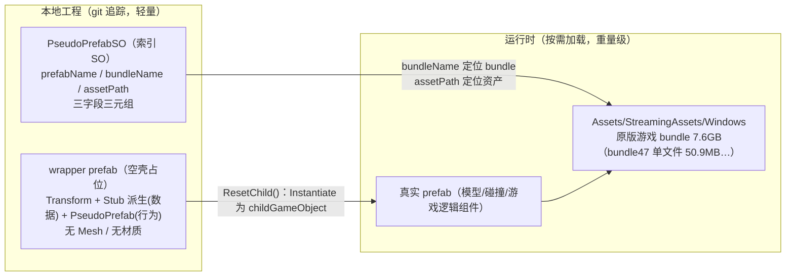
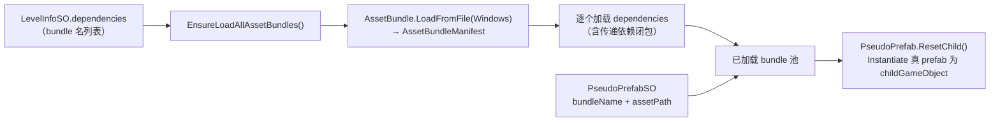

# 04 · 素材库 Assets/common 系列

> 目录：`Assets/common`、`common01`、`common02`、`common03`、`commonW1`、`commonW2`
> 一句话定位：编辑器的**游戏底层素材依赖层**——本地只放轻量"索引 SO + 空壳 wrapper prefab"，真实美术资源运行时从 7.6GB 原版游戏 bundle 加载；编辑器自制内容经 `Assets/AssetBundles/` 打包分发。
> 返回 [00-架构总览.md](00-架构总览.md)。本文所有 YAML/代码片段均为**文件原文摘录**，guid 均已对账验证。

---

## 1. 总体架构：pseudo + 原版包双层



### 1.1 PseudoPrefabSO：三字段索引（体系的核心）

脚本本体 `Assets/Scripts/LevelEditorStub/PseudoPrefabSO.cs` 全文仅 26 行：

```csharp
public class PseudoPrefabSO : ScriptableObject {
    [SerializeField] public string prefabName;
    [SerializeField] public string bundleName;
    [SerializeField] public string assetPath;

    private void OnValidate()
    {
        assetPath = assetPath.Trim('"').Replace("\\", "/");
        string prefix = @"E:/dev/test/ReversedGame/ExportedProject/";
        if (assetPath.StartsWith(prefix, System.StringComparison.OrdinalIgnoreCase))
            assetPath = assetPath.Substring(prefix.Length);
    }
}
```

| 字段 | 用途 | 消费方 |
|---|---|---|
| `prefabName` | 实例化后子物体命名 + 目录/画布显示名 | `PseudoPrefab.ResetChild()`（`Assets/Scripts/LevelEditor/PseudoPrefab.cs:41`） |
| `bundleName` | 原版包字典键 | `PseudoPrefabManager.GetAssetBundle()` |
| `assetPath` | 包内资产路径 | `bundle.LoadAsset(assetPath)` |

两个关键物证：
- **`OnValidate` 硬编码剥离 `E:/dev/test/ReversedGame/ExportedProject/` 前缀**——整套 SO 是作者直接在 AssetRipper 导出工程上批量制作的直接证据（这也解释了存量文件里遗留的 Windows 反斜杠）。
- **名实分离是合法的**：`PlayerSO.prefabName: player` 但 `assetPath: .../MultiplayerAvatar.prefab`——prefabName 不可从 assetPath 反推，`LayoutEditorCatalogApi.IngredientCatalogId`（:77-91）为此专门写了一套 canonical id 规则。

派生类：`PseudoPrefabSORecipe`（仅加 `public int score`，菜谱 SO 用）；`PseudoPrefabSOArray`（组件，挂 SO 数组，用于随机箱候选/换肤/多原料机器）。

### 1.2 wrapper prefab：三组件空壳

以 `Assets/common01/prefabs/counters/Bin.prefab`（67 行）为例，完整结构：

```yaml
--- !u!1 &1554132891853676
GameObject:
  m_Name: Bin
  m_Component:
  - component: {fileID: 4341917854781290}        # Transform (0,0,0) 无旋转
  - component: {fileID: 114096038827637246}      # PseudoPrefabStub（数据）
  - component: {fileID: 114967938430519454}      # LevelEditor.PseudoPrefab（行为）
--- !u!114 &114096038827637246
MonoBehaviour:
  m_Script: {fileID: 11500000, guid: 0f66cc8b36034eb4c8eec31e1994e471, type: 3}  # PseudoPrefabStub
  pseudoPrefabSO: {fileID: 11400000, guid: 8cb0c2b73ce3c284aada830bf2d4cf6a, type: 2}  # → BinSO.asset
--- !u!114 &114967938430519454
MonoBehaviour:
  m_Script: {fileID: 11500000, guid: d58b99f9c4313714e9c4b11f1534ae6f, type: 3}  # PseudoPrefab
  childGameObject: {fileID: 0}
```

要点：
- wrapper = **空 GameObject + Stub 派生组件（数据）+ PseudoPrefab 派生组件（行为）**，无 Mesh/材质。真实模型、碰撞、游戏逻辑全在原版 bundle 的真 prefab 上，`ResetChild()` 时 `Instantiate` 成 `childGameObject`。
- **复用的内部 fileID**：抽查 27 个 wrapper，`m_RootGameObject` 只有两个值——`1554132891853676`（18 个）与 `1382526047942262`（9 个）。即全部 wrapper 是从**两个种子模板**批量复制出的（配合 §9.1 的 BatchCreatePseudoPrefab 菜单）。
- **Y 位置约定**：476 个 wrapper 中仅 28 个 `m_LocalPosition` 非零（`AttachingFoodSpawner` 与两个气闸门 `y: 0.5` 挂点抬半格；`Sky.prefab` 等美术件带绝对坐标）。占位体永远在格点，子物体由 `EditorGridSnap` 吸附。

`Stub` 基类一行注释道破这套体系的契约（`Assets/Scripts/LevelEditorStub/Stub.cs`）：

```csharp
public class Stub : MonoBehaviour
{
    // for BepInEx plugin to find all istub and add the actual functional class
}
```

即 Stub 是**数据宿主标记**：编辑器侧由 `PseudoPrefab`（ExecuteInEditMode）实例化真 prefab 做预览；真机侧由 BepInEx 插件链（OC2DIYLevel + OC2LevelRuntimeLoader）找到 Stub 补挂真实功能类。**几十 KB 的场景文件因此能驱动 GB 级内容**。

### 1.3 运行时加载机制

`Assets/Scripts/LevelEditor/PseudoPrefabManager.cs:429`：

```csharp
string path = Path.Combine(Application.streamingAssetsPath, "Windows/" + assetBundleName).Replace("\\", "/");
...
AssetBundle assetBundle = AssetBundle.LoadFromFile(path);
```

先加载 `Windows`（AssetBundleManifest），再按 `LevelInfoSO.dependencies` 递归拉依赖 bundle。**pseudo SO 的 bundleName/assetPath 全部指向这套原版包**——编辑器里所见即玩家机器上已有资源，自建包里不需要任何美术。

### 1.4 为什么这么设计（证据）

1. **体积**：原版包 936 项 7.6GB（git 忽略，tutorial 第 2 步让用户自己从游戏目录拷入）。若把 mesh/贴图拷进工程自建 bundle，等于重打包整个游戏。
2. **工作流**：作者直接在 AssetRipper 导出树上操作（OnValidate 前缀剥离是物证），SO 的 assetPath 就是从那里复制的。
3. **跟随上游**：原版包永远是"玩家机器上已有资源"，游戏更新/换版本时索引库不需要重做美术，只调三元组。
4. **代价**（数据清洗成本）：SO 必须精确命中 bundle 内实名——`assetPath` 是**协议字段**，大小写敏感（Unity `LoadAsset`），工程里为此付出大量白名单与自愈代码（§10）。

---

## 2. 六个目录的定位与差异

| 目录 | 定位 | bundle 标记 | 规模 |
|---|---|---|---|
| **common** | 最小公共引导包（自定义关卡会话底座，4 资产） | `common` | 772KB |
| **common01** | 原版本体代理库（+ 主线主题 + 早期 DLC；唯一含 Player/game_environment/animations） | `common01`（textures 子目录独立成 `common01_textures`） | 47MB / 523 prefab / 580 SO |
| **common02** | 季节 DLC 追加代理库（dlc02 沙滩、dlc05 露营为主；独有 RecipeMatchList/story_meals/大量音频索引） | `common02` | 9.3MB / 404 prefab / 638 SO |
| **common03** | 后期 DLC 大合集（**上游正式版只读镜像**，2026-09 对齐上游重构） | `common03`（仅根 meta） | 35MB / 1296 prefab / 1376 SO |
| **commonW1** | Web 版 + 编辑器自制**增量层**（火锅/问号/背景/材质/RandomDispenser/decor） | `commonW1`（五个顶层 meta 显式标记） | 24MB / 352 prefab / 241 SO / 309 mat |
| **commonW2** | Burger 大全共享库（纯自定义菜谱数据） | `commonW2` | 5.7MB / 69 配方 / 14 模型 prefab |

> 分工速记：**common01/02 = 原版一代代理**（category-first）；**common03 = 上游正式版镜像**；**commonW1 = 上游没有/已删的编辑器增量**（dlc-first）；**commonW2 = 纯数据包**。"镜像 vs 增量"的分离让同步上游变成机械操作（`b499bd15e` + `a66d607b5` 两个提交完成一次全量对齐）。

---

## 3. common/ —— 引导包逐文件

| 文件 | 内容（实测） |
|---|---|
| **DIYLevelGameSession.prefab** | 121 行；根物体 `GameSession`（tag=GameSession）+ 子物体 `GameProgress`，挂 3 个反编译脚本组件：`GameSession`（m_DLCId: -1、WorldMapScene: StartScreen）、`PersistentObject`、`GameProgress`（m_sceneDirectory → 同包 EmptySceneDirectory，**同包内闭环引用**）。给 OC2DIYLevel 模组建立自制关卡会话骨架 |
| **LevelConfigTemplateSO.asset** | 三元组：`prefabName: LevelConfigTemplate, bundleName: bundle47, assetPath: Assets\Resources\datafile\levelconfigs\overcooked_2\Sushi_1_3_4P.asset`——**借用原版寿司关 1-3 的 LevelConfig 当模板**；运行时 `LevelConfigSetup.SetupConfig()` 从 bundle47 拉出它再按 LevelInfoSO 逐字段覆写 |
| **EmptySceneDirectory.asset** | `SceneDirectoryData` 脚本（guid `4f694f25...`）、`Scenes: []`——空的"关卡列表容器"，运行时被 `SetupSceneDirectoryData()` 动态生成的目录替换（其中 `entry.LoadScreenOverride = levelInfo.screenshot`） |
| **diylevelcover.png** | 1008×664 RGBA，spriteMode: 1（Sprite），spritePixelsToUnits: 100——关卡集默认封面图，引用方为外部模组 |

`common.meta`：`assetBundleName: common`；四个文件 .meta 均为空（**继承文件夹**）。构建产物 `Assets/AssetBundles/common.manifest` 证实恰好 4 资产、`Dependencies: []`——**引导包零依赖，模组可最先加载它**，再按 LevelInfoSO.dependencies 拉关卡所需包，启动顺序完全单向。

> 发现：common01/game_environment/ 里还有**第二份** DIYLevelGameSession.prefab（与 common/ 那份 diff 仅 1 行 guid）——前者进 `common` 包（外部模组用），后者被 `CampaignGameEnvironment.prefab` 内部引用进 `common01` 包。同构资产在不同 bundle 边界各司其职。

---

## 4. common01/ —— 原版本体代理库

### 4.1 目录规模细分（实测非 .meta 计数）

| 二级目录 | 文件数 | 明细 |
|---|---|---|
| prefabs | **523** | counters 13、utensils 9、mechanisms 7、Player 1、art **493**（city_sushi 101、npc 91、space 53、raft 30、wizard 31、dlc03_christmas 29、air_balloon 29、graveyard 25、dlc07_horde 19、dlc08_circus 9、dlc09_wonderland 9、dlc02_beach 7、throne 6、foodtruck 4+models、dlc05_camping 2、mine 1） |
| pseudo_prefab_so | **580** | counters 47、utensils 10、mechanisms 29（Teleportal 17/Switch 6/Marker 3/Lift 3）、art 408、audio 29（music 11 + AudioDirectories 18）、game_environment 19、PlayerSO 1 |
| food | 140 | Ingredients 31、Recipes 35、CookingSteps 8、PlatingSteps 1、CustomRecipes 25 + models 40 文件 |
| animations | 17 | Camera(.controller/.anim/CameraShake/PullBackIntro)、Raft_Scrolling_BG、Space_Earth_Rotate、Balloon_Background 等 |
| game_environment | 12 | CampaignGameEnvironment.prefab、GameConfig、Main.mixer、DebugGameConfig、Bootstrap 配置、冰面物理材质、第二份 DIYLevelGameSession |
| textures | 30 | 天空盒面片（Sunny3/Winter ×6 面）、t_*_d/_n 主题贴图、LightSoftCookie |
| materials / post_processing | 5 / 10 | 4 skybox mat + physicMaterial；7 profile + 3 LUT |

**bundleName 分布**（.asset 字段统计，共 666 条）：`bundle47×336`（shared_kitchen 主厨房）> `bundle29×87` > `bundle18×63`（data 域）> `bundle210×25` > `bundle297×23`…共 39 个不同 bundle。

### 4.2 PseudoPrefabSO 真实样本（四种形态）

```yaml
# ① 小写路径派（后期手工补录批次）
# pseudo_prefab_so/counters/BinSO.asset
  prefabName: workstation_bin_01
  bundleName: bundle47
  assetPath: assets/prefabs/shared_kitchen/workstation_bin_01.prefab

# ② 反斜杠派（AssetRipper 拷贝遗留，629 条）
# pseudo_prefab_so/utensils/PotSO.asset
  prefabName: utensil_pot_01
  bundleName: bundle47
  assetPath: Assets\prefabs\utensils\utensil_pot_01.prefab

# ③ 名实分离（PlayerSO）
  prefabName: player
  bundleName: bundle47
  assetPath: assets/prefabs/MultiplayerAvatar.prefab

# ④ 直译派（art 装饰，与文件同名）
# pseudo_prefab_so/art/space/alien_floor_tile_01.asset
  prefabName: alien_floor_tile_01
  bundleName: bundle47
  assetPath: Assets\prefabs\themes\space\alien_floor_tile_01.prefab
```

**assetPath 三形态统计**（python 全量扫描）：common01 666 条 = 小写 `assets/` 37 条（全在 counters/game_environment/PlayerSO——后期手工补录）+ `Assets\` 反斜杠 629 条；common02 743 条 = 正斜杠 683 + 反斜杠 60。`OnValidate` 的归一化**从未对存量批量执行**，反斜杠原样留存——Unity `LoadAsset` 对分隔符宽容才没炸，但**大小写不宽容**（见 §5.2 matchlist 事故）。

### 4.3 wrapper 家族的增量字段

带额外数据字段的 wrapper（在 Bin 三组件基础上加 Stub 派生）：

**Dispenser.prefab（食材箱）**——多挂 `PseudoPrefabDispenserStub`：

```yaml
  m_Script: {fileID: 11500000, guid: 156b7334933469e49b4f74ff333f27cd, type: 3}
  pseudoPrefabSO: {fileID: 11400000, guid: 3085f7abbd164904dbf7ff588c076f4b, type: 2}   # Dispenser01SO
  spawnerItemPrefabSO: {fileID: 11400000, guid: 8a928e5055585f34c89f8535c40fea3f, type: 2}  # = TomatoSO！
```

运行时 `PseudoPrefabDispenser.Setup()`（`PseudoPrefabDispenser.cs:12-53`）用 `RecipeHelper.GetIngredientPrefabForOptional(spawnerItemPrefabSO)` 换掉真 prefab 的 `PickupItemSpawner.m_itemPrefab`，再手改 crate 材质 UV 显示食材图标——**原版 prefab 一个字节没改，个性化全靠 Setup() 反射+材质覆写**。

| wrapper | 额外 Stub | 额外字段 |
|---|---|---|
| Teleportal.prefab | PseudoPrefabTeleportalStub | materialSOs（9 色）+ pfxMaterialSOs（9）+ pfxColors（9 组 RGBA） |
| Player.prefab | PseudoPrefabPlayerStub + FollowPseudoPlayer | playerID: 11（=Player.Count 占位）；1-10 号玩家、5 刀/6 帽可见性枚举 |
| art 装饰 | 可选 SpecificPseudoPrefabTag | prefabTag 字符串 → `HandleSpecificPrefabs()` 的 60+ case 按名特判修补（关灯/雪色变灰/粒子参数——原版 prefab 按主机烘焙光照调过，编辑器全实时光照下必须打补丁） |

### 4.4 food SO 家族解剖

```yaml
# Ingredients/TomatoSO.asset（简单）
  prefabName: Tomato
  bundleName: bundle18
  assetPath: Assets\prefabs\ingredients\Tomato.prefab

# Ingredients/CarrotSO.asset（跨包！胡萝卜竟在 OC1 legacy 包）
  prefabName: Carrot
  bundleName: bundle21
  assetPath: Assets\downloadablecontent\overcooked_legacy\dlc2\dlc_assets\prefabs\Carrot.prefab

# Recipes/Burger_Cheese_SO.asset（PseudoPrefabSORecipe，多 score 字段）
  m_Script: {fileID: 11500000, guid: 753d9e70603f6a140b05f30f176ec2dd, type: 3}
  prefabName: Burger_Cheese
  bundleName: bundle18
  assetPath: Assets\data\orderdefinitions\recipeitems\burgers\BeefBurgerCheese.asset
  score: 60

# CookingSteps/Pot.asset 与 PlatingSteps/Plate.asset
# 注意：步骤 SO 指向的是原版 data 资产（recipedata/platingstepdata），不是 prefab
```

**CustomRecipes（编辑器原生菜谱，CustomRecipeSO）**——`CustomRecipes/Burger/Burger_Lettuce_SO.asset`：

```yaml
  compositionSOs:
  - {fileID: 11400000, guid: 81232e654b602714098c1a440b66ddd5, type: 2}  # ChoppedBunSO
  - {fileID: 11400000, guid: 45f00e942534da143a3e94855455b50b, type: 2}  # LettuceSO
  - {fileID: 11400000, guid: 4ec8a736936e7744c91d254705783c2c, type: 2}  # FriedMeat（嵌套 CustomRecipeSO！）
  cookingStepSO: {fileID: 0}
  platingStepSO: {fileID: 11400000, guid: 02b04fdf..., type: 2}         # Plate
  modelSO: {fileID: 11400000, guid: b65af1b8..., type: 2}               # CompositeBurgerSO（成品模型）
  icon: {fileID: 21300000, guid: 9d384704..., type: 3}
  recipeName: Burger_Lettuce
  uID: 9990100      # 自定义 ID 段（原版 uID 远小于此）
  score: 60
```

其中 `FriedMeat.asset` 是"中间产物"配方：`compositionSOs=[MeatSO]`、`cookingStepSO=FryingPan`、`score: 0`——**嵌套组合 + score=0 标记半成品**是自定义菜谱体系的两个基本手法。

### 4.5 game_environment/ 与 animations/ 的角色

- **game_environment/**（12 文件）是"关卡运行环境真身"（非 pseudo）：`CampaignGameEnvironment.prefab`（约 2200 行巨型容器：ObjectivesManager / RendererSceneSettings / ScalingHUDCanvas / AudioManager / Player_01~04 / QuadGridManager / KitchenLoaderManager / BootstrapManager / RecipeUI / RatManager / KillPlane 等）。其 BootstrapManager 硬引用 common01 版 DIYLevelGameSession.prefab。模板场景 `Assets/Template/s_template` 与各 LevelSets 场景引用它；`PseudoPrefabManager.SetAssetRef()` 运行时向其中管理器反射注入原版 bundle 资产。
- **animations/**（17 文件）：相机动画与主题滚动背景（Raft_Scrolling_BG、Space_Earth_Rotate、Balloon_Background_Wander），被场景相机 Animator 与 art 主题背景 prefab 引用。

### 4.6 bundle 打标与 common01_textures 独立成包

- `common01.meta` → `assetBundleName: common01`；子目录 .meta 均为空（继承）。
- **唯一覆盖者**：`common01/textures.meta` → `assetBundleName: common01_textures`。
- 构建产物证实两包并存（`Assets/AssetBundles/` 下 `common01` + `common01_textures` 及各自 .manifest；common01.manifest 收录 863+ 行资产）。
- **为什么独立**：这 30 张贴图（天空盒 + 主题地板 _d/_n + glow）是本工程 materials/（4 个 skybox mat）唯一依赖的本地纹理，与 pseudo 资产零引用关系。独立成包 = 体积/更新频率隔离（贴图重、改得少），关卡集可只依赖贴图包。**这是"按依赖方而非按资产类型划 bundle 边界"的实践**。
- 对照：common02 只有 2 张 pooltiles、无 materials 目录，未复制该模式（textures.meta 为空）。

---

## 5. common02/ —— 季节 DLC 追加库

### 5.1 与 common01 的结构差异

| 维度 | common01 | common02 |
|---|---|---|
| 顶层子目录 | 8 个 | 5 个（无 animations/materials，textures 仅 2 png） |
| prefabs/art | 16 主题横铺 | 只按 dlc02_beach(173) / dlc05_camping(192) / npc(24) 组织 |
| food | Ingredients/Recipes 平铺 | 下再分 dlc02/dlc05；多出 **RecipeMatchList/(11)、story_meals/(10)、CookingSteps/icons/(10)** |
| audio 索引 | music 11 + AudioDirectories 18 | music 39（+overcooked_legacy/ 6）+ AudioDirectories 33 |
| textures 打标 | 独立包 | 空（并入 common02） |

bundleName 分布：`bundle167×218`（dlc02 主体）、`bundle250×212`（dlc05）、`bundle163×118`、`bundle18×40`…两主题三包撑起 3/4。

### 5.2 RecipeMatchList/：assetPath 协议字段的大小写事故（重点案例）

`DLC02_RecipeMatchList.asset` 内容：

```yaml
  prefabName: DLC02_RecipeMatchList
  bundleName: bundle162
  assetPath: Assets/downloadablecontent/dlc02/dlc_assets/data/recipes/DLC02_RecipeMatchList.asset
```

**问题**：bundle 内实名是全小写 `dlc02_recipematchlist.asset`（dump manifest 证实），驼峰 assetPath 在大小写敏感的 `LoadAsset` 下会失败。`Docs/zh/matchlist-mapping.md:54-67` 对账结论：common02 这 11 个 **当前零引用、不建议直接启用**，已被 `commonW1/pseudo_prefab_so/core/matchlists/` 的全小写版取代：

```yaml
# commonW1/.../matchlists/dlc02_recipematchlist.asset（现役版）
  prefabName: dlc02_recipematchlist
  bundleName: bundle162
  assetPath: Assets/downloadablecontent/dlc02/dlc_assets/data/recipes/dlc02_recipematchlist.asset  # 与 bundle 实名逐字符一致 ✓
```

**启发**：pseudo 体系容许"平行的索引库"共存，切换成本仅是改引用 guid；assetPath 是协议字段，正确形态 = **与 bundle 内实名完全一致**（commonW1 全小写版是标准答案）。

### 5.3 story_meals/ 与 audio 组织

- **story_meals/**（10 个 Composite*.asset）：故事模式"组合餐"成品模型代理（堆叠好的立体餐品，上菜/订单 UI 用）。`CompositeBurger.asset` → `bundle47 Assets/prefabs/overcooked_legacy/meals/CompositeBurger.prefab`。也被 common01/commonW2 的 CustomRecipe 当 `modelSO` 复用（**跨库复用成品模型**）。
- **music/**（39+6 个）：DLC BGM 索引，样本 `music/DLC_02_Generic.asset` → `bundle158 ...dlc_02/music/DLC_02_Generic.wav`（LoadAsset 泛型版按 AudioClip 加载 .wav）。
- **AudioDirectories/**（33 个）：音频目录索引（Shared/UI/VO/Step/各 DLC/Rats…），填进 `LevelInfoSO.audioDirectorySOs`；`SetAssetRef()` 加载后还会把 Flamethrower 条目音量压半（`PseudoPrefabManager.cs:183-185`）。
- **ambiences 不是目录**：氛围音 = `LevelInfoSO.inLevelAmbiences: GameLoopingAudioTag[]`（187 个 tag 枚举，`LevelInfoSO.cs:51-188`），音源本体在 AudioDirectory 里。
- **animators/ 子目录**：8 个 AnimatorController 也走 pseudo（如 `DLC07_NPC_Float.asset → bundle289 ...dlc07_NPC_Float.controller`）——**controller 与 prefab/wav 一样可以被三元组索引**。

### 5.4 独有 prefabs 与 models

counters：Barbeque/Blender/Campfire/GlassReturn/SinkGlass；utensils：Bellows/BlenderCup/CleanGlassStack/Glass/GriddlePan/Skewer/ToastingFork/WaterGun；mechanisms：Backpack/Burner（火焰发射器，tutorial 明示"火焰发射器（common02）"）。`Recipes/dlc{02,05}/model_so/` 存中间模型索引（如 `model_prep_pancake_01 → bundle185`），供 `RecipeHelper.GetOrderToPrefabLookup` 的 modelSOs 数组用。

---

## 6. common03/ —— 后期 DLC 大合集（上游正式版镜像）

### 6.1 现状结构（对齐上游后）

```
common03/
├─ prefabs/
│   ├─ art/{dlc03_christmas, dlc04_chinatown, dlc07_horde, dlc08_circus,
│   │       dlc09_festivemashup, dlc10_lunar, dlc11_summer, dlc13_moonfestival}
│   ├─ counters/   （8 个，平铺）
│   ├─ mechanisms/ （18 个，含 Hotpot/、dlc08_cannon/ 子目录）
│   └─ utensils/   （8 个，平铺）
├─ pseudo_prefab_so/（镜像同构，1376 个）
├─ food/{Ingredients,Recipes}/{dlc03,dlc04,dlc07,dlc08,dlc11,dlc13}
│   ├─ CookingSteps/{HotPot,RoastingTray}.asset
│   └─ PlatingSteps/Mug.asset
├─ skybox/            （5 个主题天空盒材质族）
└─ post_processing/   （12 组 LUT profile + png）
```

**art 各 dlc prefab 计数**：dlc07_horde **409**（battlements/city/courtyard/dressing/keep/throne 六子区）> dlc09_festivemashup **312**（四主题换皮区）> dlc11_summer 166 > dlc08_circus 122 > dlc03_christmas 94 > dlc13_moonfestival 87 > dlc04_chinatown 69 > dlc10_lunar 3；加 counters/mechanisms/utensils 共 **1296**。

**重要历史**：文档与代码注释里曾描述的「`prefabs/{dlcXX|core}/{category}` 三段式」是**旧布局**。git 提交 `b499bd15e`（2026-09-02，"common03 aligned to upstream formal version"）删除了旧结构（prefabs/{core,dlcXX}、materials/textures、version.txt 等），并修复了 36 个被编辑器重导入污染的目录 .meta GUID。现状即「对齐上游正式版」的 `prefabs/{category}`（art 下按 dlc 主题）布局。编辑器用**一个正则同时兼容两代**：

```csharp
// Assets/Editor/LayoutEditor/LayoutEditorCatalogLookup.cs:159-166
// 兼容两代目录结构：prefabs/{category}/（common01/02）与
// prefabs/{dlcXX|core}/{category}/（common03 通用内容按 dlc 分目录）。
var cat = System.Text.RegularExpressions.Regex.Match(assetPath,
    @"/prefabs/(?:[^/]+/)?(counters|utensils|mechanisms)/");
```

### 6.2 典型 SO 样本

```yaml
# ① dlc 食材（assetPath 指向 orderdefinitions 数据资产，无 prefab！）
# food/Ingredients/dlc08/DLC08_Ketchup.asset
  prefabName: ketchup
  bundleName: bundle354
  assetPath: Assets/downloadablecontent/dlc08/dlc_assets/data/orderdefinitions/ingredients/ketchup.asset

# ② dlc 厨具（dlc04 火锅大汤勺；注意路径含空格 "shared kitchen"）
# pseudo_prefab_so/utensils/utensil_big_ol_spoon.asset
  prefabName: utensil_big_ol_spoon
  bundleName: bundle226
  assetPath: Assets/downloadablecontent/dlc04/dlc_assets/prefabs/shared kitchen/utensil_big_ol_spoon.prefab

# ③ dlc 菜谱（PseudoPrefabSORecipe）
# food/Recipes/dlc08/DLC08_Hotdog_Onions_Ketchup.asset
  prefabName: HotdogOnionsKetchup     # camelize 去 dlc 前缀后的展示名
  bundleName: bundle354
  assetPath: Assets/.../orderdefinitions/recipeitems/hotdog_onions_ketchup.asset
  score: 100                          # optional/permutation 前缀则为 0
```

"无 prefab 食材"（ketchup/mustard/orangesoda…）在生成脚本里有专门黑名单 `NO_PREFAB_INGREDIENTS`——这类食材只进菜谱树、不能从食材箱生成。

### 6.3 prefab ↔ SO 对应关系（非严格 1:1）

按同名文件比对：1296 prefab 中 **1263 有同名 SO**；35 个 prefab 无 SO（pfx/组合件如 `noripple_m_dlc3_icecliff_270.prefab`）；SO 侧多出 113 个无 prefab 的 asset（上游 dump 重复件如 `p_dlc07_keep_flagstone_01 (11).asset`）。另有 **40 个"外观皮肤 SO"**（CounterXXXSO/SinkXXXSO）**按设计只有 SO 没有 prefab**——因为换肤 = 换整只真 prefab（玩法组件随 prefab 保留），见 `import-dlc-content.mjs` 的 `emitCounterAppearances` 注释。

### 6.4 迁移历史证据（注释原文）

`LayoutEditorHttpServer.cs:541-543`：

```csharp
// 统一保存处理：common03 引用校验（历史 Import/custom_web
// 引用告警）+ 收集 doc 引用的游戏 bundle，供后续依赖注册。
// common03 资产直接引用、随 common03 bundle 打包，不再拷贝 custom_web。
```

`LayoutEditorCustomIngredients.cs:39-40`：`public const string CustomDirName = "custom_web"; // 旧 custom_web 拷贝目录名（机制已废弃，仅为兼容读取历史数据保留）`。生成脚本头部同样注明「输出（Assets/common03/，由 Assets/Editor/LayoutEditor/Import 迁移而来）」。**旧的"拷贝进关卡集"机制已废弃，改为直接引用 common03**。

---

## 7. commonW1/ —— Web 版 + 编辑器自制增量层

### 7.1 web/hotpot/ 火锅专区（6 个 prefab）

| 文件 | SO 指向 |
|---|---|
| `web_utensil_large_pot_01.prefab` | → **common03**/pseudo_prefab_so/mechanisms/utensil_large_pot_01.asset（原版大锅 bundle226） |
| `web_utensil_large_pot_01_pushable.prefab` | → commonW1 core/utensils/utensil_large_pot_01_pushable.asset（prefabName=pushable_object） |
| `web_utensil_dlc10_large_pot_01.prefab` / `web_cooking_region_floorburner.prefab` / `web_dlc10_cooking_region_floorburner.prefab` / `web_dlc10_pushable_object.prefab` | 各自对应 dlc10/地热灶 SO |

**烹饪锅组件结构**（四组件）：

```yaml
  m_Component:
  - component: {fileID: 4341917854781290}      # Transform
  - component: {fileID: 114266618352629990}    # PseudoPrefabCookingUtensilStub
  - component: {fileID: 6598243100175246001}   # BoxCollider（!u!65）
  - component: {fileID: 114214987726898516}    # PseudoPrefab
--- !u!65 &6598243100175246001
BoxCollider:
  m_Size: {x: 2, y: 0.8, z: 2}
  m_Center: {x: -0.6, y: 0.4, z: 0.6}
```

**可推动锅**（五组件）——`b499bd15e` 所说「PushablePot| tag + SOArray carrier（slot0=锅 SO）」的落地：

```yaml
--- !u!114 &1145139284002000001
  m_Script: {fileID: 11500000, guid: 2b19728b6d0dfe44baf2f80df9bfc1e9, type: 3}  # SpecificPseudoPrefabTag
  prefabTag: PushablePot|
--- !u!114 &1145139284002000002
  m_Script: {fileID: 11500000, guid: 0232b03a35f0cc74c8326feb4f5b79cb, type: 3}  # PseudoPrefabSOArray
  pseudoPrefabSOs:
  - {fileID: 11400000, guid: 8c4d090a2f936008374d00c5df134879, type: 2}          # slot0 = 原版大锅 SO
```

目录归组：`LayoutEditorCatalogLookup.cs:149-152` 把 `/prefabs/web/hotpot/` 强制归 `Design/Counters`、pushable 归 `Design/Utensils`。

### 7.2 question_mark/（12 款）与绑定链路

清单：`question_mark_{blue, brown, chef_hat, food, gray, green, orange, pink, purple, red, theme, yellow}.png`（全部随 commonw1 bundle 打包，manifest 实测收录）。绑定链路四步：

1. 组件字段（`CustomStub/RandomCrate/RandomCrate.cs:48-50`）：`[SerializeField] public Texture2D m_questionMarkTexture;`（为空时保留游戏绘制的首食材图标，自然降级）；
2. 写回时装载（`LayoutEditorStubIO.cs:1711-1731`）：常量 `RandomCrateQuestionTextureDir = "Assets/commonW1/question_mark"`，默认款 `question_mark_chef_hat.png`；DTO 的 questionMarkGuid 失效时回落默认；
3. HTTP 端点 `/api/catalog/questionmarks` 列出样式（`isDefault = name == "question_mark_chef_hat"`）；
4. 运行时 `PaintQuestionMark(child, tex)`——渲染器查找顺序**镜像游戏** `ClientItemCrateCosmeticDecisions`（盖子 Skinned → 盖子 Mesh → 根 Mesh 兜底），兼容新皮肤结构。

### 7.3 backgrounds/（8 主题 13 prefab）

数据源 `scripts/data/commonw1-backgrounds.json`（每项 id/theme/zh/en/cellsX/cellsZ/orientation）：city(1)/core(3)/dlc02(1)/dlc05(1)/dlc07(3)/dlc10(1)/dlc13(2)/raft(1)。这些是**内置网格占位体**（不依赖 FBX）：`city_water.prefab` 的 Mesh 是引擎内置 Quad（`fileID: 10210, guid: 0000...e000...`），rotation.x=90°、scale 0.72（= 6 格 × 1.2 / 10 平面单位）——由 `gen-commonw1-prefabs.mjs` 程序化生成。

### 7.4 core/counters/RandomDispenser.prefab 解剖（随机食材箱专属道具）

根 GameObject 挂 **5 个组件**：

```yaml
  m_Component:
  - component: {fileID: 4341917854781290}      # Transform
  - component: {fileID: 114609642817661240}    # PseudoPrefabDispenserStub（156b7334…）
  - component: {fileID: 114843371774752328}    # PseudoPrefabDispenser（编辑器宿主）
  - component: {fileID: 1145139284001000001}   # SpecificPseudoPrefabTag → prefabTag: RandomCrate|
  - component: {fileID: 1145139284001000002}   # PseudoPrefabSOArray → pseudoPrefabSOs: []
```

生成方法（`CustomStubCopyTool.cs:136-176`，域重载后自动调用，幂等）：

```csharp
/// <summary>RandomDispenser 包装 prefab（commonW1）：随机食材箱的专属道具类型。
/// 基于 Dispenser 包装复制，自带数据载体空壳（tag "RandomCrate|" + 空 soArray）——
/// web 目录/调色板按独立道具展示，apply 按实例填充随机配置。幂等。</summary>
if (!AssetDatabase.CopyAsset(BaseDispenserPrefabPath, RandomDispenserPrefabPath)) { … }
var tag = go.GetComponent<SpecificPseudoPrefabTag>() ?? go.AddComponent<SpecificPseudoPrefabTag>();
tag.prefabTag = "RandomCrate|";
var soArray = go.GetComponent<PseudoPrefabSOArray>() ?? go.AddComponent<PseudoPrefabSOArray>();
soArray.pseudoPrefabSOs = new PseudoPrefabSO[0];
```

**设计要点**：复制而非手写模板（保真继承 Dispenser 的 Stub/宿主组件），再补两个"数据载体"——即使关卡集 stub 程序集还没编译，`RandomCrate|` tag + SOArray 也能让 web 数据往返不丢。

### 7.5 pseudo_prefab_so/core/（含现役 matchlists）

- `core/counters/`：blender + 外观皮肤 SO（ServingStationBlueSlimSO 等，皮肤 SO 落在 W1）；`core/utensils/`：blender、pushable 大锅；`core/art/{legacy,npc}`；`core/decor/recipes`（30 个成品菜视觉 SO）。
- **matchlists/（11 个，现役版）**：`combineddlc/dlc02/.../dlc13_recipematchlist.asset`，全部与 bundle 实名逐字符一致（§5.2）。消费方是 `LevelInfoSO.includeRecipeMatchLists`，web 的「菜谱管理 Matchlist tab」（key 白名单 dlc02…dlc13/combineddlc）。

### 7.6 materials/（309 个）与 textures/（125 png）

命名规律（首 token 统计）：`mat_*` 255（原版材质名直迁）、`FloorTiles*` 36、`dlc11_mat_*` 6、DLC2_* 3、其余零星。`.mat` 模板与 `extract_floor_materials.py` 的 `MAT_TEMPLATE` 完全一致（Standard shader，`_DiffuseMap`/`_MainTex` 双绑同一贴图 guid）。

**确定性 guid 实测验证**（§9.2 算法）：

```
md5("common03:Assets/common03/materials/FloorTiles_Chequered.mat") = 320c6f3be62978934a321ee2e4f00ecf  ✓
md5("common03:Assets/common03/textures/FloorTiles_Kitchen_2x2.png") = cf242433…  ✓
```

注意哈希输入仍是**旧 common03 路径**——materials/textures 目录后来整体迁到 commonW1（`09bfc916b`），`.meta` 原样保留，guid 稳定不破坏引用。textures 中 `FloorTiles_*` 28 张（Crossing/Desert/Kitchen_2x2/Pavement 系列/PoshRestaurant/Rainbow 1-3/Road_YellowBox/SnowRoad…）。扫描入口：`LayoutEditorFloorMaterialsApi.cs:99`（LevelSets → common01/02 → commonW1/materials 顺序 fallback）。

### 7.7 dlcXX/ 与 common03 dlcXX 的分工

commonW1 的 dlcXX 是 **dlc-first** 两级结构（`dlcXX/{art,counters,decor/{food,recipes},mechanisms,utensils}`），独有 `decor/`：

- `decor/food/`、`decor/recipes/`：**食材/成品菜的摆放包装 prefab**，pseudoPrefabSO 直接引用 common01/02/03 已有 SO（不新建）。如 `dlc13/decor/food/dlc13_chocolate.prefab`；`core/decor/food/` 31 个本体食材包装。
- `dlc09/food`、`dlc11/food`：**上游 common03 已删、按需保留**的食材包装（`build-catalog.mjs:1211-1214` 注释："上游已删、按需保留的用户食材包装（dlc11_ketchup/mustard…）"）。
- 与迁移提交 `a66d607b5`（"migrate upstream-absent common03 assets to commonW1 (pushable pot, dlc10 hotpot, dlc09 cannon, blender, dlc08 map dressing)"）一一对应。

各 dlcXX prefab 数：dlc08 99 > dlc02 27 > dlc05 26 > dlc09 23 > dlc03/13 15 > dlc10/11 14 > dlc07 13 > dlc04 12（另 core 75、backgrounds 13、web 6）。

### 7.8 bundle 打标实测

五个顶层 meta（materials/textures/prefabs/pseudo_prefab_so/question_mark）+ 根 meta 均显式 `assetBundleName: commonW1`。**148 个 folder meta 中有 38 个嵌套目录为空值**（Unity 自行生成，如 prefabs/web.meta）——实测 commonw1.manifest 收录 1039 条资产，web/hotpot 6 prefab 与 question_mark png 均在包内：**bundle 归属由最近的标记了 commonW1 的祖先目录继承，空值不阻断**。脚本自建目录则必然带标记（`ensureCommonW1FolderMeta`，guid 走确定性 `md5("commonw1-folder:"+相对路径)`，已复算验证）。

---

## 8. commonW2/ —— Burger 大全共享库

### 8.1 全貌（69 配方 + 14 模型）

- **成品汉堡（score>0）约 40 个**：单料（Lettuce/Tomato/Cucumber/Pineapple/Chicken/Cheese 各 `XBurger`）、双料组合（`LettuceTomatoBurger` 等）、三料/四料、早餐系列（`Breakfast{Cheese,Lettuce,Meat,Onion}Burger`）、特色（`DoublePineappleBurger`（含 `_filler` 变体）、`Supreme`）。
- **中间产物（score=0）**：`Fried{Cheese,Chicken,CornPone,FishPone,Mushroom,Onion,Pepperoni,Pineapple,PotatoCake,Prawn,ShrimpPone}`、`Panfried{Beef,MeatEgg,MeatMushroom,MeatOnion,Mushroom,Onion}`、`Mixed{MeatEgg,MeatMushroom,MeatOnion}`、`EggSausage/BaconSausage/ChickenPatty` 等。
- **组装定义（CustomRecipeOptionalBurgerSO）5 个**：`OptionalBurger、VeggieBurgerAssembly、ChickenBurgerAssembly、MeatBurgerAssembly、PineappleMeatBurgerAssembly`。
- **models/ 14 prefab**：CucumberSlice、FriedBeefNew、FriedBeefPatty、FriedCheese、FriedChickenPatty、FriedCornCake、FriedFishCake、FriedPotatoCake、FriedSausage、FriedShrimpCake、PanfriedMushroom、PanfriedOnion、PineappleSlice、TomatoSlice（另 11 fbx、13 mat、12 视觉 SO）。icons/ 35 png（25 呆喵成品图标 + 10 张 `ui_*` 原版风格）。

### 8.2 配方 asset 全字段

`custom_recipes/burger/BreakfastCheeseBurger.asset`：

```yaml
--- !u!114 &11400000
MonoBehaviour:
  m_Script: {fileID: 11500000, guid: 83fb008bcc8e793429b02c178c430815, type: 3}   # CustomRecipeSO
  m_Name: BreakfastCheeseBurger
  type: 1                        # RecipeType: Null/Composite/Cooked/Mixed → 1=Composite
  recipeName: BreakfastCheeseBurger
  uID: 58321002                  # 58321 号段自增
  score: 120
  platingStepSO: {fileID: 11400000, guid: 02b04fdf…, type: 2}   # → common01 PlatingSteps/Plate
  modelSO:       {fileID: 11400000, guid: 7361adeс…, type: 2}   # → common02 story_meals/CompositeBurger（跨库引用！）
  icon:          {fileID: 21300000, guid: 52f7618a…, type: 3}   # → commonW2 icons/ui_cheeseburger_01.png
  compositionSOs:                                                # choppedbun + 三个煎料
  - {fileID: 11400000, guid: 81232e65…, type: 2}   # common01 ChoppedBunSO
  - …（省略 3 项）
  optionalSOs: []
  cookingStepSO: {fileID: 0}      # Composite 无烹饪步骤；Cooked 型此处指向 HotPot/RoastingTray
```

### 8.3 names.json 与 CustomRecipeConfig

两者位于 `Assets/commonW2/custom_recipes/`（burger/ 同级）。`names.json`（带 BOM 的 UTF-8，`schemaVersion:1`，69 项，id 与 asset 文件名一致）：

```json
{ "schemaVersion": 1, "names": [
  { "id": "BaconSausage",          "zh": "培根煎香肠",   "en": "Bacon Sausage" },
  { "id": "BreakfastCheeseBurger", "zh": "早餐芝士汉堡", "en": "Breakfast Cheese Burger" }, … ] }
```

`CustomRecipeConfig.asset`（同样在 `custom_recipes/` 层）：

```yaml
  uidPrefix: 58321        # uID = 58321*1000 + 序号
  nextSequence: 69        # 下一自增序号（新配方从 58321070 起）
  categories:
  - id: burger
    zh: "Burger\u5927\u5168"      # "Burger大全"（Unity YAML 非 ASCII 转义）
    en: Burger
  modelTransforms: []     # 每菜谱模型 scale/rotation 微调，避免改宿主类定义
```

编辑器接入：`LayoutEditorCustomIngredients.ReferencesCommonW2()` 深层判定（含 composition/model 引用）决定是否注册 commonW2 依赖；`CommonW2RecipesDir` 是所有关卡集可见的固定菜谱分类扫描根。

---

## 9. 生成脚本与 guid 纪律（"为什么这么写"的核心）

### 9.1 一代批量生成器：BatchCreatePseudoPrefab（编辑器菜单）

`Assets/Editor/BatchCreatePseudoPrefab.cs`：选中目标文件夹 → 弹系统对话框选"原资源文件夹"（AssetRipper 导出目录）→ 遍历 *.prefab/*.asset/*.mat，`AssetDatabase.CreateAsset` 生成 SO + `PrefabUtility.CreatePrefab` 生成 wrapper。这解释了 §1.2 的**双种子模板 fileID** 与 SO/prefab 一一同名镜像布局。

### 9.2 二代生成器：import-dlc-content.mjs（确定性 GUID）

**核心算法一行**（`layout-editor/scripts/import-dlc-content.mjs:92-94`）：

```js
function guid(prefix, id) {
  return crypto.createHash("md5").update(`${prefix}:${id}`).digest("hex");
}
```

前缀按资产类型分命名空间：`ing` / `recipe` / `step` / `pseudo` / `prefab` / `food-decor-prefab` / `recipe-decor-pseudo` / `recipe-decor-prefab` / `commonw1-folder`——**哈希前缀天然避免不同类资产撞 guid**。三例复算全部吻合：

```
md5("pseudo:workstation_furnace_01") = ac5e7a05abd79dd690305213db33374e = SO meta guid ✓
md5("prefab:workstation_furnace_01") = 503c206df980d89cf9c3f56535c138bb = prefab meta guid ✓
md5("recipe:hotdog_onions_ketchup")  = 7dc4ac104712f59b966d187718a7d4e5 = 菜谱 meta guid ✓
```

（注意第三例：文件后来改名 `DLC08_Hotdog_Onions_Ketchup.asset`，meta 随之保留——**guid 锚定 id 而非文件名，改名不换 guid**。）

**为何 .meta 必须确定性生成**（脚本头注释）："每个 .asset/.prefab 同时生成确定性 .meta（md5(id) 派生，重复运行内容不变）"。因为这是**库外脚本直接写文件**：若让 Unity 首次导入随机分配 guid，重跑/换机器/删库重导都会得到不同 guid，场景与 web 文档里的 guid 引用全体断链。确定性 guid = 可重放构建（reproducible build）。

**查表机制**：读 `dump_bundle/manifest.json` 建小写 container 索引，`prefabContainer(name, {dlc})` 按 basename 精确/前缀匹配（`dlc` 参数做跨 DLC 同名消歧）；食材查不到再过别名表 `INGREDIENT_PREFAB_FIX`（如 `"corn"→"dlc11_corn"`），仍不行且在 `NO_PREFAB_INGREDIENTS` 黑名单则指向 orderdefinitions 资产。

**模板注释**（为何装饰物不用 MeshWithMaterial 变体）：

```js
/** Placeholder prefab for placeable props (mirrors Assets/common02 Blender/Airbed templates).
 *  装饰物也统一用普通 PseudoPrefabStub + PseudoPrefab：宿主 PseudoPrefab.Setup() 为空操作，
 *  不会因 materialSO 为 null 抛空引用（MeshWithMaterial 变体的 Setup() 会
 *  LoadAsset<Material>(materialSO)，materialSO 为空 → NullReferenceException）。 */
```

入口按模式分发：`REPAIR_DECOR / FOOD_DECOR_ONLY / RECIPE_DECOR_ONLY / DECOR_ONLY / PROPS_ONLY / 全量`——**策划清单驱动**（INGREDIENTS/RECIPES/COOKING_STEPS/PROPS(80)/PROPS_2(44)/COUNTER_APPEARANCES 均为手工校对白名单），`alreadyImported()` 扫 common01/02 已有 SO 的 m_Name 去重跳过。

### 9.3 三种 guid 策略的分层（不是一刀切）

| 脚本 | guid 策略 | 适用原因 |
|---|---|---|
| import-dlc-content.mjs / extract_floor_materials.py | **确定性 md5(prefix:id / 路径)** | 资产需要跨工具、跨机器重建（删库重跑 guid 不变；丢失后可凭 id 重建替身） |
| gen-commonw1-prefabs.mjs（backgrounds） | 随机生成 + **重跑保留**（`readGuid(metaPath) \|\| newGuid()`） | 只在本机增量维护；但 **fileID 确定性**（sha256(id) 派生 5 个 fileID，避免默认值撞车） |
| migrate-burger-recipes.mjs（commonW2） | **文件 + .meta 原样拷贝**（GUID 全保留，引用零改写） | 一次性迁移已有资产；仅打补丁（GUID_REMAP 修悬空引用、uID 统一 `UID_PREFIX*1000+i` 重排），引用闭包（BFS）决定 models/icons 收纳范围 |

### 9.4 repair-commonw1-pseudo-so.mjs：确定性 guid 的最佳注脚

背景：common03 对齐 upstream（`b499bd15e`）后，68 个 commonW1 prefab 引用的 SO guid 在工程里不存在 → `PseudoPrefab.ResetChild()` NRE。三路修复（**guid 全程不变，场景零改动**）：

```js
const detGuid = (id) => crypto.createHash("md5").update(`pseudo:${id}`).digest("hex");
// 路径 A：decor-entries.json 条目 → 按确定性 guid 重建 SO（写入 commonW1/pseudo_prefab_so/<镜像路径>）
// 路径 B：食材 SO 从 git 历史 b499bd15e^ 原样恢复 .asset+.meta（guid 不变）
const FOOD_SRC_COMMIT = "b499bd15e^";  // common03 对齐 upstream 前一版（食材 SO 尚在）
// 路径 C（回退）：剥掉 dlcNN_ 前缀后在 oc2-import/.cache/pidmap_*.json 里找基础版 prefab
```

**只有 guid 可预测（md5），才能在 SO 丢失后凭空重建一个引用兼容的替身**——路径 A 全靠算法可复算。

### 9.5 extract_floor_materials.py（六阶段）

manifest 过滤地板 Material（`EXCLUDE_RE = map_|background|sky|...`；`FLOOR_RE = floor|path|road|ground|blacktiles|pavement|woodslat|moss|tile`）→ 全量扫 StreamingAssets bundle 建 CAB→bundle 映射 → 解析 `_DiffuseMap` PPtr（texenv 优先级列表 `_DiffuseMap/_Diffuse/_Albedo/_MainTex/...`，兼容元组/字典两种 typetree 形态；跨 CAB 外部引用）→ UnityPy 解码 Texture2D 为 png（同名冲突加 `_<pathID % 100000>` 后缀）→ 写 Standard-shader .mat（`guid_for = md5('common03:'+rel)`）→ 汇总 `floor-materials-common03.json`。PPtr 解析失败的材质按名字在 dump PNG + common01/textures 里兜底找 `t_<stem>[_d].png`。

---

## 10. 脆弱点与自愈体系（专门承认"会脱同步"）

| 层 | 自愈机制 | 位置 |
|---|---|---|
| **meta ↔ AssetDatabase guid 脱同步** | `HealGuidDesync`：meta 直读 guid 与注册 guid 不一致时 ForceSynchronousImport 强制重导入 | `LayoutEditorCatalogApi.cs:10-25` |
| **运行时 bundle 加载失败** | `LoadAsset` 失败且非初始化期 → `DeInit(); Init();` 整体重载后重试 | `PseudoPrefabManager.cs:341-353` |
| **编辑器写回链** | `SafeReinit`（宿主对缺失 bundle 抛 KeyNotFoundException → try/catch + 预载 bundle + 补种子重试一次） | `LayoutEditorPseudoReload.cs:101-157` |
| **食材箱新皮肤** | `LayoutEditorDispenserIconHeal` 轮询守卫（域重载/退 Play 后反复补种子 + re-init） | `LayoutEditorDispenserIconFix.cs:396` |
| **真机 Missing Script** | loader 的 `HealScene`（tag 载体 → AddComponent 回填，见 05 §3.2） | `BepInExPlugins/.../Loader.cs` |
| **孤儿脚本引用** | `CustomStubOrphanRepair`（按字段签名分类，文本级 YAML 改写） | `Assets/Editor/LayoutEditor/CustomStubOrphanRepair.cs` |

**guid 稳定的通用纪律**：`.meta` 一旦生成就随资产入库、永不重生成；迁移时成对搬 .meta（`CustomStubCopyTool.cs:221` 的 `.cs` + `.cs.meta` 成对 File.Move）；`ForceReserializeAssets` 只重序列化内容不动 guid。

---

## 11. 启发性发现（反直觉/巧妙设计清单）

1. **1.132 空气墙魔法数 = "用几何尺寸当序列化标签"**：`SceneLayoutApplier.cs:2153`"1 格占地 = GridCellSize(1.2) × 1.132 高；1.132 为魔法数供导出识别"；导出侧用 `Mathf.Approximately(s.x, 1.132f)` 三轴计数识别空气墙。**不给隐形碰撞块加专用组件，尺寸本身就是协议**——与 pseudo SO"最小数据载体承载最大语义"同一种哲学。
2. **零宽字符绕编译器**：`PseudoPrefabPlayerStub.cs` 的 `Deprecated\u200c_Cap` 内嵌 U+200C（ZWNJ）——作者用不可见字符保留两个 "Deprecated" 前缀成员。能工作但 diff/grep 均不可见，危险。
3. **CarrotSO 的身世**：common01（"原版本体"库）的胡萝卜实际指向 `overcooked_legacy/dlc2`（bundle21）——OC2 大量复用 OC1 legacy 资产，pseudo SO 忠实记录真实出处，**不按主题归属美化**。
4. **三层 ID 体系各管一段**：原版菜谱小 uID / CustomRecipeSO `9990100` 段 / commonW2 `uidPrefix=58321` 自增段 / `LevelSetInfoSO` 的 `MD5(baseUID+version)` 版本化 uid。
5. **matchlist 双库并存**（§5.2）：同一目标资产两份代理（遗留驼峰零引用 vs 现役全小写），切换成本仅是改引用 guid。
6. **Stub 空类即协议**（§1.2）：一行注释的空 MonoBehaviour 成为编辑器↔真机两个运行时的契约点；`SpecificPseudoPrefabTag.prefabTag` 把 60+ 个 per-prefab 修补从资产层挪到代码层，避免 fork 原版 prefab。
7. **数据载体组件降级序列化**：随机箱候选/权重（`RandomCrate|<iconGuid>|w1,w2,...`）、PushablePot 槽位都编码进 tag 字符串/SOArray——stub 程序集缺失时数据不丢、自愈可回填。
8. **按依赖方划 bundle 边界**（§4.6）：common01_textures 独立成包不是按资产类型，而是按"谁是消费者"。
9. **两份 DIYLevelGameSession**（§3）：同构资产在不同 bundle 边界各司其职。
10. **common 引导包 Dependencies: []**：零依赖保证模组最先加载建立骨架，依赖方向完全单向。
11. **确定性 guid 生态**（§9）：md5 前缀命名空间 + guid 锚定 id 不锚定文件名 + 丢失后凭 id 重建——整套"引用稳定高于一切"的工程纪律，在脚本（File.Move 成对搬 meta）与资产两个世界一致表达。

---

## 12. 两套 bundle 的角色与加载关系

| bundle 集 | 位置 | 角色 |
|---|---|---|
| **原版游戏资源包** | `Assets/StreamingAssets/Windows/`（7.6GB，936 项，git 忽略） | 468 实体文件 = 269 个 `bundle\d+` + 199 个场景/主清单（s_* 144、throneroom/startscreen/worldmap 等 + Windows manifest）。**pseudo SO 的 bundleName/assetPath 全部指向这套包**，真实美术都在这里 |
| **本工程自建 bundle** | `Assets/AssetBundles/`（90MB，git 忽略） | `Tools/Build AssetBundles` 产出：common、common01、common01_textures、common02、common03、commonw1、commonw2 + 关卡集包（jia_carnival、oc1_story、test_level、tester_web…） |

**打标方式**：文件夹 `.meta` 的 `assetBundleName`（common01_textures 是唯一子目录覆盖者；commonW1 五个顶层显式标记、38 个嵌套空值靠最近祖先继承不阻断）；`AssetBundleTools.CleanFolderBundle` 批量清除标记。

**加载链路**：`LevelInfoSO.dependencies` 列 bundle 名 → `EnsureLoadAllAssetBundles()` 先加载 `Windows` manifest，再递归加载依赖闭包。自建包承载 stub/材质/自定义配方，原版包提供真实渲染资源，二者靠 pseudo SO 桥接：


