# 05 · 运行时加载器 OC2LevelRuntimeLoader

> 目录：`BepInExPlugins/OC2LevelRuntimeLoader/`（唯一源文件 `Loader.cs`，639 行，v1.6.0）
> 一句话定位：「Overcooked2 关卡代码分发」体系的**游戏侧运行时注入端**——把编辑器按关卡集编译、随关卡 zip 分发的 C# 程序集（`Stub_<set>.dll`，内含随机食材箱等自定义玩法逻辑）在**关卡场景加载之前**注入游戏进程的 AppDomain，使场景 bundle 里的脚本引用能解析成真实组件。
> 返回 [00-架构总览.md](00-架构总览.md)

---

## 1. 文件列表

```
BepInExPlugins/
├── build.sh                               一键构建脚本（mac；Windows 用 dotnet build -p:GameDir）
├── LogOutput.log / LogOutput2.log         真机 BepInEx 日志样本（排障参考）
└── OC2LevelRuntimeLoader/
    ├── Loader.cs                          ★ 唯一源码（639 行，v1.6.0，单类）
    ├── OC2LevelRuntimeLoader.csproj       net35 工程（BepInEx 5.4.22 + 老式整包 UnityEngine.dll）
    ├── README.md                          机制/构建/安装/排障文档
    ├── bin/Release/OC2LevelRuntimeLoader.dll   构建产物（手动同步到 web/public/）
    └── obj/                               MSBuild 中间产物（非手写代码）
```

要点：
- 本插件**不携带任何资源**——图标库、prefab 走 `commonW1` bundle，由 OC2DIYLevel 模组管辖。
- 分发副本 `layout-editor/web/public/OC2LevelRuntimeLoader.dll` 与 `bin/Release/` 产物需**手动保持同步**（改 Loader.cs 后 build → 拷贝覆盖）。

## 2. 项目定位：解决什么问题

背景约束（决定了它必须存在）：
1. 自定义关卡场景是 **AssetBundle 场景**，场景里的自定义组件（如 `CustomStub.RandomCrate`）引用的脚本类必须**先于场景加载**进入 AppDomain，否则 Unity 的 MonoScript 解析失败，组件变 "Missing Script"；
2. 这些代码**不能进 Assembly-CSharp、也不能进公共 common bundle**（每个关卡集专属、可独立更新）；
3. 所以链路是：编辑器把 `Stub_<set>.dll` 以 `*.dll.bytes` TextAsset 形式打进一个**普通（非场景）bundle**，文件名就叫 `runtime`，与 `info_<set>` / `s_*` 同层放在关卡集目录里；本插件负责扫到它、`Assembly.Load` 注入。

**它不是** Harmony 玩法补丁集（v1.6.0 零 Harmony 引用），而是「**程序集装载器 + 场景自愈器 + 排障日志中枢**」三合一。

## 3. Loader.cs 详解（唯一源文件）

| 项 | 内容 |
|---|---|
| 命名空间/类 | `OC2LevelRuntimeLoader.LevelRuntimeLoader : BaseUnityPlugin`，`[BepInPlugin("oc2.levelruntimeloader", "OC2 LevelRuntime Loader", "1.6.0")]` |

**类内状态**：`_log`（BepInEx 日志）、`PendingRaw`（Load 失败暂存字节，供 AssemblyResolve 兜底）、`LoadedNames`（程序集名去重）、`LoadedBundles`（bundle 路径去重，忽略大小写）、`_startupScanDone`（首帧只扫一次闸门）、`_miIsInSession/_miIsHost`（ConnectionStatus 反射缓存）、`ReportedResolveMisses`（解析失败只报一次防刷屏）。

### 3.1 执行流程（何时加载、从哪加载、加载什么）

```
BepInEx Chainloader 实例化插件
  ├─ Awake()：_log = Logger；AppDomain.AssemblyResolve += OnAssemblyResolve（引用顺序兜底）
  ├─ Update() 首帧：DumpEnvironment()（环境探测）+ ScanOnce(verbose=true)（正式扫描+加载）
  ├─ Start()：SceneManager.sceneLoaded += OnSceneLoadedHeal
  └─ 每次场景加载（切关卡/重开都会触发）
       └─ OnSceneLoadedHeal：ScanOnce(verbose=false)（幂等补扫）+ HealScene(scene)（自愈）
```

**候选根目录**（`GetLevelsRoots()`，按优先级）：
1. `<BepInEx>/plugins/OC2DIYLevel/levels`（主路径）
2. `<dataPath>/StreamingAssets/OC2DIYLevel/levels`
3. `<dataPath>/StreamingAssets/OC2DIYLevel`

第一个存在的作主扫描根；其余存在的也会补扫（容纳混合安装）。全部不存在时逐条 Warning 列出候选路径。

**对每个 `<levelsRoot>/<set>/`**：
- 无 `runtime` 文件 → 打日志「该关卡集不含关卡代码」，跳过；
- 有 → `AssetBundle.LoadFromFile(runtime)`（**绝不 Unload**——场景组件的类型活在其中加载的程序集里）；
- 遍历 `bundle.GetAllAssetNames()`，筛选**资产路径**以 `.dll.bytes` 结尾的条目 → `LoadAsset<TextAsset>` → `LoadFromBytes()`。

> **关键历史 bug（v1.2.0 及之前）**：Unity 导入 `.bytes` 时会把扩展名从**资产名**剥掉（`Stub_x.dll.bytes` → `asset.name == "Stub_x.dll"`），旧代码用 `asset.name.EndsWith(".dll.bytes")` 永远漏匹配、静默不加载。v1.3.1 起改按 `GetAllAssetNames()` 的完整路径匹配。

**`LoadFromBytes(displayName, raw)` 装载流程**：
1. `Assembly.Load(raw)`；失败 → 存入 `PendingRaw` 交 `AssemblyResolve` 兜底；
2. 程序集短名去重；
3. 内容自检：`asm.GetType("CustomStub.RandomCrate")` 存在 → 日志打 `CustomStub.RandomCrate ✓`（DLL 新鲜度第一道金丝雀）；
4. **EntryPoint 引导（v1.4.0+）**：反射查找并调用 `CustomStub.EntryPoint.Install()`（public static、无参）——stub 套件（TimedSwitch/PushablePot/VoidFall/SwitchReenable/WorldMapDressing/UtensilTiming/TerminalGuard/Harmony KillPlane 补丁/统一 StubTicker）的安装入口。loader 与 stub **零编译依赖**（纯反射约定）。

### 3.2 HealScene 场景自愈（RandomCrate 专用保险）

- `FindLoadedType("CustomStub.RandomCrate")` 找不到 → 无任何关卡 runtime 程序集，跳过；
- 反射取字段 `m_itemSOs / m_weights / m_questionMarkTexture`（缺任一 → 版本不匹配警告，返回）；
- 遍历场景全部根对象的全部 MonoBehaviour（含未激活），找类型名 `SpecificPseudoPrefabTag` 且 `prefabTag` 以 **`RandomCrate|`** 开头的载体组件；
- 若该物体**没有** RandomCrate 组件（覆盖 MonoScript 解析失败、烘焙缺失、关卡后装等一切情况）→ 动态 `AddComponent(crateType)`：
  - 候选列表：从兄弟组件 `PseudoPrefabSOArray.pseudoPrefabSOs` 直接回填 `m_itemSOs`；
  - 权重：解析 tag——v2 格式 `RandomCrate|<iconGuid>|<w1,w2,...>`（兼容旧两段式），逐段 `float.TryParse`（<1 或失败回落默认 5f）；
  - 问号贴图：`m_questionMarkTexture = null`（游戏侧无法从 guid 反查 → 自然回落原版首食材图标，随机逻辑不受影响）；
- 逐物体打日志（层级路径、候选数、权重）+ 场景级汇总。

### 3.3 日志体系（联机排障）

- `Prefix()`：`[HH:mm:ss.fff][主机|客机|单机|未知] `；`RoleTag()` 反射游戏 internal 类 `ConnectionStatus.IsInSession()/IsHost()`（随进/出房间实时变化）；
- `LogFromCrate(string, bool)`（public static）：**stub 日志桥**——stub 侧 `StubLog` 反射查找此方法转发，使全部日志汇入同一 `[OC2 LevelRuntime Loader]` 来源；**有 `[Stub:...]` 段 = stub 桥接日志，无 = loader 原生**；
- `DumpEnvironment()`（启动首帧）：四路路径探测 + `plugins/OC2DIYLevel` 与 `StreamingAssets/OC2DIYLevel` 两级目录清单（levels 装没装、装哪了直接可见）+ AppDomain 程序集清单过滤。

## 4. 与游戏本体的 Hook 点

**当前 v1.6.0 不包含任何 Harmony patch**。全部接触面：

| 类别 | 具体点 |
|---|---|
| BepInEx 生命周期 | `Awake/Start/Update` |
| .NET 运行时事件 | `AppDomain.AssemblyResolve` |
| Unity 场景事件 | `SceneManager.sceneLoaded` |
| Unity 资源 API | `AssetBundle.LoadFromFile/GetAllAssetNames/LoadAsset<TextAsset>`、`AddComponent(Type)` |
| 游戏类型（反射只读） | `ConnectionStatus.IsInSession()/IsHost()` |
| 游戏类型（反射读字段） | `SpecificPseudoPrefabTag.prefabTag`、`PseudoPrefabSOArray.pseudoPrefabSOs` |
| 关卡程序集类型（反射写/调） | `CustomStub.RandomCrate` 三字段、`CustomStub.EntryPoint.Install()` |

**注意区分**：真机日志里大量 `Patched: ...` 行来自 **OC2DIYLevel.dll**（外部模组）与 **stub 程序集内部的 HarmonyPatches**（由 EntryPoint.Install() 安装），不经本插件代码。历史上 v1.5.3–1.5.6 曾有一组 Harmony 诊断探针（LoadLevel/LoadingScreen/MultiplayerController 等 9+N 处，用于定位"进关卡卡死"），v1.6.0 全部删除。

## 5. 与编辑器项目的配合（文件/路径约定）

### 5.1 编辑器产物 → 游戏侧落位

| 编辑器侧产物 | 游戏侧落位（zip 解压到 `BepInEx/plugins/OC2DIYLevel/`） | 说明 |
|---|---|---|
| `Assets/LevelSets/<set>/stub/Stub_<set>.dll.bytes`（bundle 名 `<set>/runtime`） | `levels/<set>/runtime`（**无扩展名**，与 info_<set>/s_* 同层） | 本插件扫描并 LoadFromFile 的目标 |
| `Assets/AssetBundles/commonw1` | `commonW1` | **不由本插件加载**（归 OC2DIYLevel）；含 question_mark 图标库 + RandomDispenser prefab + web 火锅 |
| `layout-editor/web/public/OC2LevelRuntimeLoader.dll` | zip 顶层 | 即本插件自身 |
| `Assets/AssetBundles/commonw2` | `commonW2`（按需） | 汉堡菜谱库，与本插件无关 |

### 5.2 命名/路径约定汇总

- **`runtime`**：无扩展名 bundle 文件名，约定为"该关卡集含 C# 关卡代码"的标志；`LayoutEditorSetExporter` 在 prepare 阶段检测场景未使用 CustomStub 时，zip 里**不带** runtime。
- **`*.dll.bytes`**：bundle 内 DLL 资产的**路径**后缀（资产名会被 Unity 剥掉 `.bytes`——v1.3.1 修复的根因）。
- **`Stub_<set>`**：每集程序集名；由 `LayoutStubDLLBuilder.StageSet` 从 `Library/ScriptAssemblies/` 拷贝为 `.dll.bytes` 并赋 bundle 名，带新鲜度守卫（源码比 DLL 新即 stale，导出显式报错）。
- **tag 载体协议**：`RandomCrate|<iconGuid>|<w1,w2,...>`（v2，兼容旧两段式）——loader 的 HealScene 与编辑器 `LayoutEditorStubIO`、`EntryPoint.HealObject`、`LayoutEditorSetExporter.CustomStubTagPrefixes` **多处同步维护**（loader 只管 `RandomCrate|`，其余前缀归 EntryPoint 自愈）。
- **维护流程**：改 `Loader.cs` → `./BepInExPlugins/build.sh` → 拷 `bin/Release/OC2LevelRuntimeLoader.dll` 覆盖 `layout-editor/web/public/` 同名文件；导出日志会打该文件时间戳供追溯。
- **双向反射约定**：stub 侧 `StubLog` 反射查找 `LogFromCrate`；loader 反射调 `EntryPoint.Install()`。双向零编译依赖，编辑器宿主（无 loader 类型）自动回落 `Debug.Log` / `[RuntimeInitializeOnLoadMethod]` 自装。

## 6. 版本演进史

| 版本 | 关键变化 |
|---|---|
| ≤1.2.0 | 按 `asset.name` 匹配 `.dll.bytes`——因 Unity 剥扩展名而**静默失效** |
| 1.3.0 | 日志体系（Info 常开） |
| 1.3.1 | **改按 `GetAllAssetNames()` 资产路径匹配**（决定性修复） |
| 1.3.2 | `LogFromCrate` 日志桥 |
| 1.4.0 | `Assembly.Load` 后反射调用 `CustomStub.EntryPoint.Install()` |
| 1.5.0 | **坏包勿分发**：批量改名事故致日志助手自递归栈溢出闪退 |
| 1.5.1 | 环境探测 + 时间戳/角色前缀 + 多候选路径 |
| 1.5.2 | 桥接消息保证 `[Stub:...]` 段 |
| 1.5.3–1.5.6 | 加载链路 Harmony 探针（9+N 处 patch + 2s 心跳，定位"进关卡卡死"） |
| **1.6.0（当前）** | **移除全部 Harmony 探针**，回归纯「扫描 + 加载 + 自愈 + 日志」 |

## 7. 构建与安装

- **构建**：`cd BepInExPlugins && ./build.sh`（即 `dotnet build OC2LevelRuntimeLoader/OC2LevelRuntimeLoader.csproj -c Release`）；Windows 用 `-p:GameDir="..."` 指向游戏目录。csproj：net35；引用 BepInEx.dll（5.4.22）+ **老式整包 UnityEngine.dll**（BepInEx 5.4 的 BaseUnityPlugin 编译自老式整包，必须引同名程序集做类型统一，引模块 DLL 会 CS0012）；mac 路径回退 `~/Downloads/[前置]BepInEx/...` + Unity 2017.4.8f1 Managed。
- **安装**：产物放 `BepInEx/plugins/OC2DIYLevel/`（随导出 zip 分发则自动就位）。
- **排障顺序**（README）：环境探测日志 → LogOutput.log 三种特征（`AssemblyResolve 未命中` / `CustomStub.RandomCrate ✓` 缺失 / `[Stub:...]` 缺失）→ zip 新鲜度 → commonW1 存在性。v1.5.0 起警惕"坏包勿分发"。

## 8. 一图总结数据流

```mermaid
flowchart TD
    subgraph EDITOR["编辑器（本仓库）"]
        CS["Assets/Editor/LayoutEditor/CustomStub/<br/>母本"] -- "CustomStubCopyTool.CopyToSet<br/>（.cs 不带 .meta → 每集新 GUID）" --> SETSTUB["Assets/LevelSets/&lt;set&gt;/stub/<br/>（asmdef：Stub_&lt;set&gt;）"]
        SETSTUB -- "Unity 编译" --> SA["Library/ScriptAssemblies/Stub_&lt;set&gt;.dll"]
        SA -- "LayoutStubDLLBuilder.StageSet<br/>（新鲜度守卫）" --> BYTES["Assets/LevelSets/&lt;set&gt;/stub/Stub_&lt;set&gt;.dll.bytes<br/>（bundle 名 &lt;set&gt;/runtime）→ BuildAssetBundles"]
        BYTES --> ZIP["web 导出 zip"]
    end

    subgraph PLAYER["玩家真机（Windows + BepInEx）"]
        ZIP2["web 导出 zip"] -- "解压" --> ROOT["BepInEx/plugins/OC2DIYLevel/"]
        ROOT --> L1["OC2LevelRuntimeLoader.dll<br/>（BepInEx 递归扫描加载）"]
        ROOT --> L2["commonW1（question_mark / RandomDispenser / …）"]
        ROOT --> L3["levels/&lt;set&gt;/（info_&lt;set&gt; / s_* / 按需 runtime）"]
        L1 -- "启动首帧 + 每次场景加载幂等" --> STEP1["AssetBundle.LoadFromFile(runtime)<br/>→ *.dll.bytes → Assembly.Load"]
        STEP1 --> STEP2["EntryPoint.Install() 反射引导"]
        STEP2 --> STEP3["sceneLoaded：ScanOnce 补扫<br/>+ HealScene（RandomCrate| tag 载体<br/>→ AddComponent 回填）"]
        STEP3 --> OK["场景 MonoScript 解析成功<br/>CustomStub 玩法生效"]
        L3 -.-> STEP1
    end
```


