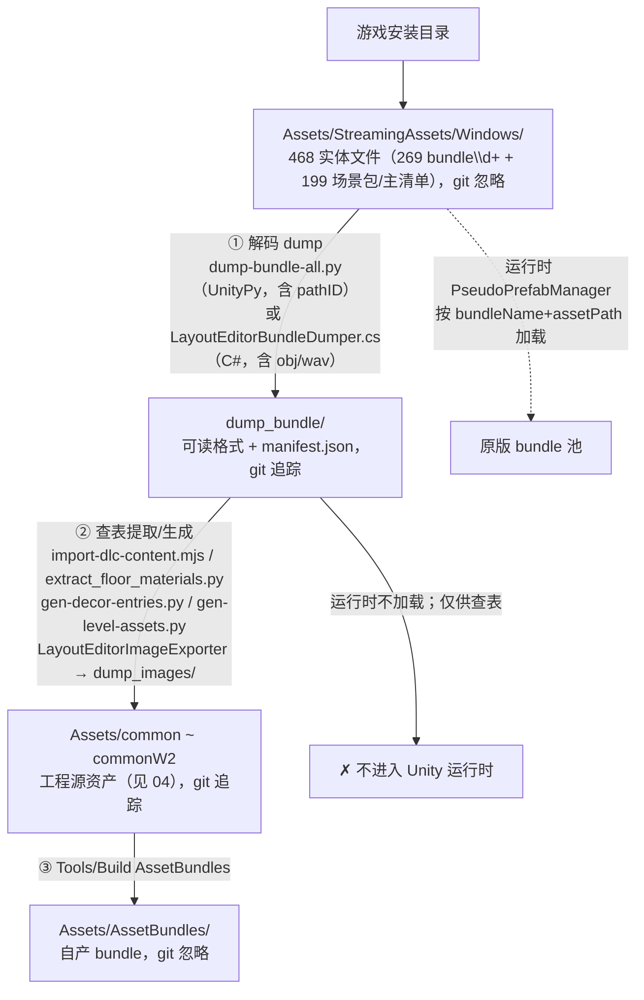

# 06 · 资源包 dump_bundle

> 目录：`dump_bundle/`（35,122 文件 / 7.7GB + manifest.json 10.5MB，git 全量追踪）
> 一句话定位：把游戏原始 AssetBundle（`Assets/StreamingAssets/Windows/`）**完整解码导出**的"资源数据金矿"——**不参与 Unity 运行时加载**，而是资源流水线中游的查表依据与素材来源，供构建脚本生成 `Assets/common*` 源资产，再重新打包为本项目自己的 AssetBundles。
> 返回 [00-架构总览.md](00-架构总览.md)。所有 JSON/Python 片段均为文件原文摘录。

---

## 1. 总览：目录形态与"双生成器"血统

```
dump_bundle/
├── manifest.json          # 10.5 MB 合并清单
├── Assets/                # 27 个顶层目录，按游戏 container 路径组织
│   ├── animations/ audio/ "bagel art"/ data/ downloadablecontent/
│   ├── fbxexporters/ font/ gizmos/ gui/ meshbaker/ models/
│   ├── midcounters.json  package.txt  particles/ pcicons/
│   ├── physicsmaterials/ plugins/ postprocessing/ prefabs/
│   ├── resources/ scenes/ screenshots/ scripts/ shaders/
│   ├── "standard assets"/ xboxone_localization/
└── _unassigned/           # 12 个 bundle 的 AssetBundle 主对象
```

**决定性事实**：当前 dump 是「**C# 全量底座 + UnityPy 局部重导**」的混合产物——

- 38,169 条 objects 中，**30,472 条无 `pathID`**（来自 `Assets/Editor/LayoutEditor/LayoutEditorBundleDumper.cs`，manifest 条目只有 5 个字段，能产出 `obj`/`wav`——Python 版从不产出这两种格式）；
- **7,697 条带 `pathID`**，全部来自 12 个 bundle：`bundle18/162/208/222/225/247/293/354/404/419/427/448`（story + 各 DLC 的 recipe/matchlist bundle，与 `_unassigned/` 的 12 个目录一一对应），由 `layout-editor/scripts/dump-bundle-all.py --only …` 重导并合并写回。

这个血统决定了后文所有"字段有两套语义/文件名有两代规则"的陷阱（§8）。

### 资源流水线全景



---

## 2. manifest.json 精确解剖

### 2.1 顶层字段（实测值）

```json
{
 "total": 38169,
 "failed": 0,
 "formats": {"png": 739, "json": 6899, "txt": 59},
 "bundles": 269,
 "objects": [ ...38169 条... ]
}
```

| 字段 | 实测值 | 语义与陷阱 |
|---|---|---|
| `total` | 38169 | 合并后条目总数（kept 30472 + 新导 7697），**非本轮导出数** |
| `failed` | 0 | **只统计最后一次（12 bundle 局部）运行**的失败数 |
| `formats` | png 739 / json 6899 / txt 59 | **只统计最后一次局部重导**（§8.1 陷阱），与磁盘真实分布（obj 7796、wav 84…）严重不符 |
| `bundles` | 269 | 有产物的 distinct bundle 数（Python 合并版语义；C# 版写的则是"扫到的 bundle 文件总数含跳过的场景包"） |
| `objects` | 38169 | 逐对象清单 |

### 2.2 objects 条目字段逐项（真实条目）

C# 底座条目（5 字段，无 pathID）：

```json
{"bundle": "bundle47", "type": "GameObject",
 "container": "assets/prefabs/shared_kitchen/countertop_01_chopping_board_gold.prefab",
 "file": "Assets/prefabs/shared_kitchen/countertop_01_chopping_board_gold.obj",
 "format": "obj"}
```

UnityPy 重导条目（多一个 pathID）：

```json
{"bundle": "bundle156", "type": "Texture2D",
 "container": "assets/gui/multiplayer_lobby/control_wide_bg.png",
 "file": "Assets/gui/multiplayer_lobby/control_wide_bg.png", "format": "png"}

{"bundle": "bundle18", "type": "MonoBehaviour",   ← RecipeMatchList 实体（UnityPy 侧游戏脚本一律显示 MonoBehaviour）
 "container": "assets/data/recipedata/therecipematchlist.asset",
 "file": "Assets/data/recipedata/therecipematchlist.asset.json",
 "format": "json", "pathID": 4488256628171388257}
```

| 字段 | 语义 |
|---|---|
| `bundle` | `Assets/StreamingAssets/Windows/` 下的文件名 |
| `type` | Unity 序列化类型名。**C# 版取 `asset.GetType().Name` 能给出游戏脚本类型名**（CampaignLevelConfig、SceneDirectoryData…）；UnityPy 版取 `obj.type.name`，游戏脚本一律 MonoBehaviour。类型分布 top：GameObject 9486 / Mesh 6177 / Texture2D 4616 / Material 4464 / AnimationClip 2915 / MonoBehaviour 1582…共 74 种 |
| `container` | bundle 内资产路径，**全小写**（实测 0 条含大写），可含空格（`.../prefabs/shared kitchen/...`） |
| `file` | 相对 `dump_bundle/` 的落盘路径（`assets/` 已规范化为 `Assets/`） |
| `format` | png/json/txt（UnityPy 侧）或 png/json/txt/obj/wav（C# 侧） |
| `pathID` | 仅 UnityPy 条目有。源码注释写明用途（`dump-bundle-all.py` L199-201）：`# bundle 内 pathID（matchlist m_recipes 的 fileID 即此值，stat-matchlist-mapping.mjs 靠它做精确成员解析）` |

### 2.3 pathID 的下游消费：stat-matchlist-mapping.mjs

pathID 是 int64（超 2^53，`JSON.parse` 会丢精度），消费方三段关键机制：

```js
// ① 文本级大整数保真
function parseJsonBig(text) {
  return JSON.parse(text.replace(/([:\[]\s*)(-?\d{16,})(\s*[,\}\]\n])/g, '$1"$2"$3'));
}
// ② manifest 双索引 + PPtr 解析（同 bundle 优先，跨 bundle 唯一命中才可信）
function resolveRef(bundle, fileID) {
  if (fileID == null) return { entry: null, scope: "unresolved" };
  const same = byBundle.get(bundle)?.get(String(fileID));
  if (same) return { entry: same, scope: "same-bundle" };
  const cands = globalByPathId.get(String(fileID)) || [];
  if (cands.length === 1) return { entry: cands[0], scope: "cross-bundle" };
  if (cands.length > 1) return { entry: null, scope: "ambiguous" };
}
```

③ matchlist 成员解析：从 dump 的 matchlist JSON 读 `m_recipes`（每项 `{m_FileID, m_PathID}` PPtr）逐个 resolveRef 得 container。产物 `scripts/data/matchlist-mapping.json` 真实条目：

```json
{ "pathID": "-7314007444348139487", "external": false,
  "container": "assets/data/orderdefinitions/cookedingredients/boiledfish.asset",
  "name": "boiledfish", "kind": "cookedingredient", "resolve": "same-bundle" }
```

### 2.4 bundles=269 与 StreamingAssets/Windows 936 项的关系

实测 Windows 目录：936 项 = **468 实体文件 + 468 .meta**。468 实体文件再分：

- **269 个 `bundle\d+`**——**全部已 dump**（即 manifest 的 269）；
- **199 个非 bundle\d+**：144 个 `s_*` 场景包 + throneroom(18)/startscreen(12)/worldmap(7)/throne(7)/movingplatform2~5(4) + credits/frontend/ident/ingamemenu/loading/lobbies(各 1) + `Windows` 主清单。**这 199 个一个都没 dump**。

原因：C# 底座按 `GetAllAssetNames()` 枚举，场景包会抛 `InvalidOperationException` 被显式跳过：

```csharp
try { assetNames = bundle.GetAllAssetNames(); }
catch (InvalidOperationException) { continue; // scene bundle }
```

s_\* 关卡的**截图**倒是存在（它们是普通 bundle 里的 Texture2D，如 `Assets/screenshots/capture_s_balloon_1_5.png`，bundle87）。**关卡几何的"地面真值"依赖外部 AssetRipper 导出**（`oc2-import/scan-levels.py` 的 `RIPPER` 常量指向 `AssetRipper_export_20260728_091744`），不在 dump_bundle 里。

---

## 3. 各子目录代表性文件内容

### 3.1 data/recipedata —— 菜谱数据三兄弟

**① RecipeMatchList 实体**（`Assets/data/recipedata/therecipematchlist.asset.json`）：

```json
{ "m_Name": "TheRecipeMatchList",
  "m_includeLists": [],
  "m_recipes": [ {"m_FileID": 0, "m_PathID": -7314007444348139487}, ... 共 115 项 ],
  "m_cookingSteps": [ {"m_FileID": 0, "m_PathID": -2045975493477524072}, ... 共 10 项 ] }
```

**② RecipeList（关卡出单表）**（`.../recipelists/burritolevel_meatandchicken.asset.json`）：

```json
{ "m_Name": "BurritoLevel_MeatAndChicken",
  "m_recipes": [
    {"m_order": {"m_FileID": 0, "m_PathID": -7802531756795876450},
     "m_weight": 1.0, "m_scoreForMeal": 80}, ...], ... }
```

**③ 菜谱条目**（`.../orderdefinitions/recipeitems/sushi/sushi_plainprawn.asset.json`）字段树：

```
m_Name("Sushi_PlainPrawn")
├─ m_orderGuiDescription[2]        # 订单 UI 瓦片（m_tileDefinition.m_mainPictures.m_children…）
├─ m_platingStep:    PPtr(pathID 2423405141991993217)
├─ m_platingPrefab:  PPtr(fileID 1, pathID 4443388703444188627)   # 跨文件引用
├─ m_uID: 32748
├─ m_composition[1]: PPtr → IngredientComposition
└─ m_optional[]
```

### 3.2 downloadablecontent/*/levelconfigs —— gen-level-assets.py 的口粮

`dlc02/dlc_assets/data/levelconfigs/beach_1_1_2p.json`（CampaignLevelConfig，顶层 `{"MonoBehaviour": {...}}`）标量字段实测：

```
m_Name = "Beach_1_1_2P"
m_disableDynamicParenting = true
m_orderLifetime      = 120.0    ← gen-level-assets.py: orderLifeTime
m_timeBetweenOrders  = 10.0     ← timeBetweenOrders
m_plateReturnTime    = 7.0      ← plateReturnTime
m_recipesBeforeTimerStarts = 1
m_rounds[0] = {"m_recipes": {fileID 1681578636529328656}, "m_roundTimer": 210.0}
                                ↑ roundTime = sum(m_roundTimer)
```

**星级线不在 levelconfig 里**，而在同 DLC 的 coopgamescenedirectory（`dlc02_coopgamescenedirectory.json`，bundle161，type=SceneDirectoryData）：

```json
"SceneVarients"[0] = {
  "PlayerCount": 1, "SceneName": "s_beach_1_1",
  "LevelConfig": {"fileID": -4508623252358099560},
  "m_PCStarBoundaries": {"m_OneStarScore": 120, "m_TwoStarScore": 280,
                          "m_ThreeStarScore": 460, "m_FourStarScore": 720} }
```

levelconfigs 的 bundle 分布：bundle47(546)、bundle293(90)、bundle354(66)、bundle247(64)、bundle161(63)、bundle448(36)…共 470 条 CampaignLevelConfig + 87 条 ScriptedCampaignLevelConfig。

### 3.3 prefabs/themes 与 GameObject JSON

主题目录（`Assets/prefabs/themes/`）：air_balloon、city_sushi、graveyard、mine、raft、space、swamp、throne、wizards_school；`shared_kitchen/` 全是合并 obj（78 件）。DLC 侧 dressing 在 `downloadablecontent/dlcNN/dlc_assets/prefabs/`（`beach theme`、`dressing assets`、**`shared kitchen` 带空格**）。

GameObject JSON 结构（UnityPy 重导的 bundle162 粒子 prefab，`pfx_watergunspray.prefab_2.json`）——`m_Component` 是 PPtr 列表：

```json
{ "m_Component": [
   {"component": {"m_FileID": 0, "m_PathID": 4756982456508846649}},
   {"component": {"m_FileID": 0, "m_PathID": -8748627086378826826}}],
  "m_Layer": 0, "m_Name": "collision", "m_Tag": 0, "m_IsActive": true }
```

同一 container 下多个 GameObject 展开为 `prefab_2/_6/_12/_14.json`。GameObject 双形态：obj 7585（C# 模型容器）/ json 1901，消费端要按 format 分流。

### 3.4 models/ 的合并 obj

`Assets/models/plated/m_plated_fish_cucumber_01.obj`：纯 `v/vt/vn/f` 流 + 按 `g <TransformPath>_<subMesh>` 分组，**组名带 `(Clone)` 后缀**（`g m_plated_fish_cucumber_01(Clone)_0`）——C# 版 `BuildModelObj` 先 `Object.Instantiate(root)` 再合并的铁证；顶点已变换到根局部空间，X 轴取反、面序倒排（镜像 UnityPy 的 obj 约定）。**合并语义的代价**：子件不再独立可分，需要原始分层时要回到 AssetRipper 侧。子目录：characters/ingredients/map/npcs/plated/props/recipes/themes/utensils/overcooked_legacy 等。

### 3.5 其余目录速览

| 目录 | 实测内容 |
|---|---|
| `font/` | firasans-bold.json（EditorJsonUtility 格式，`m_FontData` 为 base64 字体字节、`m_CharacterRects[]`）+ 字体图集 png |
| `gui/` | 图集/图标：largeicon1024.png、levelimagespreview/、hud/、emotes/、纯色 `0xff000000_32x32.png` |
| `shaders/` | Shader typetree json（含 `__base64__` 字节块）、pfx/ 子目录 |
| `screenshots/` | 51 张 capture_*.png（含 s_\* 关卡截图） |
| `audio/` | C# 侧解码 `.wav`（RIFF/PCM16，如 effects/ovendoorclose.wav）；UnityPy 重导同名资产为 `.wav.json`（m_AudioData base64） |
| `resources/` | datafile/levelconfigs 本体旧配置 + steam/steam_appid.txt |
| `pcicons/` | 7 张 balloon_icon_{16..1024}.png |
| `scenes/` | **不是场景文件**：92 个普通 bundle 里的场景附属资产（光照贴图 lightmap-0_comp_light.png 等） |
| 根级杂项 | `package.txt`（assetbundlebrowser 1.3.0 包描述，偶然混入）、`midcounters.json`（AnimatorController 序列化） |

---

## 4. _unassigned/：12 个 AssetBundle 主对象

结构固定为 `_unassigned/<bundle>/AssetBundle/<bundle>.json`，内容是 `m_PreloadTable`（数千条 (m_FileID, m_PathID) 预加载对）。成因：UnityPy 版对 `obj.container is None` 的对象（每个 bundle 恰有 1 个 AssetBundle 主对象）落到 `_unassigned/`（`dump-bundle-all.py` L88-91）；C# 版按 container 枚举根本看不到这类对象——所以**只有重导过的 12 个 bundle 有**。

---

## 5. 生成器细节

### 5.1 dump-bundle-all.py（UnityPy 版，实测环境 UnityPy 1.25.3）

核心流程：输入 `ROOT/Assets/StreamingAssets/Windows`（过滤 `.` 开头 / .meta / .manifest；`--only bundle18 bundle23` 白名单，缺失报错退出）→ 按类型分发导出：

```python
if t in ("Texture2D", "Sprite") and want_png:
    img = obj.read().image
    dest = dedupe_path(out_dir, rel + ".png", used)   # 注意：追加式扩展名
if t == "TextAsset":
    raw = obj.get_raw_data()  # utf-8 失败回退 latin-1 → rel + ".txt"
tree = obj.read_typetree()    # 其他一切类型 → rel + ".json"
                             # typetree 失败 → rel + ".bin"（当前 0 个）
```

（bytes 递归转 `{"__base64__": ...}`。）路径规范化 `clean_path` 把 `assets/` 首段换成 `Assets/`；`dedupe_path` 以**小写**为键追加 `_2/_3…`。**合并式写回**（`--only` 的关键改进，L206-219）：

```python
# 合并式写回：--only 定向重导时保留未重导 bundle 的既有条目，
# 只替换本次重导的 bundle（旧版直接整表覆盖，全量清单会被降级成局部）。
merged_objects = list(manifest)
if only and os.path.exists(manifest_path):
    prev = json.load(open(manifest_path, encoding="utf-8"))
    redumped = set(files)
    kept = [o for o in prev.get("objects", []) if o.get("bundle") not in redumped]
    merged_objects = kept + manifest
```

注意 `used` 去重集合**不持久化**：局部重导时 `_2/_3` 计数从 1 重新起算，与底座旧文件可能互不匹配（孤儿文件成因之一）。

### 5.2 LayoutEditorBundleDumper.cs（C# 版）

按 `bundle.GetAllAssetNames()` 的 container 驱动、`LoadAssetWithSubAssets` 取主+子资产——因此**没有 pathID、跳过场景 bundle、也看不到 AssetBundle 主对象**。导出类型映射（`ExportObject`，文件名规则 = container 扩展名**替换**为真实格式扩展名）：

| Unity 类型 | 导出格式 | 实现要点 |
|---|---|---|
| Texture2D（w/h>1） | `.png` | 不可读纹理经 RenderTexture Blit + ReadPixels（MakeReadable） |
| Sprite | `.png` | textureRect 裁剪，越界夹紧 |
| Cubemap | `.png ×6`（_px/_nx/_py/_ny/_pz/_nz） | 每面一张 |
| TextAsset | `.txt` | UTF-8 严格解码失败回退 latin-1(28591) |
| Mesh | `.obj` | X 取反、面序倒排 |
| **模型容器**（主资产为带网格 GameObject，任意后缀） | 单个合并 `.obj` | 实例化层级、SkinnedMeshRenderer.BakeMesh 烘焙蒙皮、按根局部空间合并 |
| AudioClip | `.wav` | GetData 取 float PCM → 16bit RIFF；失败降级 JSON |
| Font / 其他 | `.json` | EditorJsonUtility.ToJson；空对象写 `{"name":...,"type":...}` 兜底 |

manifest 手写 StringBuilder 拼装（`BuildManifest`），字段固定五元组无 pathID。bundle 复用 `PseudoPrefabManager.GetAssetBundle(name)`，否则 LoadFromFile + finally `Unload(true)`。

### 5.3 两版能力差异表

| 能力 | dump-bundle-all.py（UnityPy） | LayoutEditorBundleDumper.cs |
|---|---|---|
| 运行环境 | 命令行 python3 + UnityPy + Pillow | Unity Editor 菜单（可取消进度条） |
| 枚举驱动 | `env.objects` 逐对象 | container + 子资产 |
| pathID 字段 | ✅ | ❌ |
| AssetBundle 主对象 | ✅ → `_unassigned/` | ❌ 看不见 |
| 场景 bundle（199 个） | 会尝试（当前未跑全量） | 显式跳过 |
| Mesh/模型 | ❌ 只有 typetree json | ✅ 合并 obj（蒙皮烘焙） |
| AudioClip | ❌ typetree json | ✅ 解码 wav |
| Cubemap 六面 | ❌ | ✅ |
| typetree 完整性 | ✅ 含私有字段/`__base64__` | EditorJsonUtility（公开序列化字段） |
| 文件命名 | **追加**扩展名（`x.wav` → `x.wav.json`） | **替换**扩展名（`x.wav` → `x.json`） |
| `--only` 局部重导 + manifest 合并 | ✅ | ❌（整表覆盖） |
| `--skip-png` | ✅ | ❌ |

---

## 6. 下游消费的精确机制

### 6.1 import-dlc-content.mjs（container 查表 → 生成 common03/W1 源库）

先建**小写 container 索引**，两类查表（前缀/后缀过滤都在索引上；`dlc` 参数做跨 DLC 同名隔离）：

```js
const containerIndex = new Map();
for (const o of manifest.objects) {
  const c = (o.container || "").toLowerCase();
  if (!containerIndex.has(c)) containerIndex.set(c, o);
}
function prefabContainer(name, { exact = true, dlc = null } = {}) {
  const target = name.toLowerCase();
  for (const [c, o] of containerIndex) {
    if (!c.endsWith(".prefab")) continue;
    if (dlc && !c.includes(`/dlc${dlc}/`)) continue;
    const base = c.slice(c.lastIndexOf("/") + 1, -".prefab".length);
    if (exact ? base === target : base.startsWith(target)) return o;
  }
}
```

生成 SO：`const assetPath = "Assets/" + o.container.replace(/^assets\//, "")`，写 `pseudoPrefabAsset(id, prefabName, o.bundle, assetPath)` + 确定性 meta（`guid("ing", id)`，详见 [04 §9.2](04-素材库-Assets-common系列.md)）。装饰物 `emitDecor` 逐条 `containerIndex.get(e.container.toLowerCase())` 校验后写 `common03/prefabs/<dlc>/art/<theme>/<id>.prefab` + pseudo SO。

### 6.2 extract_floor_materials.py（_DiffuseMap 解析 → 地板材质落地）

六阶段：manifest 过滤（type=Material + .mat + /materials/ + FLOOR_RE/EXCLUDE_RE）→ 单遍扫全部 bundle 建 **CAB→bundle 映射**（从 `env.files` 名字提取 `cab-<32hex>`）→ 解 `_DiffuseMap` PPtr（texenv 优先级 `_DiffuseMap/_Diffuse/_Albedo/_MainTex/_ColourAlpha/...`；`m_FileID==0` 同 CAB，否则 externals[file_id-1].path 的 CAB 查映射）→ UnityPy 解码 Texture2D 为 png（同名冲突加 `_<pathID % 100000>` 后缀）→ 写 Standard .mat（`guid_for = md5('common03:'+rel)`）→ 汇总 `floor-materials-common03.json`。兜底：PPtr 失败的材质按名在 dump PNG + common01/textures 里找 `t_<stem>[_d].png`（剥尺寸/变体后缀的多级正则）。

### 6.3 gen-decor-entries.py（manifest → 装饰物清单）

输出 `scripts/data/decor-entries.json`（1903 条；byTheme 如 dlc07_horde 545、dlc02_beach 105…）。条目形如 `{"id":"1_2_float","bundle":"bundle167","container":"...prefabs/beach theme/1_2_float.prefab","theme":"dlc02_beach","dlc":"02"}`。规则要点：`TARGETS` 是 **(bundle, 主题子目录) 精确表**（含 bundle226/421/449 的 "map" 微缩装饰）；排除 EXCL/GAMEPLAY 正则；**Unity 重复导入去重**——同 (bundle,主题) 内 `<base>` 与 `<base> N`/`<base> (N)` 并存时剔除后者，基名不存在则保留；与 common01/02/03 现有 prefab 名去重；另附 NPC/FESTIVAL_FOOD/FLOOR/FURNITURE 四张手工表（container 必须小写实名）。

### 6.4 gen-level-assets.py（levels.json + dump 配置 → LevelInfo/config_Xp）

输入：`out/levels.json`（scan-levels.py 产）+ dump 的 levelconfig JSON + pidmap 缓存 + AssetRipper 源场景（m_inLevelAmbiences 原样拷贝）+ audio-catalog.json；输出 `Assets/LevelSets/oc2_dlc_story/data/<LEVEL_ID>/{LevelInfo, config_1p..4p}` + 报告。消费字段即 §3.2 所列（m_orderLifetime/m_timeBetweenOrders/m_plateReturnTime/m_rounds[].m_roundTimer/m_disableDynamicParenting；星级线来自 levels.json，源头 m_PCStarBoundaries）。菜谱解析链：config dump 的 `m_rounds[].m_recipes.fileID` → pidmap 查 RecipeList container → 读其 dump json 的 `m_recipes[].m_order.fileID` → pidmap 查 order container → basename 对编辑器 SO 索引得 guid。

### 6.5 LayoutEditorImageExporter（"建模贴图/素材图"分类）

扫描 `dump_bundle/Assets` 的图片，**按 container 任一路径段（整段相等、忽略大小写）命中模型相关目录判为建模贴图**：

```csharp
private static readonly string[] ModelSegments = {
    "models", "meshes", "fbxexporters", "scenes", "materials",
    "textures", "particles", "postprocessing", "post-processing",
    "post processing", "standard assets", "effects", "skyboxes" };
```

其余（gui 图标、背景、UI）归"素材图"。输出 `dump_images/{建模贴图,素材图}/`（类别内独立 DedupePath）+ manifest（含 source 回指 dump_bundle 路径）。**注意：当前仓库根没有 dump_images/ 目录**——该功能存在但输出未生成/未保留，属**可选产物、当前缺失**。

### 6.6 oc2-import/.cache 的 pidmap 缓存

`scripts/oc2-import/.cache/` 现有 **160 个** `pidmap_bundle*.json`。机制（`scan-levels.py` L63-75）：

```python
def load_pidmap(bundle):
    """path_id -> container（带磁盘缓存）。"""
    cache = os.path.join(CACHE_DIR, f"pidmap_{bundle}.json")
    if os.path.exists(cache):
        return {int(k): v for k, v in json.load(open(cache)).items()}
    import UnityPy  # 延迟导入
    env = UnityPy.load(os.path.join(BUNDLES, bundle))
    m = {o.path_id: o.container for o in env.objects if o.container}
    json.dump(m, open(cache, "w", encoding="utf-8"))
    return m
```

**与 manifest.pathID 互补**：pidmap 覆盖任意指定 bundle（含未重导的 C# 底座 bundle，160 个），manifest.pathID 只覆盖那 12 个。

---

## 7. 引用清单（谁在用它）

| 位置 | 用途 |
|---|---|
| `LayoutEditorBundleDumper.cs` | C# 生成器本体（Bridge 窗口按钮） |
| `LayoutEditorImageExporter.cs` | 图片分类导出（目录缺失时自动先触发 Dump） |
| `LayoutEditorBridgeWindow.cs` | 菜单按钮入口 |
| `LayoutEditorHttpServer.cs` | `/api/env/status` 检查 manifest 存在性（DTO 字段 dumpManifest） |
| `web/src/editor/ui/depsCheck.ts` | 依赖检查项"Bundle 清单（dump）" |
| `web/src/envStatus.ts` / `web/src/modelUnits.ts` | 类型定义 / 模型单位比例经 dump 网格 AABB 校准 |
| `scripts/dump-bundle-all.py` | Python 生成器（合并式 manifest、pathID） |
| `scripts/import-dlc-content.mjs` 等五个脚本 | 内容生成（§6） |
| `scripts/oc2-import/out/levels.json` | config 字段直接指向 dump 的 levelconfigs JSON |
| `Docs/zh/matchlist-mapping.md` | 对账依据声明 |

---

## 8. 启发与陷阱（均有实据）

### 8.1 `formats` 只反映最后一次局部重导（最重要的读数陷阱）

`total=38169`（合并全集）但 `formats` 合计仅 7697——**恰好等于带 pathID 的 12-bundle 重导条目数**。磁盘真实分布：json 21745 / obj 7796 / png 5332 / txt 165 / wav 84。**不要用 manifest.formats 做任何容量规划**；`failed: 0` 同理只代表最后一轮。

### 8.2 同名 container 的 `_2/_3` 去重实况（含 MonoScript 冒名）

- **MonoScript 冒名占坑**：bundle222/225 中 `*recipematchlist.asset` 容器下 MonoScript 先导出占了 `dlc04_recipematchlist.asset.json`，**真正的 RecipeMatchList MonoBehaviour 落在 `_2.json`**（pathID 4986753429552120572）；bundle162 顺序相反。`stat-matchlist-mapping.mjs` 为此专门做"真 matchlist 判定"（`Array.isArray(mb.m_recipes) || Array.isArray(mb.m_includeLists)` 打 1000 分再按节点数取最全）。
- 同 container 多 GameObject：`pfx_watergunspray.prefab_2/_6/_12/_14.json`。
- 同名 MonoScript 在多个 bundle 里 pathID 相同（如 RecipeMatchList 脚本类 pathID `4191680583457546622`）——这正是 stat 脚本需要 `globalByPathId` 判 ambiguous 的原因。

### 8.3 两代命名规则并存 → 孤儿文件 2688 个

UnityPy **追加**扩展名 vs C# **替换**扩展名：`.png` container → UnityPy 出 `xxx.png.png`、C# 出 `xxx.png`；`.wav` → `xxx.wav.json` vs `xxx.json`；`.asset` → `xxx.asset.json` vs `xxx.json`。实测磁盘有 **2688 个不在 manifest 里的孤儿文件**（json 2018 / png 410 / txt 56 / wav 12 / obj 192）——两个生成器都不清理输出目录、`used` 集不跨代持久。**孤儿不等于废文件**：`scan-levels.py` 给 dlc10/11/13 用的 `combineddlc_coopgamescenedirectory.json`（C# EditorJsonUtility 格式）就是孤儿，仍被正常消费。

### 8.4 资产路径大小写与目录形态不一致

manifest container 全小写，但本地包装 SO 的 assetPath 若照抄混合大小写（common02 的 `DLC02_RecipeMatchList.asset` vs 实名 `dlc02_recipematchlist.asset`）运行时会失败（详见 [04 §5.2](04-素材库-Assets-common系列.md)）。目录形态陷阱：多数 DLC 是 `downloadablecontent/dlcNN/dlc_assets/...`，但 **dlc13 是 `downloadablecontent/dlc13/assets/...`**；`shared kitchen`（带空格，dlc02-09）vs `sharedkitchen`（连写，dlc09+/dlc13）。**下游查表一律 toLowerCase + 子串匹配正是为了吸收这些差异**。

### 8.5 其他

- **GameObject 双形态**（obj/json 同 type 不同 format）消费端按 format 分流。
- **C# obj 的 `(Clone)` 组名与合并语义**：需要原始分层回 AssetRipper。
- **git 全量追踪的取舍**：35,122 文件全进版本库（无 LFS）——好处是任何 commit 可完整复现资产地面真值、下游脚本离线可跑；代价是 7.7GB 仓库膨胀。局部重导会成批翻动 manifest 与数千文件，**建议配合 `--only` 白名单审慎提交**。

---

## 9. 快速事实卡

| 项 | 值 |
|---|---|
| manifest | total 38169 / failed 0 / bundles 269 / formats {png 739, json 6899, txt 59}（仅末轮） |
| 带 pathID 条目 | 7697（12 个 recipe bundle） |
| 磁盘 | 35,122 文件 / 7.7GB；json 21745、obj 7796、png 5332、txt 165、wav 84 |
| 源 bundle 池 | Windows 936 项 = 468 文件（269 bundle\d+ 已 dump + 199 场景/主清单未 dump）+ 468 .meta |
| _unassigned | 12 × AssetBundle 主对象（m_PreloadTable） |
| 孤儿文件 | 2688（多代导出残留） |
| dump_images | **不存在**（功能在 ImageExporter，当前未生成） |
| 关键脚本 | dump-bundle-all.py（UnityPy 1.25.3）、LayoutEditorBundleDumper.cs、stat-matchlist-mapping.mjs、import-dlc-content.mjs、extract_floor_materials.py、gen-decor-entries.py、oc2-import/{scan-levels,gen-level-assets}.py、.cache/pidmap_*.json（160 个） |
