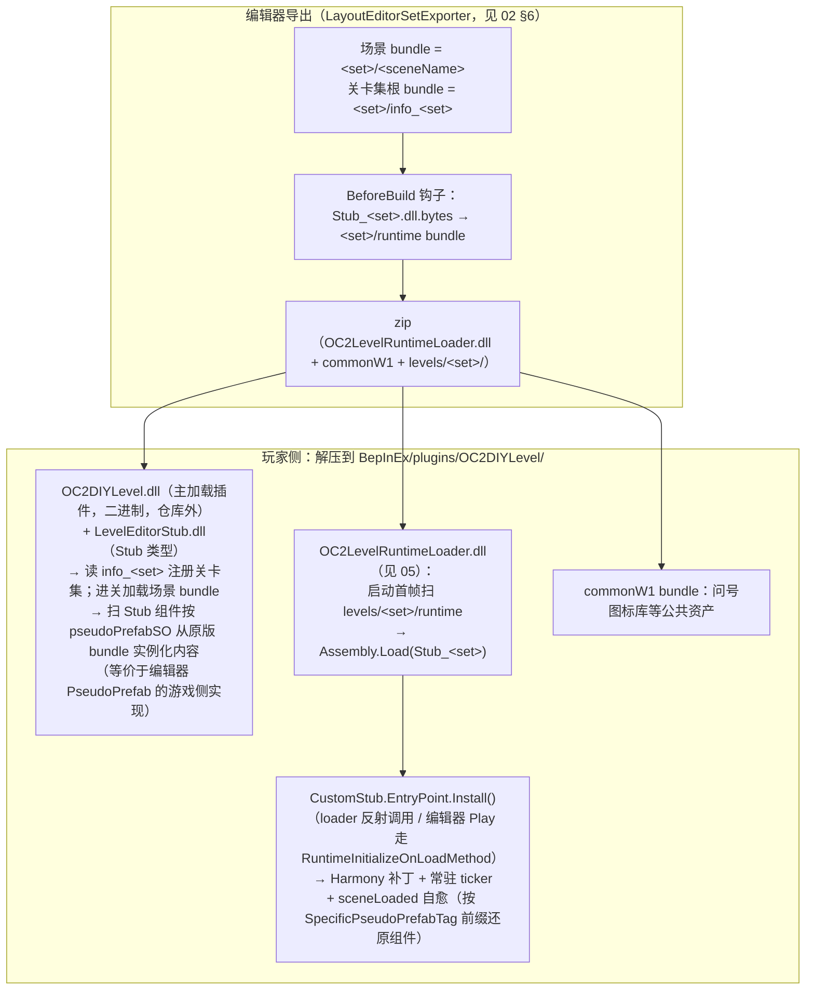

# 07 · 游戏核心 Assets/Scripts

> 目录：`Assets/Scripts/`（2446 个 .cs：Assembly-CSharp 2365 + LevelEditor 36 + LevelEditorStub 45）
> 一句话定位：编辑器工程的"游戏底层"= 原版游戏反编译源码全量拷贝 + 自研 `LevelEditor`（组装逻辑）/ `LevelEditorStub`（数据载体）两个旁路程序集；关卡以"真实场景 + Stub 数据 + 原版 bundle 引用"表达，经 `LevelConfigSetup` 在运行时临时伪造原生配置对象喂给未修改的游戏流程代码。
> 返回 [00-架构总览.md](00-架构总览.md)

---

## 1. 目录树（.cs 按子目录归组）

```
Assets/Scripts/
├── Assembly-CSharp/                 # 2365 个 .cs —— OC2 游戏本体反编译源码（无 asmdef，编译进主程序集）
│   ├── (根目录 ~2050 个 .cs)          # 全局命名空间游戏类型，按前缀家族组织（见 §3/§4）
│   ├── AssetBundles/        (11)     # Unity 官方 AssetBundleManager 演示代码（游戏原装）
│   ├── AStar/               (4)      # A* 寻路
│   ├── BitStream/           (3)      # 位流读写（网络序列化底座）
│   ├── DigitalOpus/MB/Core/ (43)     # MeshBaker 网格合并插件源码
│   ├── GameModes/           (86)     # 游戏玩法模式（Campaign/Practice/Survival/Horde…）
│   │   └── Horde/           (45)     # 生存守家模式
│   ├── InControl/           (~170)   # 手柄输入库 + 各手柄 Profile
│   ├── LitJson/             (21)     # JSON 库
│   ├── OrderController/     (2)      # OrderID / ServerOrderData
│   ├── Properties/          (1)      # AssemblyInfo（Version 0.0.0.0，反编译痕迹）
│   ├── Team17/Online/…     (~130)    # 自研网络层（Session/Connection/Messaging/Synchroniser）
│   ├── UnityEngine/PostProcessing/ (49)  # 后处理栈
│   └── XInputDotNetPure/    (8)      # XInput 封装
│
├── LevelEditor/                     # 36 个 .cs —— 编辑器自研"伪预制体"运行时（无 asmdef，命名空间 LevelEditor）
│   ├── PseudoPrefab.cs               # 基类：按 PseudoPrefabSO 从 bundle 实例化子物体 + 特殊 prefab 修正
│   ├── PseudoPrefabManager.cs        # 单例：加载全部 bundle、反射注入场景管理器引用
│   ├── LevelConfigSetup.cs           # 由 LevelInfoSO 动态构建原生配置
│   ├── RecipeHelper.cs               # 菜谱 SO → 游戏原生 OrderDefinitionNode 树
│   ├── RuntimePrefabManager.cs       # 运行时克隆"隐藏 prefab"（全局命名空间，Editor/游戏两侧共用）
│   ├── MultiCookingStationTypes.cs   # 一炊具适配多种炉灶类型
│   ├── SetupCustomPrefab.cs / SetupCannon.cs / SetupPushableObject.cs / PseudoParticleSystem.cs
│   ├── 20 余个 PseudoPrefabXxx 子类（CookingUtensil/Dispenser/Teleportal/Terminal/Switch/…）
│   └── Debugger.cs / FollowPseudoPlayer.cs / FloatingObjectShake.cs
│
└── LevelEditorStub/                 # 45 个 .cs —— 关卡数据载体（asmdef "LevelEditorStub"，随关卡分发）
    ├── Stub.cs                       # 标记基类："for BepInEx plugin to find all istub and add the actual functional class"
    ├── LevelInfoSO.cs                # ★ 关卡描述 SO
    ├── LevelSetInfoSO.cs             # ★ 关卡集 SO
    ├── LevelConfigSetupPerPlayerCountSO.cs  # 按人数数值配置
    ├── PseudoPrefabSO.cs             # ★ "伪预制体"引用三元组
    ├── PseudoPrefabSORecipe.cs / PseudoPrefabSOArray.cs / SpecificPseudoPrefabTag.cs / TriggerPasser.cs
    ├── CustomRecipeSO.cs / CustomRecipeOptionalBurgerSO.cs / CustomRecipeOptionalPizzaSO.cs
    ├── PseudoPrefabManagerStub.cs    # 场景引导桩
    ├── PseudoPrefabStub.cs + 22 个 PseudoPrefabXxxStub
    ├── SetupCustomPrefabStub.cs / SetupCannonStub.cs / SetupPushableObjectStub.cs
    └── FloatingObjectShakeStub / FollowPseudoPlayerStub / SetAnimatorSpeed.cs / RotateUV.cs
```

配套事实：`Assets/StreamingAssets/Windows/` 存有 7.6GB 原版游戏 Windows bundle（运行时资产来源）；`Assets/Plugins/Assembly-CSharp-firstpass/` 另有 firstpass 反编译源（Steamworks.NET、UnityStandardAssets），不在本目录。

## 2. 与上游 Assembly-CSharp-Patch 的关系

`Assets/Scripts/Assembly-CSharp` 是对游戏本体程序集的**反编译源码拷贝**（近乎全量，本地重编译，与游戏运行中的 DLL 无引用关系）；`Assembly-CSharp-Patch/` 的 44 个文件按 tutorial 流程**整文件覆盖**进来（详见 [01](01-上游补丁-Assembly-CSharp-Patch.md)）。判断依据：全局命名空间、`_xxx`/`m_xxx` 命名、空调试块、`AssemblyVersion 0.0.0.0`、`PseudoPrefabSO.OnValidate()` 硬编码剥离 `E:/dev/test/ReversedGame/ExportedProject/` 前缀（原版游戏 ExportedProject 导出工程路径）。

**重要**：这份拷贝**不含 LD/LevelDesc 子系统**（`AttachSpawn`/`CrateReference`/`SpawnReferences`/`ILDSortedLoadable`/`Loader.Register`/`CrateList` 全仓库 0 命中）——本项目与社区 "Overcooked2 Level Loader" 的 LD 注册路线不是同一体系，其职能被自研 PseudoPrefab / LevelInfoSO / OC2DIYLevel 管线取代（术语对照见 [01 §5](01-上游补丁-Assembly-CSharp-Patch.md)）。

## 3. 核心功能域划分

| 功能域 | 主要类型 | 说明 |
|---|---|---|
| **关卡描述/配置** | `LevelConfigBase`(抽象 SO) → `KitchenLevelConfigBase` → `CampaignLevelConfig`(m_rounds) / `StoryLevelConfig` / `SinglePlayerLevelConfig` / `DynamicCampaignLevelConfig` / `HordeLevelConfig`；`RoundData`(RecipeList + 回合计时)；`SceneDirectoryData`(Scenes[]×4 人变体 + 星级线) | 游戏侧"关卡=场景+LevelConfig SO"。**编辑器侧对应物在 LevelEditorStub**，经 `LevelConfigSetup` 运行时换算成原生类型 |
| **厨房流程控制** | `FlowControllerBase` → `KitchenFlowControllerBase`(m_maxOrdersAllowed/计分) → `CampaignFlowController` 等；服务端镜像 `ServerFlowControllerBase` → `ServerKitchenFlowControllerBase`(回合计时/订单增删/送餐判定/combo) → `ServerCampaignFlowController` | 一局厨房完整生命周期（intro→in-round→outro→下一场景） |
| **厨房物件** | 站台类：`Workstation`、`AttachStation`、`SwitchStation`、`Terminal`、`ConveyorStation`、`CookingStation`/`HeatedCookingStation`/`MixingStation`/`WashingStation`、`PlateStation`、`PlateReturnStation`、`Teleportal` 家族、`Cannon`、`Travelator`；容器类：`ItemContainer`→`IngredientContainer`/`CookableContainer`/`MixableContainer`/`PreparationContainer`/`PlacementContainer`/`Tray…`；行为类：`CookingHandler`/`MixingHandler`、`AutoWorkstation`、`UtensilRespawnBehaviour` 家族、`*CosmeticDecisions` | 全部成对出现 `Xxx` + `ServerXxx` + `ClientXxx` |
| **食材与菜谱/订单** | `OrderDefinitionNode`(抽象) → `IngredientOrderNode`/`ItemOrderNode`/`CompositeOrderNode`→`CookedCompositeOrderNode`/`MixedCompositeOrderNode`、`WildcardOrderNode`、`AssembledDefinitionNode` 家族；`RecipeList`(Entry: order+weight+score，可位流序列化)；`RecipeMatchList`(includeLists 递归 + recipes + cookingSteps)；`CookingStepData`/`PlatingStepData`；`OrderToPrefabLookup`/`ComboOrderToPrefabLookup`；订单控制：`OrderID`、`ServerOrderControllerBase`、`ServerFixedTimeOrderController`、`ServerTeamMonitor` | 编辑器侧入口为 `CustomRecipeSO*` + `RecipeHelper` |
| **玩家** | `PlayerControls`(+Impl)、`PlayerAttachmentCarrier`、`PlayerSwitchingManager`、`PlayerManager` 家族、`ClientInputTransmitter`/`ServerInputReceiver`、`PlayerRespawnBehaviour`、`ChefAvatarData`/`ChefColourData`/`ChefMeshReplacer`、`RespawnCollider` | 厨师实体、输入、换人、重生 |
| **网络/同步** | `Team17/Online/`；`MultiplayerController`(★ `StartKitchen()` 注册约 200 对 Server/Client 同步组件)；`Mailbox`/`ServerMessenger`/`ClientMessenger`；`BitStream/` | 单机亦走同一套"本地 server+client"实体同步 |
| **场景/加载基建** | `BootstrapManager`→`KitchenBootstrapManager`；`GameSession`；`GameProgress`(m_sceneDirectory)；`KitchenLoaderManager`→`CampaignKitchenLoaderManager`；`ServerKitchenLoader`/`ClientKitchenLoader`(加载状态机)；`LoadingScreenFlow`；`AssetBundles/AssetBundleManager` | §6 详述 |
| **第三方库** | InControl、LitJson、DigitalOpus MB3、PostProcessing、XInput | 游戏原装依赖随拷贝带入 |

## 4. 关键文件清单

### 4.1 Assembly-CSharp/（游戏反编译拷贝，路径相对 `Assets/Scripts/`）

| 文件 | 类 | 作用 |
|---|---|---|
| `Assembly-CSharp/LevelConfigBase.cs` | LevelConfigBase | 关卡配置 SO 抽象基类：hazardInfo、objectives、`RecipeMatchList` |
| `Assembly-CSharp/KitchenLevelConfigBase.cs` | 同名 | 厨房关卡抽象：订单寿命/间隔/回盘时间、三种模式配置 |
| `Assembly-CSharp/CampaignLevelConfig.cs` | 同名 | 战役关卡：`RoundData[] m_rounds`——**编辑器运行时克隆的目标类型** |
| `Assembly-CSharp/RoundData.cs` | 同名 | 一轮：`RecipeList` + 回合计时，按权重防重复抽单 |
| `Assembly-CSharp/SceneDirectoryData.cs` | 同名 | 关卡目录 SO：`Scenes[].SceneVarients[4]`（每人数 LevelConfig+SceneName+四平台星级线） |
| `Assembly-CSharp/GameSession.cs` | 同名 | 全局会话：`LevelSettings.SceneDirectoryVarientEntry`、Progress、SelectedChefData |
| `Assembly-CSharp/KitchenFlowControllerBase.cs` | 同名 | 场景侧流程基类，`m_maxOrdersAllowed`（编辑器写入） |
| `Assembly-CSharp/ServerKitchenFlowControllerBase.cs` | 同名 | 服务端流程：`BuildOrderConfig()`、送餐/连击/倍率、KitchenFlowMessage 广播 |
| `Assembly-CSharp/ServerCampaignFlowController.cs` | 同名 | 战役服务端：GameSession 取 LevelConfig → IServerMode → TeamMonitor + 订单控制器 → GetNextScene |
| `Assembly-CSharp/KitchenBootstrapManager.cs` | 同名 | 场景引导：按活动场景名在 SceneDirectory 反查 PerPlayerCountDirectoryEntry 写入 GameSession.LevelSettings |
| `Assembly-CSharp/BootstrapManager.cs` | 同名 | 实例化 MetaEnvironment 与 GameSession 并 LoadSession() |
| `Assembly-CSharp/KitchenLoaderManager.cs` / `CampaignKitchenLoaderManager.cs` | 同名 | 连接就绪后 `StartKitchen()`；给 User 分配厨师实体 |
| `Assembly-CSharp/ServerKitchenLoader.cs` / `ClientKitchenLoader.cs` | 同名 | 加载状态机：LoadKitchen→ScanNetworkEntities→StartSynchronising→AssignChefsToUsers→StartEntities→RunKitchen |
| `Assembly-CSharp/MultiplayerController.cs` | 同名 | `StartKitchen()` 注册全部 Server/Client 同步类型对（同步总线启动） |
| `Assembly-CSharp/RecipeList.cs` | 同名 | 菜谱 SO：`Entry{m_order, m_weight, m_scoreForMeal}`，支持网络位流序列化 |
| `Assembly-CSharp/RecipeMatchList.cs` | 同名 | 玩家可用菜谱匹配表——**编辑器重建的核心对象** |
| `Assembly-CSharp/OrderDefinitionNode.cs` 家族 | 多个 | 菜谱组成树（原料/组合/烹制/混合/通配） |
| `Assembly-CSharp/OrderToPrefabLookup.cs` | 同名 | 菜品内容→展示 prefab 查找表（编辑器改写炊具"可放食材"的关键） |

### 4.2 LevelEditorStub/（关卡数据载体，随关卡包分发）

| 文件 | 类 | 作用 |
|---|---|---|
| `Stub.cs` | Stub : MonoBehaviour | 全部 Stub 的标记基类；供 BepInEx 插件找到所有 IStub 并挂真实功能类 |
| `LevelInfoSO.cs` | LevelInfoSO | ★ 关卡描述：levelName(ZH)/sceneName/screenshot、recipes[]、min/maxOrderCount、菜谱匹配表开关与 allIngredients/optionalItems/allCookingSteps、音乐+环境音(GameLoopingAudioTag 枚举 187 项)、onDeathEffect、**config_1p~4p**、**dependencies[]（依赖 bundle 名单）** |
| `LevelSetInfoSO.cs` | LevelSetInfoSO | 关卡集：名称/作者/**uid = MD5(baseGUID+version)**（版本变更自动刷新）、`LevelInfoSO[] levelInfos` |
| `LevelConfigSetupPerPlayerCountSO.cs` | 同名 | 分人数数值：orderLifeTime/timeBetweenOrders/plateReturnTime/survivalTimeMultiplier/roundTime/1-4 星分数线 |
| `PseudoPrefabSO.cs` | PseudoPrefabSO | ★ 跨工程资产引用三元组 `{prefabName, bundleName, assetPath}`，指向原版 bundle 内资产 |
| `PseudoPrefabSORecipe.cs` | 同名 | 指向原版 `OrderDefinitionNode` 资产并附 score（原版菜谱引用） |
| `PseudoPrefabSOArray.cs` | 同名 | 多资产引用数组（换材质/多原料机器/随机箱候选用） |
| `CustomRecipeSO.cs` | 同名 | 自定义菜谱：type(Composite/Cooked/Mixed)+composition/optional 树+cookingStep/platingStep+model/icon |
| `CustomRecipeOptionalBurgerSO.cs` / `CustomRecipeOptionalPizzaSO.cs` | 同名 | "可选汉堡/披萨"菜谱（面包底/容量/原料模型） |
| `PseudoPrefabManagerStub.cs` | 同名 | 场景引导桩：levelInfo + FlowManager/RecipeUI/AudioManager/PlayerSwitchingManager/BootstrapManager/KillPlane 等 GO 引用与各模板 PseudoPrefabSO；Awake/OnDestroy 留作 BepInEx 补丁入口 |
| `PseudoPrefabStub.cs` | 同名 | 通用伪预制体桩：仅 `pseudoPrefabSO` 字段 |
| 22 个 `PseudoPrefabXxxStub.cs` | 同名 | 各类物件编辑参数：`CookingUtensilStub`(capacity/allowedIngredientSOs/allowedCookingStationTypes/modelSOs)、`DispenserStub`(spawnerItemPrefabSO)、`TeleportalStub`(exitPortal/portalColor)、`SwitchStub`/`ToggleSwitchStub`/`PressureSwitchStub`(接线)、`TerminalStub`(pilotableObject)、`PlayerStub`(playerID/hat/knife 可见性)、`CleanPlateStackStub`(plateCount)、`ConveyorStub`/`TravelatorStub`(速度)、`BurnerStub`(FireMode)、`HeatedOvenStub`、`ServingStationStub`/`PlateReturnStub`(绑定)、`AttachingFoodSpawnerStub`(顺序/权重/间隔)、`IngredientSprayStub`、`FlamethrowerStub`、`AutoWorkstationStub`、`MarkerStub`、`MeshWithMaterialStub`、`NPCStub` |
| `SpecificPseudoPrefabTag.cs` | 同名 | 字符串 tag 载体：驱动 `PseudoPrefab.HandleSpecificPrefabs()` 的逐 prefab 修正，亦是 CustomStub 烘焙标记（`"RandomCrate|"`、`"UtensilTiming|"` 等前缀约定） |
| `TriggerPasser.cs` | 同名 | 编辑态触发转发器 |
| `SetupCannonStub.cs` 等 | 同名 | 非伪预制体类的 Setup 桩（大炮姿态/可推物图标/伪粒子） |

### 4.3 LevelEditor/（编辑器内运行时逻辑，不进游戏包）

| 文件 | 类 | 作用 |
|---|---|---|
| `PseudoPrefabManager.cs` | 同名 | ★ 核心：`Init()` 加载 Windows manifest + dependencies 全部 bundle → `SetAssetRef()`（反射注入 LevelIntroFlowroutine/RecipeFlowGUI/CampaignAudioManager/PlayerSwitchingManager/KitchenBootstrapManager 私有字段，并经 `LevelConfigSetup.SetupSceneDirectoryData` 反射注入 `GameProgress.m_sceneDirectory`、取 4 人变体设 LevelSettings）→ `ResetAllPseudoPrefabs()`；提供 `LoadAsset<T>(PseudoPrefabSO)`、编辑/构建/游戏三态 |
| `PseudoPrefab.cs` | 同名 | ★ 基类：`ResetChild()` 实例化 bundle prefab 为子物体 + `HandleSpecificPrefabs(tag)`（~60 个按 tag 的手工修正：关灯/雪材质/气闸门接线/煤炭桶查找表…）；虚方法 Setup/LateSetup/SetupAfterStartSynchronising |
| `LevelConfigSetup.cs` | 同名 | ★ 桥接器：`SetupConfig()` 克隆模板 `CampaignLevelConfig` 并按 LevelInfoSO+人数覆盖数值、重建 `RecipeList` 与 `RecipeMatchList`；`SetupSceneDirectoryData()` 生成 `SceneDirectoryData`（每关 4 变体+星级线） |
| `RecipeHelper.cs` | 同名 | `GetRecipe()/GetOrderDefinitionNode()`：PseudoPrefabSORecipe→bundle 加载原版节点；CustomRecipeSO→递归现造 Composite/Cooked/Mixed OrderNode + 装盘 prefab |
| `PseudoPrefabCookingUtensil.cs` | 同名 | 最复杂子类：按 Stub 重建炊具容量/可用食材 `OrderToPrefabLookup`，为煎锅/烤盘/串签/炒锅/搅拌机克隆 cosmetics prefab 并反射写入查找表 |
| `MultiCookingStationTypes.cs` | 同名 | 自研组件：炊具 ↔ 多种 `CookingStationType` 匹配 |
| `RuntimePrefabManager.cs` | 同名 | 把场景对象克隆成 HideAndDontSave 的 "inactive prefab" 供运行时替换引用（**故意写在全局命名空间**，Editor/游戏两侧共用） |
| 20 余个 `PseudoPrefabXxx.cs` | 同名 | 各物件 Setup 实现：Dispenser 注入生成物、Teleportal 配对与材质、Terminal 绑 pilotableObject 等 |
| `SetupCustomPrefab.cs` / `SetupCannon.cs` / `SetupPushableObject.cs` | 同名 | 非伪预制体物件的 Setup 框架与实现 |
| `Debugger.cs` | 同名 | Play 期注入默认键位（InControl 反射）便于试玩 |
| `FollowPseudoPlayer.cs` / `FloatingObjectShake.cs` / `PseudoParticleSystem.cs` | 同名 | 编辑器预览辅助 |

## 5. 编辑器后端对本目录的依赖（三层）

**A. `LevelEditorStub` 命名空间（数据模型，引用频次最高）**：`PseudoPrefabSO`(~280 次)、`LevelInfoSO`(~249)、`CustomRecipeSO`(~178)、`PseudoPrefabStub`(~110) 及 20 余个子 Stub、`SpecificPseudoPrefabTag`(~56)、`LevelSetInfoSO`、`PseudoPrefabManagerStub` 等——`LayoutEditorStubIO.cs`、`LayoutEditorLevelInfoResolver.cs`、`LayoutEditorLevelAdminApi.cs` 的主要类型来源。

**B. `LevelEditor` 命名空间（运行时组装能力）**：`PseudoPrefabManager`(~147 次，LoadAsset/ResetAllPseudoPrefabs/GetAssetBundle；`LayoutEditorPseudoReload.cs` 即"Reload Pseudo Assets"）、各 `PseudoPrefabXxx`（写回时按类型补参数）、`LevelConfigSetup`、`RecipeHelper`、`RuntimePrefabManager`。

**C. 全局命名空间游戏原生类型**：`Teleportal`、`Terminal`、`CookingHandler/MixingHandler`、`IngredientContainer`、`EditorGridSnap`、`TriggerOnAnimator`、`AutoWorkstation`；数据类型 `IngredientOrderNode`、`RecipeMatchList`、`GameLoopingAudioTag`、`AudioDirectoryData`、`ChefAvatarData` 等；反射字符串目标 `ServerRespawnCollider`、`ClientTerminalCosmeticDecisions` 等（CustomStub GameApi 反射桥）。

## 6. 运行时加载流程

### 6.1 编辑器内 Play（即时试玩链）

```mermaid
flowchart TD
    OPEN["打开 LevelSets/&lt;set&gt;/scenes/&lt;关卡场景&gt;<br/>（常驻 PseudoPrefabManager + PseudoPrefabManagerStub）"] --> INIT["PseudoPrefabManager.Init()"]
    INIT --> LOAD["EnsureLoadAllAssetBundles()：<br/>LoadFromFile(Windows) → Manifest<br/>→ 逐个 levelInfo.dependencies（含依赖闭包）"]
    LOAD --> REF["SetAssetRef()（反射注入场景管理器）：<br/>LevelIntroFlowroutine / RecipeFlowGUI / CampaignAudioManager<br/>/ PlayerSwitchingManager / KitchenBootstrapManager"]
    REF --> CFG["KitchenBootstrapManager.m_bootstrapConfig =<br/>LevelConfigSetup.SetupConfig(configTemplateSO, levelInfo, 4)"]
    CFG --> CFG1["Instantiate(模板 CampaignLevelConfig)<br/>+ 按 config_4p 覆盖数值"]
    CFG1 --> CFG2["Instantiate(RecipeList)：recipes → RecipeHelper.GetRecipe()<br/>（PseudoPrefabSORecipe→bundle 加载；CustomRecipeSO→现造节点树+GUI 描述）"]
    CFG2 --> CFG3["新建 RecipeMatchList：原版表(可选) + include<br/>+ allIngredients + optionalItems + 菜谱 m_order"]
    CFG3 --> GAMEATT["Game 态附加：BootstrapManager.EnsureSetup()<br/>→ GameSession.LoadSession()"]
    GAMEATT --> SD["反射 GameProgress.m_sceneDirectory =<br/>LevelConfigSetup.SetupSceneDirectoryData(...)<br/>→ gameSession.LevelSettings = GetSceneVarient(4)"]
    SD --> RESET["ResetAllPseudoPrefabs()：每个 PseudoPrefab.ResetChild()<br/>Instantiate(bundle prefab) 为子物体<br/>→ HandleSpecificPrefabs(tag) → Setup()"]
    RESET --> PLAY["进入 Play（游戏原生流程接管）"]
    PLAY --> MK["KitchenLoaderManager.Update（等 ConnectionModeSwitcher Complete）<br/>→ MultiplayerController.StartKitchen()：注册 ~200 对同步组件"]
    MK --> KL["ServerKitchenLoader 状态机：<br/>LoadKitchen → ScanNetworkEntities → StartSynchronising<br/>（LevelConfig = GameSession.LevelSettings… ←★ 编辑器注入的配置在此被消费<br/>IServerMode.Setup → ServerFixedTimeOrderController）<br/>→ AssignChefsToUsers → StartEntities"]
    KL --> RUN["RunKitchen → RunLevelIntro → InLevel(RunRound)<br/>→ RunLevelOutro → GetNextScene → LoadLevel(下一场景)"]
```



### 6.2 真机（BepInEx）分发链



**要点总结**：编辑器工程的"游戏底层"= 原版反编译源码全量拷贝（缺 LD 子系统）+ 自研 `LevelEditor`/`LevelEditorStub` 两个旁路程序集；关卡经 `LevelConfigSetup` 在运行时临时伪造 `SceneDirectoryData`/`CampaignLevelConfig`/`RecipeList`/`RecipeMatchList` 喂给未修改的游戏流程代码；分发到真机则依赖 OC2DIYLevel + LevelEditorStub + Stub_\<set\> 三层 BepInEx 程序集还原同样的语义。
