# 05 · 运行时加载器 OC2LevelRuntimeLoader

> 目录：`Assets/WebCustomStubRuntime/Loader~/`（唯一源文件 `Loader.cs`，v3.5.3；`~` 后缀 Unity 忽略，dotnet 单独编译）
> 一句话定位：「Overcooked2 关卡代码分发」体系的**游戏侧运行时注入端**——把编辑器按关卡集编译、随关卡 zip 分发的 C# 程序集（统一运行时 `WebCustomStubRuntime`，内含随机食材箱等自定义玩法逻辑）在**关卡场景加载之前**注入游戏进程的 AppDomain，使场景 bundle 里的脚本引用能解析成真实组件。
> **零介入铁律（v3.5.0）**：未使用 web 导出的关卡（官方图/旧导出集/无自定义关卡），loader 及其注入的运行时对游戏**零介入**——不 hook 任何函数、不装任何补丁、不做任何场景扫描/探测；web 关卡集里未用 CustomStub 的关卡同样零监控零对局钩子。
> 返回 [00-架构总览.md](00-架构总览.md)

---

## 1. 文件列表

```
Assets/WebCustomStubRuntime/
├── Loader~/                                （`~` 目录 Unity 忽略，dotnet 单独编译）
│   ├── Loader.cs                           ★ 唯一源码（v3.5.3，纯加载器——不含任何 Harmony patch）
│   ├── Loader.csproj                       net35 工程（BepInEx 5.4.22 + 老式整包 UnityEngine.dll；无 0Harmony 引用）
│   ├── build.sh                            一键构建（版本号从 Loader.cs 自动提取）
│   ├── bin/Release/Loader.dll              构建产物（手动同步到 web/public/）
│   └── README.md                           机制/构建/安装/排障文档
├── core/EntryPoint.cs                      ★ 逐关卡清单闸门 + 特征挂载（运行时侧）
└── RuntimeDll/WebCustomStubRuntime.dll.bytes   统一运行时 staging（AutoBake 自动）
```

要点：
- 本插件**不携带任何资源**——图标库、prefab 走 `commonW1` bundle，由 OC2DIYLevel 模组管辖。
- 分发副本 `layout-editor/web/public/Loader.dll` 与 `bin/Release/` 产物需**手动保持同步**（改 Loader.cs 后 build → 拷贝覆盖）。

## 2. 项目定位：解决什么问题

背景约束（决定了它必须存在）：
1. 自定义关卡场景是 **AssetBundle 场景**，场景里的自定义组件（如 `CustomStub.RandomCrate`）引用的脚本类必须**先于场景加载**进入 AppDomain，否则 Unity 的 MonoScript 解析失败，组件变 "Missing Script"；
2. 这些代码**不能进 Assembly-CSharp、也不能进公共 common bundle**（统一运行时随依赖包分发）；
3. 所以链路是：编辑器把 `WebCustomStubRuntime.dll` 以 `.dll.bytes` TextAsset 形式打进依赖包的 `webcustomstub_runtime` bundle；本插件负责扫到它、`Assembly.Load` 注入。

主体是「**程序集装载器 + 逐关卡清单闸门 + 排障日志中枢**」三合一，不含任何功能性 Harmony 补丁（v3.5.0 起连旧包兼容护栏也已移除）。

## 3. Loader.cs 详解（唯一源文件）

| 项 | 内容 |
|---|---|
| 命名空间/类 | `OC2LevelRuntimeLoader.LevelRuntimeLoader : BaseUnityPlugin`，`[BepInPlugin("oc2.oc2diylevelruntimewloader", "OC2DIYLevelRuntimeWLoader", "3.5.3")]` |

**类内状态**：`_log`（BepInEx 日志）、`PendingRaw`（Load 失败暂存字节，供 AssemblyResolve 兜底）、`LoadedNames`（程序集名去重）、`LoadedBundles`（bundle 路径去重，忽略大小写）、`_startupScanDone`/`_filesystemScanDone`/`_resolveHooked`（幂等闸门）、**`_depLoadState`/`_queueRunning`/`_pendingOps`/`_instance`**（v3.5.2 异步加载队列状态机，替代旧布尔位 `_depsLoaded`）、**`WebManifest`**（web stub 关卡清单，`public static string[]`，stub 侧 EntryPoint 反射读取）、`ReportedResolveMisses`（解析失败只报一次防刷屏）。

### 3.1 执行流程（v3.5.0 清单驱动；v3.5.2 依赖加载异步化）

```
BepInEx Chainloader 实例化插件
  ├─ Awake()：仅日志/配置绑定（不预载、不挂事件）
  ├─ Update() 首帧：DumpEnvironment() + BeginScan(true)（后台线程磁盘扫描）
  ├─ ApplyScanResult（主线程 Drain）：
  │    读 levels/<set>/stub_levels.txt → WebManifest（"集|关卡|特征,..."）
  │    ├─ 清单为空 → 【完全休眠】不加载 bundle/程序集、不挂 AssemblyResolve，
  │    │   一个字节都不加载（未用 web 导出的环境零介入）
  │    └─ 非空 → 挂 AssemblyResolve → LoadDependenciesAndRuntime()
  │        （入队 commonW* + webcustomstub_runtime + *_custom_runtime →
  │          LoadQueueCoroutine 协程 LoadFromFileAsync 分帧加载 →
  │          Assembly.Load → EntryPoint.Install，见下方「异步加载」）
  └─ 每次场景加载：OnSceneLoadedHeal（休眠模式=verbose 日志即返回；
       队列幂等——未启动则启动，在途/已完成直接返回）
       逐关卡闸门在 CustomStub.EntryPoint.ProcessScene（见 §4）
```

**异步加载（v3.5.2，2026-09-29 启动读档卡顿修复）**：依赖 bundle（commonW1+W2+W3 约 56MB，LZMA 压缩）与统一运行时原在启动首几帧主线程同步 `LoadFromFile`——LZMA 须整包解压，与游戏 Bootstrap 读档窗口（`PCSaveManager.BootstrapAwake` 同样跑主线程）撞车，实测「读存档卡 2-5 秒」。现全部 `LoadFromFileAsync` 进协程分帧：解压在工作线程、主线程逐帧收结果；`Assembly.Load`/`EntryPoint.Install` 仍在主线程（协程内），完成点仍在启动期数帧内，MonoScript 程序集解析时序铁律不受影响。⚠ C#4 铁律：内层迭代器 `LoadQueueCoroutine` 的 yield 全部裸露（不得处于带 catch 的 try 内），异常防护由外层驱动器 `RunSafe`（手动 MoveNext + try/catch）承担。入队去重双保险：`LoadedBundles`（已完成）+ `IsPendingLoadOp`（在途——双重扫描产生两次 ApplyScanResult 时防同 bundle 双载）。

**info bundle 预载（v3.5.8 引入，v3.5.9 整体回退——不可行，教训入档）**：根因（v3.5.6/3.5.7 资产跟踪实锤）= OC2DIYLevel 进关卡选择时对**每个**关卡集做主线程同步 `LoadFromFile`+`LoadAsset`（info bundle 为 LZMA 整包解压，实测 11 条慢调用合计 ~15s = 看门狗的 14.3s 冻结）。v3.5.8 曾尝试启动期异步预载 info_*，真机翻车：**Unity 2017.4 对同一 bundle 文件的二次 `LoadFromFile` 不返回缓存实例，而是报错 "can't be loaded because another AssetBundle with the same files is already loaded" 并返回 null** → OC2DIYLevel 全部 `failed loading file` → 关卡列表全空。结论：该卡顿**只能由上游 OC2DIYLevel 修**（启动时自己异步预载 / 加载前先查 `GetAllLoadedAssetBundles` / 改异步）。⚠ 铁律：**loader 绝不预载外部模组自己会 `LoadFromFile` 的 bundle 文件**——我们的 commonW* 预载成立仅因 OC2DIYLevel 对 commonW 系不加载（各自管各自的包）。

**版本门控**：`requires.txt`（= 依赖包 SSOT 版本）与 PluginVersion semver 比较，过低则该集跳过 stub 支持（维持原行为）。

**清单规则**：
- `stub_levels.txt`（v3.5.0 导出器逐场景写出）：每行 `<关卡名>|<特征1,特征2,...>`（'#' 注释/空行忽略）；**每个集都写（含空清单）**；
- **旧版导出集兼容（3.5.0 ≤ 版本 < 4.0.0，用户决策 2026-09-28）**：有 `requires.txt` 无 `stub_levels.txt` 的集（如 3.2.1 导出）→ loader 生成 `"集|*|legacy"` 兼容条目，EntryPoint 对其维持 v3.4 行为（探测 + tag 自愈 + 特征全开）——**已分发旧集无需重导出即可继续工作**；v4.0.0 起 loader 不再生成兼容条目（`LegacyCompatCutoff`），旧集归零、需重新导出一次。新导出的集始终走严格清单路径；
- 无 `requires.txt` 的集（前 web 导出时代）本就不归 loader 管（旧 `runtime` 文件自 v2.0 起忽略+告警）。

**`LoadFromBytes(displayName, raw)` 装载流程**：
1. `Assembly.Load(raw)`；失败 → 存入 `PendingRaw` 交 `AssemblyResolve` 兜底；
2. 程序集短名去重（同名冲突保留先载版本并打诊断日志）；
3. **EntryPoint 引导**：反射调用 `CustomStub.EntryPoint.Install()`——loader 与 stub **零编译依赖**（纯反射约定）。

### 3.2 EntryPoint 逐关卡闸门（core/EntryPoint.cs，v16）

- **清单注入**：EntryPoint 反射读 loader 的 `WebManifest` 静态字段（镜像 StubLog→LogFromCrate 桥方向，规避「程序集一加载就 Install」的时序环）；**null = 无约束**（编辑器 Play，无 loader）→ 维持 v12 探测+tag 自愈旧行为。
- **场景闸门**（sceneLoaded 与 Install 首跑共用 `ProcessScene`）：`scene.path` 解析 `assets/levelsets/<集>/scenes/<关卡>`（大小写不敏感）→ 查清单三态：
  - **未命中**（官方图/主菜单/世界地图/未用 CustomStub 的 web 关卡）→ 直接休眠归零：HealScene、无 tag 扫描（AnimGridMemberSync/SwitchStartVisual）、TickProbe 探测全部不跑，仅保留 `ResetSceneTickers` 纯托管清场（防跨场景引用泄漏，零场景查询）；
  - **旧版兼容条目 `"集|*|legacy"`**（loader 兼容期 3.5.0≤v<4.0.0 为无清单旧集生成）→ v3.4 行为（探测态起步 + tag 自愈 + 特征全开），旧集无需重导出；
  - **精确命中** → `ActivateCore`（触发区占用同步 + 联机诊断随核心装）+ **按特征挂载** + HealScene；
- **按特征挂载**：KillPlane 补丁仅 `pushable`；ticker 子系统轮询各按特征（HotPot←hotpot|pushable、VoidFall←pushable、UtensilTiming←timing、TerminalGuard←terminal、CannonGuard←cannon）；锅具时间/空气取出/大炮/相机/实体扫描锚点维持 tag 触发的按需安装（与特征闸双保险）；
- **TickProbe 30 秒探测通道**在无约束模式（编辑器）与旧版兼容分支保留；新导出集的真机路径不依赖名字子串探测（清单权威化，消灭 IsLargePot 误判类风险）。

### 3.3 特征表（stub_levels.txt，编辑器 → 运行时契约）

| 特征 | 编辑器检测通道 | 运行时挂载单元 |
|---|---|---|
| crate | RandomCrate\| tag / 组件 | 自愈（组件自治，无补丁无 ticker） |
| pushable | PushablePot\| tag / 组件 / `pot_01_pushable`/`pushable_object` 名字子串 | KillPlane 补丁 + 实体扫描锚点 + ticker VoidFall/HotPot |
| hotpot | `large_pot` 名字子串（镜像运行时 IsLargePot） | ticker HotPot |
| timing | UtensilTiming\| tag / 组件 | UtensilTiming 补丁组 + ticker 分支 |
| switch | TimedSwitch\|/SwitchReenable\| tag / 组件 | 自愈 + ticker 压相 |
| startvisual | PseudoPrefabSwitchStub.startEnabled==false | HealSwitchStartVisuals |
| blrelay | BLRelay\| tag / ButtonLogicRelay 组件 | 自愈（组件自治） |
| coaxial | Coaxial\| tag / CoaxialButtonGroup 组件 | 自愈（同轴按钮组，组件自治） |
| animgrid | Design/Animated Objects 有组根 | HealAnimGridMembers |
| conveyor | ConveyorDirectionSync\| tag / 组件 | 自愈 |
| camera / travelator / teleportal / rat / worldmap | 对应 tag / 组件 | 自愈（camera 加注册+按需补丁） |
| terminal | Terminal.m_pilotableObject==null | ticker TerminalGuard |
| cannon | SetupCannonStub 根 | ticker CannonGuard + 大炮补丁 |
| stub | 未知 CustomStub 组件兜底（导出告警） | 核心（保底激活） |

> **新增 stub 类型四处同步**：① `CustomStubTagPrefixes`、② `StubTagFeatureMap`、③ `StubComponentFeatureMap`（均 LayoutEditorSetExporter.cs）、④ 运行时特征消费方（EntryPoint.ProcessScene / StubTicker）。

### 3.4 日志体系（联机排障）

- `Prefix()`：`[HH:mm:ss.fff][主机|客机|单机|未知] `（RoleTag 反射 ConnectionStatus，按帧缓存）；
- `LogFromCrate(string, bool)`（public static）：stub 日志桥（`[Stub:...]` 段 = stub 桥接，无 = loader 原生）；
- `DumpEnvironment()`（启动首帧）：路径探测 + （Verbose 时）目录清单 + AppDomain 相关程序集；
- **帧卡顿看门狗（v3.5.3 引入；v3.5.5 起 `[Logging] StallWatchdog` 默认 true，键名从 FrameStallWatch 改名——BepInEx 已保存配置值优先于新默认值，旧键存的 false 会压住改默认，故换键绕开）**：相邻帧间隔超 100ms 记一行 `[帧卡顿] Δ=Nms（frame/场景）`——本行时间=卡顿结束、上一条日志时间≈卡顿开始，**对照两行之间的日志即定位责任方**（loader 耗时行 / 游戏本体日志 / 其它模组）。纯被动计时不 hook 不扫描，休眠模式也可用（拔掉 web 关卡集仍卡 = 与 loader 无关的对照证据）；
- **异步加载心跳（v3.5.4）**：队列等待期每 2s 一行 `[心跳] <bundle> 异步加载进行中 Ns`——心跳间隔远超 2s = 主线程在该窗口硬卡（冻结期协程不推进），与 [帧卡顿] 互相印证；
- **主线程耗时打点（v3.5.3 常开）**：`Assembly.Load=/GetTypes=/EntryPoint.Install=` 毫秒数随行输出（Install 含 GameApi 反射初始化与自检，是异步化后的主线程残余大头）；commonW* 行附「后台解压 Nms」（不占主线程）；
- **资源加载跟踪（v3.5.6，v3.5.7 阈值化，v3.5.8 起 `[Diagnostics] TraceAssetLoads` 默认 false，仅激活态安装）**：给 `AssetBundle.LoadFromFile / LoadAsset(string,Type) / LoadAllAssets(Type)` 三个**同步阻塞**入口挂 Harmony 计时。**仅 ≥100ms 慢调用**输出 `[资产跟踪]` 明细行（快调用只原子计数零日志零字符串，开销≈0）；10s 汇总与队列心跳均为 Verbose 级（v3.5.8 日志减负）。已立功：抓到 OC2DIYLevel 同步加载 `levels/<set>/info_<set>` bundle 的 11 条慢调用合计 ~15s（=看门狗的 14.3s 冻结）→ v3.5.8 info 预载由此而来；当前用于验证预载命中缓存（进关卡选择不应再出现 info_* 慢调用行）。⚠ v3.5.6 教训：逐条打日志在每帧 30-40 次 LoadAsset 轮询下 2 分钟 26.6 万行/65.7MB 直接拖慢加载——**该跟踪器永远不得回到逐条日志形态**。0Harmony 引用为此回到 csproj（v3.5.0 曾移除）。

## 4. 与游戏本体的 Hook 点

**v3.5.0 起 loader 不含任何 Harmony patch（0Harmony 编译期引用已从 csproj 移除）。** 全部接触面：

| 类别 | 具体点 | 生效条件 |
|---|---|---|
| BepInEx 生命周期 | `Awake/Start/Update` | 总是（纯托管） |
| .NET 运行时事件 | `AppDomain.AssemblyResolve` | **清单非空才挂** |
| Unity 场景事件 | `SceneManager.sceneLoaded`（loader 侧仅幂等补扫；EntryPoint 侧为闸门入口） | EntryPoint 已安装（=清单非空或编辑器） |
| Unity 资源 API | `AssetBundle.LoadFromFile/GetAllAssetNames/LoadAsset<TextAsset>` | 清单非空 |
| 游戏类型（反射只读） | `ConnectionStatus.IsInSession()/IsHost()`（日志前缀） | 有日志输出时 |
| 关卡程序集类型（反射调） | `CustomStub.EntryPoint.Install()`、`WebManifest` 字段读取（反向） | 清单非空 |

**stub 侧补丁组全部条件化**：触发区占用同步+联机诊断 = 清单命中（核心）；KillPlane = pushable 特征；锅具时间/空气取出/大炮/相机/实体扫描锚点 = tag/事件按需；ticker 子系统 = 清单特征。官方图与未用 CustomStub 的关卡**零 detour、零扫描、零 Update 开销**（哨兵对象与已装补丁跨场景保留——卸载补丁风险大于收益，ticker 已 disable）。

## 5. 与编辑器项目的配合（文件/路径约定）

### 5.1 编辑器产物 → 游戏侧落位

| 编辑器侧产物 | 游戏侧落位（zip 解压到 `BepInEx/plugins/OC2DIYLevel/`） | 说明 |
|---|---|---|
| `Assets/WebCustomStubRuntime/RuntimeDll/WebCustomStubRuntime.dll.bytes`（bundle `webcustomstub_runtime`，依赖包目录） | `OC2DIYLevelRuntimeWLoader/webcustomstub_runtime` | 本插件扫描并 LoadFromFile 的目标 |
| `Assets/AssetBundles/commonw1` 等 | `OC2DIYLevelRuntimeWLoader/commonW1`（与 common01/02 同级） | 由本插件幂等加载（清单非空时） |
| `layout-editor/web/public/Loader.dll` | 依赖包目录 | 即本插件自身 |
| `levels/<set>/requires.txt + stub_levels.txt` | 与 info_<set>/s_* 同层 | 版本门控 + 逐关卡清单（§3） |

### 5.2 命名/路径约定汇总

- **`stub_levels.txt`**：逐关卡清单（v3.5.0+）。loader 汇总注入 EntryPoint 做逐关卡闸门与按特征挂载；**旧导出的集没有此文件 = 运行时休眠，重新导出即恢复**。
- **`requires.txt`**：依赖包版本门控（semver）。
- **`*_custom_runtime`**：每关卡自定义代码预留通道。
- **`scene.path` 契约**：关卡场景 bundle 内部路径必须保持 `assets/levelsets/<set>/scenes/<level>.unity`（闸门的解析依据；真机 Verbose 日志可验证 path 有值）。
- **维护流程**：改 `Loader.cs` → `./build.sh`（版本号自动从源码提取）→ 拷 `bin/Release/Loader.dll` 覆盖 `layout-editor/web/public/`。
- **双向反射约定**：stub 侧 `StubLog`→`LogFromCrate`、`EntryPoint`→`WebManifest`；loader 侧→`EntryPoint.Install()`。双向零编译依赖。

## 6. 版本演进史（摘要）

| 版本 | 关键变化 |
|---|---|
| ≤1.6.0 | 早期：`.dll.bytes` 路径匹配修复、日志桥、EntryPoint 引导、移除探针回归纯加载器 |
| 2.x | 统一运行时体系：`requires.txt` semver 门控、commonW 动态发现、扫描挪后台线程、Verbose 配置 |
| 3.0–3.2.1 | 扫描启动一次化；同名程序集冲突诊断；旧包兼容护栏（RecipeHelper 空节点） |
| 3.3.x–3.4.0 | 随统一运行时功能同步版本号（按钮联动/传送带/开关初始色，loader 侧无改动） |
| **3.5.0（当前）** | **零介入铁律**：① 删除兼容护栏（不主动 hook 非 web 关卡路径的函数；旧集混装崩溃=重导出解决）；② `stub_levels.txt` 逐关卡清单 + `WebManifest` 注入 + EntryPoint 逐关卡闸门（未命中场景零扫描/零探测/零补丁）；③ 按特征挂载（KillPlane 仅 pushable、ticker 子系统按特征）；④ 清单为空=加载器整体休眠；⑤ **兼容期（<4.0.0）：旧版导出集走 `"集|*|legacy"` 条目维持 v3.4 行为（探测+自愈），已分发旧集无需重导出；v4.0.0 起严格按清单**；⑥ 新导出集的真机路径不再依赖 TickProbe 名字子串探测 |

## 7. 构建与安装

- **构建**：`cd Assets/WebCustomStubRuntime/Loader~ && ./build.sh`（版本号从 Loader.cs 自动提取）；Windows 用 `dotnet build Loader.csproj -c Release -p:GameDir="..."`。csproj：net35；引用 BepInEx.dll（5.4.22）+ **老式整包 UnityEngine.dll**（BepInEx 5.4 的 BaseUnityPlugin 编译自老式整包，必须引同名程序集做类型统一，引模块 DLL 会 CS0012）；**无 0Harmony 引用**（v3.5.0 随兼容护栏移除）。
- **安装**：产物随依赖包 zip 落 `BepInEx/plugins/OC2DIYLevelRuntimeWLoader/`。
- **排障顺序**：环境探测日志 → 休眠/激活状态行（「未发现任何 web 导出的 stub 关卡…休眠」= 清单空；「stub 关卡清单命中 N 关…激活」= 正常）→ `AssemblyResolve 未命中` / `[Stub:...]` 缺失 → zip 新鲜度（含 stub_levels.txt）→ commonW1 存在性。

## 8. 一图总结数据流

```mermaid
flowchart TD
    subgraph EDITOR["编辑器（本仓库）"]
        SRC["Assets/WebCustomStubRuntime/（母本）<br/>+ AutoBake staging"] --> RT["RuntimeDll/WebCustomStubRuntime.dll.bytes<br/>（依赖包 bundle webcustomstub_runtime）"]
        PREP["SetExporter prepare：逐场景<br/>CollectActiveSceneStubFeatures<br/>（tag/组件/无 tag 内容三通道）"] --> MANIFEST["levels/&lt;set&gt;/stub_levels.txt<br/>（每行 关卡|特征,...）"]
        RT --> ZIP["web 导出 zip（含 requires.txt + stub_levels.txt）"]
        MANIFEST --> ZIP
    end

    subgraph PLAYER["玩家真机（Windows + BepInEx）"]
        ZIP2["web 导出 zip"] -- "解压" --> ROOT["BepInEx/plugins/"]
        ROOT --> L1["OC2DIYLevelRuntimeWLoader/Loader.dll"]
        ROOT --> L2["OC2DIYLevelRuntimeWLoader/<br/>commonW* + webcustomstub_runtime"]
        ROOT --> L3["OC2DIYLevel/levels/&lt;set&gt;/<br/>info / s_* / requires.txt / stub_levels.txt"]
        L1 -- "启动扫描：stub_levels.txt 为空？" --> GATE{"清单非空？"}
        GATE -- "空（无 web stub 关卡）" --> DORM["【完全休眠】零加载零事件零介入"]
        GATE -- "非空" --> LOAD["挂 AssemblyResolve + 预载<br/>commonW* → Assembly.Load(统一运行时)<br/>→ EntryPoint.Install → WebManifest 注入"]
        LOAD --> STEP3["sceneLoaded：ProcessScene 逐关卡闸门<br/>scene.path → (集,关卡) 查清单三态"]
        STEP3 -- "未命中（官方图/未用 stub 的 web 关卡）" --> ZERO["零扫描/零探测/零补丁"]
        STEP3 -- "旧版集（集|*|legacy 兼容条目，<4.0.0）" --> LEGACY["v3.4 行为：探测+tag 自愈<br/>（旧集无需重导出）"]
        STEP3 -- "精确命中" --> ACT["核心（触发区同步+联机诊断）<br/>+ 按特征挂载（KillPlane←pushable、<br/>ticker 子系统各按特征）+ HealScene"]
        ACT --> OK["CustomStub 玩法生效"]
        L3 -.-> L1
    end
```


